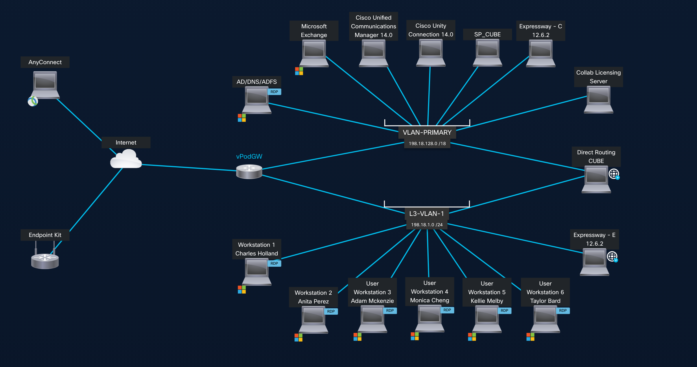
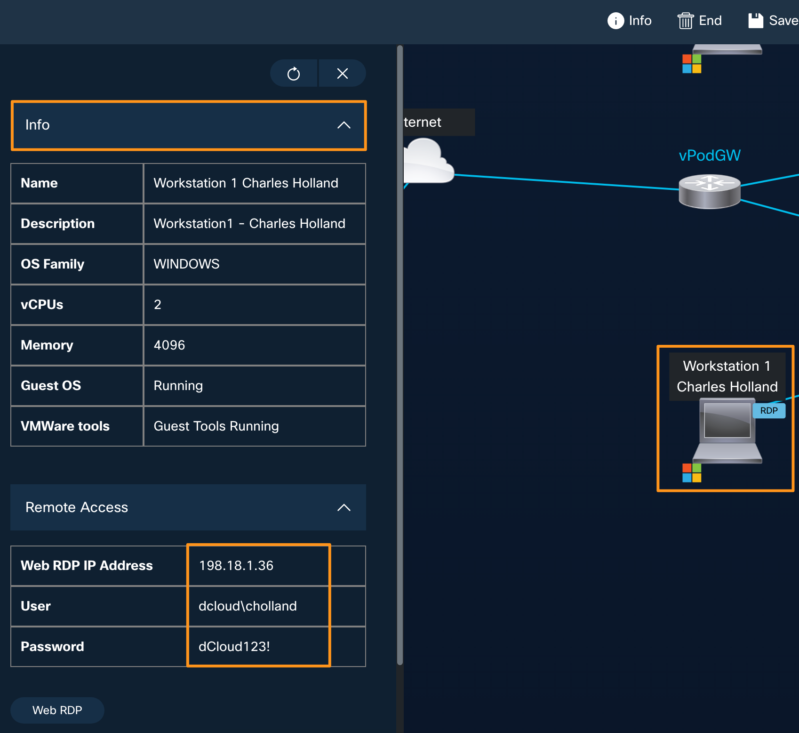
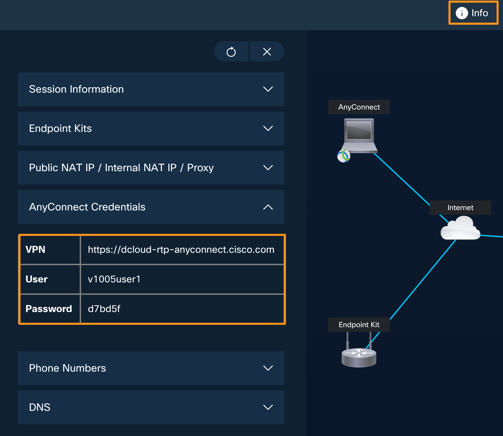
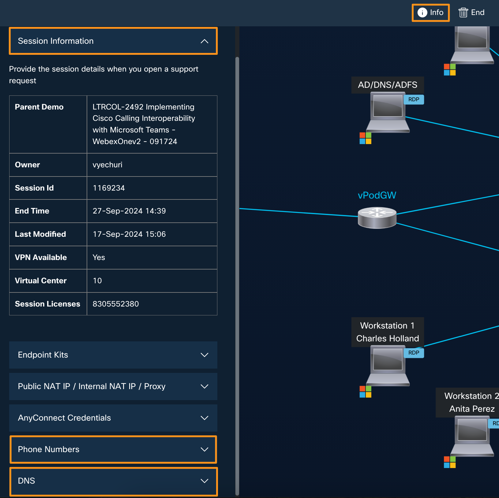
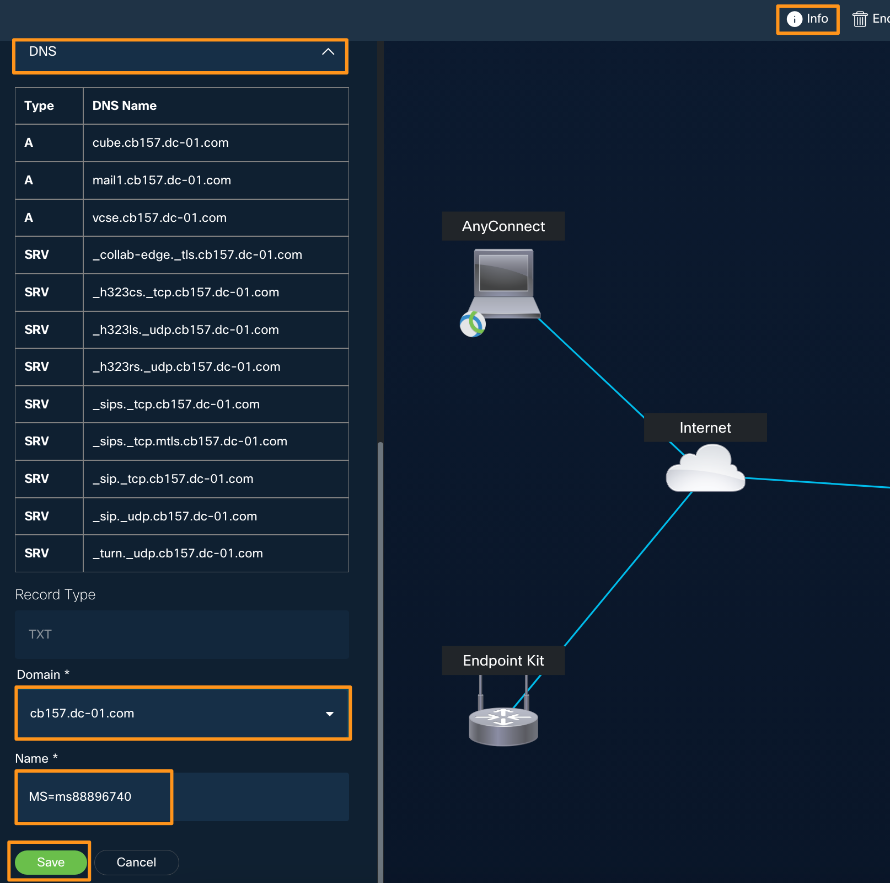

## Accessing your Lab -- \[Approx 10 min\]

1.  Open a browser on your laptop and go to <https://dcloud.cisco.com> 

2.  Click **Login** at the top right corner and log in with your
    ***cisco.com*** credentials

    

3.  Once logged in, open a new browser tab and paste the **event URL**
    for your lab. The **event URL** is
    [Update](ttps://dcloud2-sjc.cisco.com/event/396291/access) later

4.  You will be automatically assigned to a lab session and will be
    taken to the lab topology page as shown below.

    

5.  Click on the **Workstation 1** **Charles Holland** icon on the
    topology page and it will bring up a fly-out window on left with
    **Workstation 1** related information like **IP Address**,
    **username,** and **password** as shown below.

    

6.  Similarly, you can click on any other Virtual Machine on the
    topology page to get its accessing details.

7.  In this lab, you will access **Workstation 1** (through **WebRDP or
    Remote Desktop**) and from **Workstation 1** you will be able to
    access all the other virtual machines or Cisco UC applications like
    Cisco UCM, CUBE, etc., to complete the lab tasks.

8.  There are **two** ways you can access **Workstation 1**. You can
    either connect via a **local RDP connection** (option A - preferred)
    connection or via a **WebRDP connection** (option B) from your
    classroom laptop.

    **Option (A) -- \[Preferred\]**
    
    To connect to the Workstation using your **local RDP connection**,
    first, you need to connect to your lab session via a VPN. Open **Cisco
    AnyConnect** on your laptop. It will prompt you for the **Host
    Address**, **username,** and **password** information for your
    session. You will find all these details under the **Info** \ 
    **AnyConnect** **Credentials** section of your lab. Enter all the
    details as shown below and click **OK** to connect to your session.
    The **Host Address**, **username,** and **password** will be different
    for each lab. Use **YOUR OWN** assigned lab details.
    
    
    
    Once you are connected to your lab session over VPN, you can open a
    local RDP connection on your laptop and connect to **Workstation 1**
    using the following details:
    
    Host: **198.18.1.36**
    
    Username: **dcloud\\cholland**
    
    Password: **dCloud123!**
    
    **Option (B)**
    
    To access Workstation 1 over **WebRDP**, click on the **Workstation
    1** icon on the topology page and when it brings up a fly-out window
    with workstation details. On the fly-out window go to click on the
    **Remote Access \  Web RDP**. It will open a new browser tab and
    connect you to Workstation 1.
    
    

9.  On the lab topology page, click on the **Info** tab on the top a
    fly-out window will open on left side. Here you will find all your
    lab-specific access information like the **Session ID**, **DNS
    Domain** name, **PSTN Numbers,** etc., You will need all this
    information throughout this lab session. All this information is
    captured and put in a text file called ***Lab_info.txt*** file on
    **Workstation 1'**s Desktop. Once you have connected to
    **Workstation 1** using one of the methods mentioned above, open the
    text file ***Lab_info.txt*** located on Desktop and review it. Keep
    this file open and handy as you will need this information
    throughout the lab.

    
 
  ***Below information is just for reviewing purpose only.***
 
  **Session ID**: you will find it under the details tab, as sho­wn above
  (Example **1041368**)
 
  **Control Hub password**: dCloud**1368**! (**dCloud** + last four
  digits of **session ID** + ***!***)
 
  **Domain Name**: Go to the **Info** tab of your session and scroll
  down to see the **DNS** section. It will be in the **cbXXX.dc-YY.com**
  format.
 
  **Expressway -- E Password**: Same as **AnyConnect password**, found
  under **Info** tab \  **AnyConnect Credentials**.
 

## Configuring Microsoft trial Tenant - \[Approx 15 min\]

In this lab, we are going to use a temporary Microsoft trial tenant.
These tenants will have random domain names assigned as part of the
trial creation process. To make it easy to go through the lab we are
going to add your session specific domain **cbXXX.dc-YY.com** (with
which On-Prem Cisco UC applications, AD and Webex Control Hub have been
setup with) to the Microsoft tenant and update the users on Microsoft
tenant with this new domain (cbXXX.dc-YY.com) so that all client and
application logins for users in this lab will be with one single domain
cbXXX.dc-YY.com. **The cbXXX.dc-YY.com will be different for each
attendee \[XXX and YY will be different for every participant and can be
found on the dCloud session (under Details) page\]**. Please note in
production environments you will **NOT** need to do these changes as the
Microsoft domain and other domains (like On-Prem UC server, Webex, AD
etc.,) will be usually same.

### Add ***cbXXX.dc-YY.com*** domain to the Microsoft Trial tenant \[Approx 10 min\]

1.  Make sure you have connected to **Workstation 1** using one of the
    options described above. Then, open the Chrome browser and go to
    **Collaboration Admin Links** \  **Microsoft Admin Center**. Or you
    can directly go to
    [https://admin.microsoft.com](https://admin.microsoft.cisco.com)

2.  Log in with **Microsoft Trial tenant credentials given for your pod
    by your proctor.** Email will be in the format of,
    [cholland@dtbxxxxx.onmicrosoft.com](mailto:cholland@dtbxx0xx02xx8.onmicrosoft.com)
    and the password is **dCloud123!**

3.  Once logged into the Microsoft admin center, on the left side pane
    go to **Setup.** On the Setup page under **Sign-in and security**
    click **Get your custom domain setup**.

    

4.  On **Get your custom domain setup page**, click **Get started**.

    

5.  On the **Add a Domain** page, enter your session domain name (from
    **Lab_info.txt** file you have opened above, it will be in the
    format of cbXXX.dc-YY.com) and click **Use this domain**.

    

6.  It will take you to **Verify you own your domain page**. Keep the
    radio button selected for **Add a TXT record to the domain's DNS
    records** and click **Continue**.

    

7.  It will take you to **Add a record to verify ownership** page and
    will display a **TXT name** and **TXT value**. Copy the entire TXT
    value (you can use the copy icon next to it).

    

8.  Go back to your dCloud lab/session page. Click on the **Info** tab,
    it will bring up a fly-out window on the left side. Scroll down on
    the fly-out window & drop down **DNS**. You will see an option to
    **Add TXT Record**. Enter the following values and click **Save**.

    **Domain Name**: drop down and select your session domain
  (cbXXX.dc-YY.com)
    
    **Name**: MS=ms88896740 (the value you copied above from your
  Microsoft tenant). **It will be different for your session.**

    

9.  It will give add this TXT record to backend DNS service for
    verficaiton from Microsoft cloud.

10. Go back to workstation 1 where you had the **Microsoft Admin** page
    opened. Click **Verify** on the **Add a record to verify ownership**
    page.

    
 
    **NOTE**: *Sometimes it may take longer to update the DNS TXT record
  you added just now, so in case if the verification fails, wait a few
  seconds and try again to verify*.

11. It will take you to **How do you want to connect your domain** page.
    Keep the option **Add your own DNS records** selected and click
    **Continue**.

12. On the next page, **Add DNS records page**, **uncheck** the option
    for **Exchange and Exchange Online Protection**. Open/Click
    **Advanced options** and check mark **Skype for Business.** We need
    to add two **CNAME** records and two **SRV** records to the DNS
    server. Drop down CNAME Records (2) and SRV Records (2) to note/read
    the records/ports/TTL etc., for your knowledge. ***We have added
    these records already to DNS server to save the time***. Once you
    reviewed them, click **Continue**.

    

13. It will verify the DNS records and show the status of verification.
    The verification should be successful and it will give you a message
    saying "**Domain setup is complete**" as shown below. Click
    **Done**.

    

This completes adding **cbXXX.dc-YY.com** domain to the Microsoft
    Trial tenant for your session

### Update users on Microsoft tenant to ***cbXXX.dc-YY.com*** domain - \[Approx 5 min\]

As we have now added the cbXXX.dc-YY.com to the Microsoft tenant, let us
update the user domain for user from
[**cholland@dtbxxxxx.onmicrosoft.com**](mailto:cholland@dtbxx0xx02xx8.onmicrosoft.com)
to **cholland@cbXXX.dc-YY.com**.

1.  Continuing on Workstation 1, go back to the Microsoft admin page
    where you logged in before. If the previous login is timed out login
    back again using the Microsoft Trial credentials given by your
    proctor for the lab.

2.  Once you are on the admin home page, go to **Users** \  **Active
    users**

3.  From the available users select **Charles Holland**, and it will
    open a flyout window. On the flyout window under Account click
    **Manage username and email**.

    

4.  On the **Manage username and email** page, click edit (pencil icon
    towards the right) to modify the **Primary email address and
    username**.

5.  Keep the username the same as **cholland** and drop down the Domain
    and choose the cbXXX.dc-YY.com domain that you added in the above
    section. Click **Done** and then click **Save Changes**.

    

6.  As soon as you click **Save Changes**, you will be logged out from
    the Microsoft Admin page, which is expected. As you have just
    updated the username and the primary email address to a new domain,
    it will log you out.

7.  From now on you will use the email address
    <cholland@cbXXX.dc-YY.com>  to log back into the Microsoft Admin
    Center.

8.  Open a new browser tab and from the homepage go to Collab Admin
    Links \  Microsoft Admin Center and login as
    <cholland@cbXXX.dc-YY.com>  and password as **dCloud123!**

9.  Repeat this process, steps 2 through 5 (Manage username and email)
    for **Adam McKenzie**, **Anita Perez**, **Kellie Melby**, **Monica
    Cheng**, and **Taylor Bard**, and update the **Primary email address
    and username** domain to
    [cbXXX.dc-YY.com](mailto:aperez@cbXXX.dc-YY.com). Once you have
    updated all listed users, the Active users list will be as shown
    below.

    

10. This completes updating users on Microsoft tenant to
    ***cbXXX.dc-YY.com*** domain.
