# Module 1: Direct Routing with CUBE and Interworking with CUCM via CUBE
## **Module 1a: Direct Routing with CUBE**

Microsoft Direct Routing is a Microsoft solution that lets you connect a
certified, customer-provided Session Border Controller (SBC) to
Microsoft Phone System for on-premises or customer-provided PSTN
connectivity.

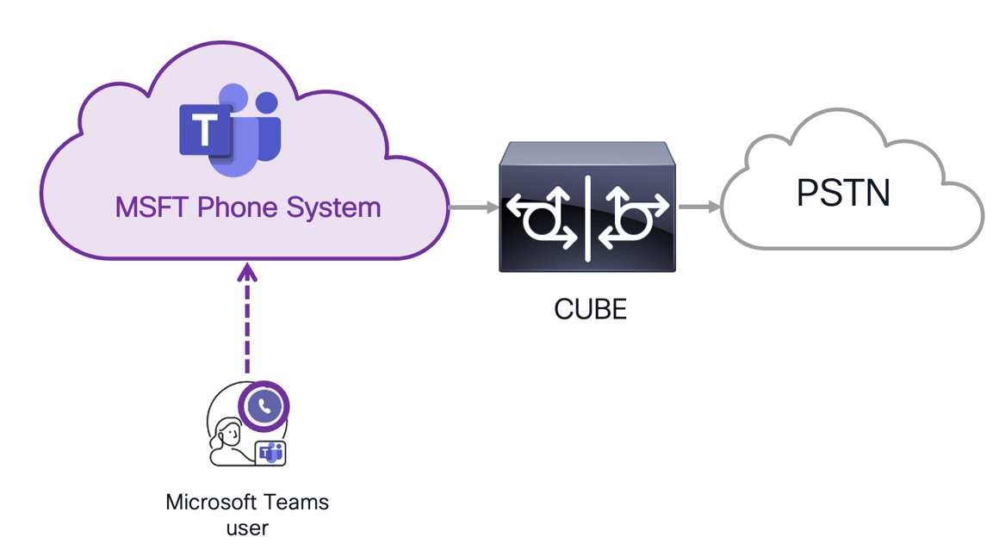

### Direct Routing CUBE Configuration: **Option A** \[Approx 20 min\]

In this modulde there are 6 sub modules, out of which 4 sub modules are
CLI (Command Line Interface) based. These 4 moudules contain importing
required certificates for CUBE registration with Microsoft Cloud, SIP
profiles, Dial Peers and others. If you are not familiar with CLI& **DO
NOT** want to go through manual configuration, we have generated the
entire required configuration for CUBE and put it on **Workstation 1
Desktop** in a file called **Ready-CL_DR_CUBE-Config.txt** file. If you
like to use this file and configure CUBE with copy/ paste, follow below
procedure and then go to **Module 1a.5** directly.

OR

If you want to configure the CUBE manually and go through step by step
go to **Direct Routing CUBE Configuration Option B**.

1.  Continuing on Workstation 1, Minimize all applications and open text
    file **Ready-CL_DR-CUBE-Config.txt** with **Notepad++**. Right click
    on the file and choose **Edit with Notepad++**.

    > **NOTE**: ***DO NOT*** open this file with Microsoft default notepad
application, the certificates will not be formatted correctly.

    

2.  Open **Putty** from the taskbar and open an SSH connection to
    **198.18.133.231** (or you can load **cube.dcloud.cisco.com** from
    available saved logins on Putty) and login as **admin** and
    **dCloud123!**

3.  Copy all (use **Ctrl + a**) the contents of the file
    (**Ready-CL_DR-CUBE-Config.txt**). Go to the putty window and paste
    (**Right click** anywhere on the putty window).

4.  Once all the configuration is entered on Putty, scroll up and make
    sure there are **NO** error messages for any of the commands and
    also make sure the certificate **import is successful** as show
    below.

    

5.  Once all the configuration is verified go to the **Moudle 1a.5**
    directly.

### Direct Routing CUBE Configuration: **Option B** \[Approx 50 min\]


### Module 1a.1: Import certificates on CUBE \[Approx 15 min\]

We need a publicly signed CA certificate and keys on CUBE for Microsoft
to trust the communication from CUBE. The Certificates for this lab are
already created and placed in the **certs** folder on **Workstation 1**
desktop.

1.  Continuing on Workstation 1, open **Putty** from the taskbar and
    open an SSH connection to **198.18.133.231** (or you can load
    **cube.dcloud.cisco.com** from available saved logins on Putty) and
    login as **admin** and **dCloud123!**

    > **NOTE**: *We will need to execute commands on CUBE for Direct Routing configuration. All these commands that you need to execute are saved in a text file named **CUBE_Commands-For_Direct-Routing.txt** and available on **Workstation 1 Desktop**. We recommend copying the commands from that text file and pasting it onto Putty to avoid any formatting issues from the PDF/MS Word file (this lab guide). You can still follow this guide for command explanation.*

    **IMPORTANT NOTE**: *Be cautious of copying and pasting the commands/certificates as adding an extra space or leaving a character out would cause so many issues and that involves a lot of troubleshooting and redoing of those commands*.

    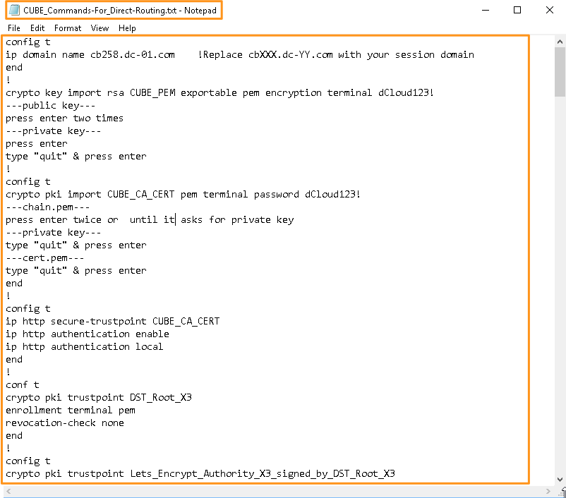

2.  Let's first update the IP domain with your lab session's domain with
    the following commands. Use the same domain name for the CUBE
    platform as used for the Microsoft tenant.

    ```
    config t                                                              

    ip domain name cbXXX.dc-YY.com **!Replace cbXXX.dc-YY.com with your session Domain**                                                      

    end
    ```
    Press enter after **end**.

    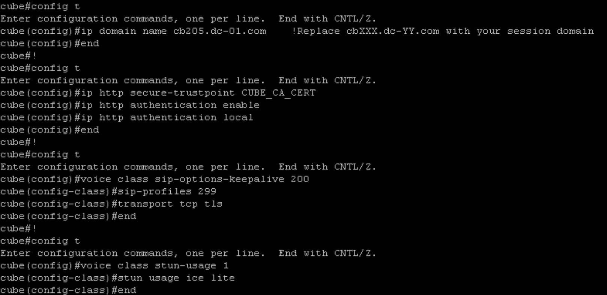

3.  Now, open the **certs** folder on the **Workstation 1** **Desktop**
    and you will see 4 files: Cube Certificate (cert.pem); Certificate
    Chain (chain.pem); Private Key (privkey1-rsa.pem), and Public Key
    (pubkey1.pem)

    

4.  **Right-click** on each (or all) of these files and choose **Edit
    with Notepad++**. Make sure you have all **four** files opened
    before continuing to the next step.

    

5. Enter the following command to import Public Key and Private Key

    ```
 
    crypto key import rsa CUBE_PEM exportable pem encryption terminal
    dCloud123!
  
    ```

6. It will prompt you to paste/enter the **public key** first. Copy the
    public key (**pubkey1.pem**) that you opened from the certs folder
    (in **Notepad++**) and paste it on the CUBE. Then Press Enter
    **twice** (or until it prompts you to enter the private key).

7. Now, copy the **private key** (**privkey1-rsa.pem**) that you opened
    from the certs folder and paste it on the CUBE as shown below. Press
    **Enter**. Then type the word **quit** and Press Enter again.

8. Cube will import the public key and private key and give you
    **import succeeded** message as shown below

    

9. Now we will need to import the certificate chain, private key, and
    the CA signed CUBE certificate. Enter the following commands.


       ```
       config t

       crypto pki import CUBE_CA_CERT pem terminal password dCloud123!
       
       ```

10. It will prompt you to enter the **CA certificate chain**. Copy the
    contents of **chain.pem** file that you opened from the certs folder
    and paste it on the CUBE.

11. Press **Enter** twice (or until it prompts you to enter Private
    Key). If you are copying the **chain.pem** from the Notepad++ file
    with a Ctrl + A, there is already an extra space towards the end,
    resulting in you pressing **Enter** just once.

12. When it prompts, copy the **private key** (privkey1-rsa.pem) that
    you opened from the certs folder and paste it on the CUBE. Press
    **Enter**.

13. Type the word **quit** and press **Enter again.**

14. When it prompts, copy the **certificate** (**cert.pem**) that you
    opened from the certs folder and paste it on the cube.

15. Press **Enter** and type the word **quit** and press **Enter
    again**. CUBE will import the certificates and private key and give
    you **import successeded** message as shown below.

    

    

16. Enter the command **end** to come out of the configuration window.

17. Configure the CUBE_CA_CERT trustpoint and enable HTTP authentication

    ```
    config t
    
    ip http secure-trustpoint CUBE_CA_CERT
    
    ip http authentication enable
    
    ip http authentication local
    
    end
    ```

    Press enter after **end**.
    
    

18. Enter the following commands to add trustpoints named 
<span style="color:orange">*DST_Root_X3*</span>, 
<span style="color:green">*Lets_Encrypt_Authority_X3_signed_by_DST_Root_X3*</span> 
and <span style="color:blue">*CUBE_CA_CERT*</span>.

    ```
    conf t

        crypto pki trustpoint DST_Root_X3

            enrollment terminal pem

            revocation-check none

        end

    !

    config t

        crypto pki trustpoint Lets_Encrypt_Authority_X3_signed_by_DST_Root_X3

            enrollment terminal pem

            chain-validation continue DST_Root_X3

            revocation-check none

        end

    !

    config t

        crypto pki trustpoint CUBE_CA_CERT

            enrollment pkcs12 **! might not need this command**

            revocation-check crl

            rsakeypair CUBE_CA_CERT

        end

    !

    config t

        voice class srtp-crypto 1

            crypto 1 AES_CM_128_HMAC_SHA1_80

        end

    !
    ```

    With the voice class srtp-crypto command, we are setting the crypto
cipher for the Microsoft Phone System trunk as SHA1_80.

    

    > **NOTE**: *Ignore the warning about pkcs12 enrollment.*

19. Download the trust bundle from cisco.com to CUBE using the below
    commands.

        config t

        crypto pki trustpool policy

            no cabundle url http://www.cisco.com/security/pki/trs/ios_core.p7b

            cabundle url http://www.cisco.com/security/pki/trs/ios.p7b

            revocation-check crl

            crypto pki trustpool import ca-bundle

        end
        

    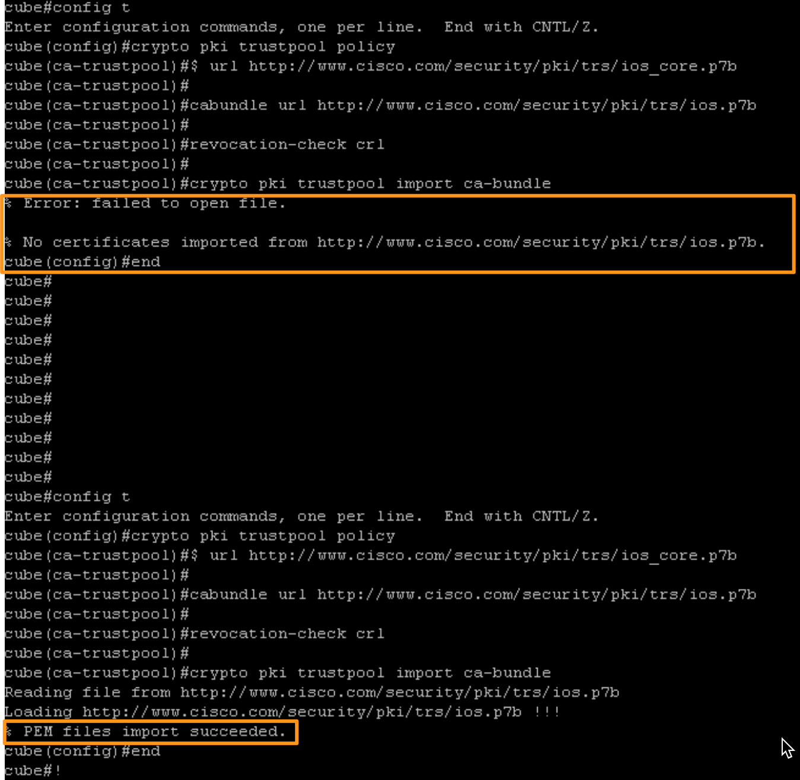

    > **NOTE**: *If these commands do not work or the import is unsuccessful,
run the commands again.*

20. This completes importing and configuring CUBE with public
    certificates and trusted CA certs.

### Module 1a.2: Configure sip user agent and voice services on CUBE \[Approx 5 min\]

1.  Enter the following commands to configure sip-ua to enable TLS1.2
    exclusivity (disabling TLV v1.0 and v1.1) and specify the default
    trustpoint as **CUBE_CA_CERT**. We are also disabling Remote-Party
    Identity (RPID) value to send the calling party information.

     
        config t

        sip-ua

        no remote-party-id

        retry invite 2

        transport tcp tls v1.2

        crypto signaling default trustpoint CUBE_CA_CERT

        handle-replaces

        end
   

    


2.  Configure voice service voip with the below commands

            config t

        voice service voip

            ip address trusted list ! SIP messages allowed from these networks

                ipv4 52.112.0.0 255.252.0.0 ! Microsoft cloud services

                ipv4 52.120.0.0 255.252.0.0

                ipv4 19.51.100.0 ! Service Provider trunk

            rtcp keepalive

            address-hiding

            mode border-element **! ignore the warning about CSR reload**

            media bulk-stats

            media-address range 198.18.1.231 198.18.1.231 port-range 36000 48000

            allow-connections sip to sip

            no supplementary-service sip refer

            supplementary-service media-renegotiate

            fax protocol t38 version 0 ls-redundancy 0 hs-redundancy 0 fallback none

            sip

                listen-port secure 5061

                session refresh

                header-passing

                error-passthru

                no conn-reuse

        end

    

    > **NOTE**: *Ignore the warning about reloading, you don't have to
reload.*

    **Explanation of the commands:**

    | Command                      | Description                                                                                                                       |
|------------------------------|-----------------------------------------------------------------------------------------------------------------------------------|
| `ip address trusted list`    | Allows traffic from Phone System and the PSTN. Refer to Microsoft documentation for address and port information to use for firewall configuration. |
| `allow-connections sip to sip` | Allow back to back user agent connections between two SIP call legs.                                                              |
| `rtcp-keepalive`             | Enables CUBE to send RTCP keepalive packets for the session keepalive.                                                            |
| `handle-replaces`            | Handles INVITEs with replaces. Required for Phone System.                                                                         |
| `no conn-reuse`              | The conn-reuse feature is not required for this solution.                                                                         |
| `media bulk-stats`           | Enables the control plane to poll the data plane for bulk call statistics.                                                        |
| `early-offer forced`         | Forces the CUBE to send SDP information in the initial INVITE message instead of waiting for acknowledgment from the neighboring peer. |
| `header-passing`             | Passes Supported Non-Mandatory Headers and the Unsupported Headers.                                                               |


3.  Enter the following commands to configure the listening port to 5061
    under voice service voip

            config t

        sip

        voice service voip

            sip

                shutdown

            sip

                listen-port secure 5061

                no shut

        end

    

4.  Configure the following command to allow pass-through of Referred-By
    header to be used in the REFER INVITE send to the Microsoft Phone
    System.

            config t

        voice class sip-hdr-passthrulist 290

            passthru-hdr Referred-By

        voice service voip

            sip

                sip-profiles inbound

                    pass-thru headers 290

        end

    

This completes the configuring of SIP User Agent and voice services
    on CUBE.

### Module 1a.3: Configure voice class sip-profiles and voice class tenants on CUBE \[Approx 10 min\]

We need to configure 4 SIP profiles for message manipulation on CUBE to
interop with Direct Routing. Refer to pages 17 to 25 of the following application note for
detailed explanation of the SIP Profiles being used.

<https://www.cisco.com/c/dam/en/us/solutions/collateral/enterprise/interoperability-portal/direct-routing-with-cube.pdf>

These SIP profiles are already prepared and put on Workstation 1's
Desktop in the file **Ready-SIP-Profiles_Direct-Routing.txt** for you
and they are ready to just copy and paste on CUBE. If you want to read
more information and understand these SIP profiles, go to the Appendix
section which will explain the SIP profiles and let you prepare them
manually!

1.  Continuing on Workstation 1, minimize the putty session, notepad,
    and other applications. Find the file named
    ***Ready-SIP-Profiles_Direct-Routing.txt*** on the Desktop.
    **Right-click** on the file and choose **Edit with Notepad++**.

    

2.  It will open up the file in Notepad++, copy all contents (you can
    use Ctrl + A) of the file and paste it on the CUBE. Ensure no errors
    are generated while pasting these commands.

    

    

    > **IMPORTANT NOTE**: *Once SIP profiles are configured on CUBE, you can close the **Ready**-**SIP-Profiles_Direct-Routing.txt** file (or minimize Notepad++) and go back to **CUBE_Commands-For_Direct-Routing.txt** file to continue to configure rest of the configuration on CUBE.*

    > **Hint**: *In the **CUBE_Commands-For_Direct-Routing.txt** file there is a note **You will Configure SIP Profiles & then come back to following commands** for you to identify the place you need to continue from. If copying from Notepad, make sure you don't copy the ! symbol at the end of the script.*

3.  Configure the voice class tenants with below commands. Replace the
    dns name with your session cube name that you noted above.

        config t

            voice class sip-options-keepalive 200

                sip-profiles 299

                transport tcp tls

            end

        !

        config t

            voice class stun-usage 1

                stun usage ice lite

            end

        !

        config t

            voice class tenant 200

                handle-replaces

                srtp-crypto 1

                localhost dns:cube.cbXXX.dc-YY.com **!Replace cbXXX.dc-YY.com with your session domain**

                session transport tcp tls

                no referto-passing

                bind all source-interface GigabitEthernet 1

                pass-thru headers 290

                no pass-thru content custom-sdp

                sip-profiles 200

                sip-profiles 290 inbound

                early-offer forced

                block 183 sdp present

            end

        !

        config t

            voice class tenant 100

                session transport udp

                bind control source-interface GigabitEthernet2

                bind media source-interface GigabitEthernet2

                no pass-thru content custom-sdp

                early-offer forced

            end

    

Here is an explanation of the commands used above:

**`voice class sip-options-keepalive 200`**

Configures a keepalive profile and enters voice class configuration mode. You can configure the time (in seconds) at which a SIP Out of Dialog Options Ping is sent to the target when the heartbeat connection to it is in UP or Down status. This keepalive profile is triggered from the dial-peer configured towards Microsoft Phone System.

**`sip-profiles 299`**

To ensure that the contact headers include the CUBE's fully qualified domain name, SIP profile 299 is used under OPTIONS-keepalive 200 above.

**`voice class stun-usage 1`**

Configure voice class stun-usage 1 to enable ICE-lite on the Microsoft Phone System trunk.

**`voice class tenant 200`**

Defines parameters for the trunk towards Phone System in a tenant.

### Module 1a.4: Configure voice class uris, translation-patterns, dial-peers on CUBE \[Approx 5 min\]

1.  Configure the required dial-peers, voice class URIs and translation
    profiles for the Direct Routing to work.

        conf t

            voice class codec 1

                codec preference 1 ********

            end

        !

        conf t

            voice class e164-pattern-map 200

                e164 6018

            end

        !

        conf t

            voice class uri 290 sip

                host cube.cbXXX.dc-YY.com **!Replace cbXXX.dc-YY.com with your session domain**

            end

        !

        conf t

            voice class uri 190 sip

                host ipv4:198.18.133.3

            end

        !

        conf t

            dial-peer voice 200 voip

                description towards Phone System Proxy 1

                preference 1

                rtp payload-type comfort-noise 13

                session protocol sipv2

                session target dns:sip.pstnhub.microsoft.com

                destination e164-pattern-map 200

                voice-class codec 1

                voice-class sip tenant 200

                voice-class sip options-keepalive profile 200

                dtmf-relay rtp-nte

                srtp

                fax protocol none

                no vad

            end

        !

        conf t

            dial-peer voice 201 voip

                description towards Phone System Proxy 2

                preference 2

                rtp payload-type comfort-noise 13

                session protocol sipv2

                session target dns:sip2.pstnhub.microsoft.com

                destination e164-pattern-map 200

                voice-class codec 1

                voice-class sip tenant 200

                voice-class sip options-keepalive profile 200

                dtmf-relay rtp-nte

                srtp

                fax protocol none

                no vad

            end

        !

        conf t

            dial-peer voice 202 voip

                description towards Phone System Proxy 3

                preference 3

                rtp payload-type comfort-noise 13

                session protocol sipv2

                session target dns:sip3.pstnhub.microsoft.com

                destination e164-pattern-map 200

                voice-class codec 1

                voice-class sip tenant 200

                voice-class sip options-keepalive profile 200

                dtmf-relay rtp-nte

                srtp

                fax protocol none

                no vad

            end

        !

        conf t

            dial-peer voice 290 voip

                description inbound from Microsoft Phone System

                rtp payload-type comfort-noise 13

                session protocol sipv2

                incoming uri to 290

                voice-class codec 1

                voice-class sip tenant 200

                dtmf-relay rtp-nte

                srtp

                no vad

            end

        !

        conf t

            dial-peer voice 280 voip

                description Phone System REFER routing

                destination-pattern +AAAT

                rtp payload-type comfort-noise 13

                session protocol sipv2

                session target sip-uri

                voice-class codec 1

                voice-class sip profiles 280

                voice-class sip tenant 200

                voice-class sip requri-passing

                dtmf-relay rtp-nte

                srtp

                no vad

            end

        !

        conf t

            dial-peer voice 100 voip

                description outbound to PSTN

                destination-pattern +1[2-9]..[2-9]......$

                rtp payload-type comfort-noise 13

                session protocol sipv2

                session target ipv4:198.18.133.3

                voice-class codec 1

                voice-class sip tenant 100

                dtmf-relay rtp-nte

                no vad

            end

        !

        conf t

            dial-peer voice 190 voip

                description inbound from PSTN

                translation-profile incoming 100

                rtp payload-type comfort-noise 13

                session protocol sipv2

                incoming uri via 190

                voice-class codec 1

                voice-class sip tenant 100

                dtmf-relay rtp-nte

                no vad

            end

        !

        conf t

            voice translation-rule 200

                rule 1 /^\\+1\\(.*\\)/ /\\1/

            end

        !

        conf t

            voice translation-profile 200

                translate calling 200

                translate called 200

            end

        !

        conf t

            voice translation-rule 100

                rule 1 /^(2-9)......../ /+1\\1/

            end

        !

        conf t

            voice translation-profile 100

                translate calling 100

                translate called 100

            end

        !

        config t

            voice class e164-pattern-map 200

                e164 +6017

                e164 +6018

            end

Now the CUBE configuration is complete. Here is an explanation of the
commands used above:

**`voice class codec 1`**

Specify the codec used on the trunks.

**`voice class uri <tag> sip`**

To specify either an FQDN, IP, or a pattern to be used in a SIP dial-peer.

**`Dial-peer voice 200/201/202 voip`**

To ensure the correct failover order, the above prioritized dial peers
are used. To simplify configuration, a common E164 pattern map defining
all numbers and prefixes used by Phone System is used for all the three
dial peers. Use patterns that match the number ranges used for calls
placed to Phone System. The configuration for all three dial peers is
the same, with the exception of preference and Phone System proxy FQDN.

Additional dial-peers are configured to accept incoming traffic from
Microsoft Phone System (dial-peer voice 290 voip), Refer handling
(dial-peer voice 280 voip), and incoming and outgoing facing ITSP
(dial-peers voice 100 and 190).

### Module 1a.5: Add CUBE to the Microsoft Teams and configure Voice policies \[Approx 10 min\]

> **NOTE**: *In the Microsoft admin center, we will add CUBE as a Session
Border Controller (SBC)*

1.  Continuing on Workstation 1, open a new browser tab, go to **Collab
    Admin links,** and choose **Microsoft Teams Admin Center**. Login
    with <cholland@cbXXX.dc-YY.com> and **dCloud123!**, if prompted.

2.  Once logged into the **Microsoft Teams admin center,** on the left
    side pane, go to **Voice** \> **Direct Routing**. On the Direct
    Routing page click **Add** to add a new SBC (CUBE).

3.  On the **Add SBC** page, name the SBC as **cube.cbXXX.dc-YY.com**
    (the FQDN of the CUBE), and toggle ON the option for **Enabled,**
    and set SIP signaling port to 5061. Scroll down and click **Save**.

    

4.  You will be taken to the SBCs page and there you will see the newly
    added SBC.

    

    > **NOTE**: *Sometimes CUBE may take longer to show as Active. Also TLS connectivity status may show an exclamation mark (indicating a warning) due to inactivity but you can ignore that.*

    At this point, CUBE should be able to talk to Microsoft Cloud services
and establish a TLS connection. You can test that using the below
commands on the CUBE to check active connections.

    **`show sip-ua connections tcp tls brief`**

    

    **`show sip-ua connections tcp tls detail`**

    

    > **NOTE**: *The **52.114.X.X** subnet belongs to Microsoft Cloud indicating CUBE has successfully established communication with Microsoft Cloud/tenant.*

5.  Now go to **Voice** \> **Voice routing policies**. There will be a
    default routing policy named **Global (Org-wide default)**. Select
    the **Global** voice routing policy, and under **PSTN usage
    records** click **Add PSTN usage records.** It will bring up a
    fly-out window to add PSTN usage records. Click **Add** on the
    fly-out window and name it **PSTNUR**, checkmark the PSTN usage
    record you just created and click **Save and Apply.** The fly-out
    window will be closed and you will be taken back to the **Global**
    policy page, click **Save** and click **Confirm** on the pop-up
    window to update the Global policy with the newly created PSTN usage
    record (PSTNUR).

    

6.  Now let's add a voice route. Go to **Voice** \> **Direct Routing**.
    On the Direct routing page go to the **Voice routes** tab and click
    **Add** to add a new voice route.

    

7.  On the Add voice route page, populate the following parameters and
    click **Save**.

    | **Parameter**      | **Value**                                                                                                                                   |
    |--------------------|---------------------------------------------------------------------------------------------------------------------------------------------|
    | **Name**           | PSTN-DR                                                                                                                                     |
    | **Priority**       | 2                                                                                                                                           |
    | **\+1***             | \+1.*                                                                                                                                     |
    | **SBCs enrolled**  | Click **Add SBCs** and on the fly-out window, checkmark the available SBC (`cbXXX.dc-YY.com`) and click **Apply**.                          |
    | **PSTN usage records** | Click **Add PSTN usage records** and on the fly-out window, checkmark the available PSTN usage record (`PSTNUR`) and click **Apply**. |

    

8.  Now, let's add the Calling policy. Go to **Voice** \> **Calling
    policies.** Click **Add** to add a new Calling policy.

    

9.  Name the Calling policy as **PSTN-CP.** Scroll down on the page and
    select **On** for the option **Busy on busy during calls** option.
    Click **Save**.

    

10. Now we need to assign the phone number and apply the policies (we
    defined above) for the user that we are going to use in this section
    of the lab (**Charles Holland**). On the Microsoft Teams admin
    center go to **Users** \> **Manage users.**

11. From the list of users select **Charles Holland**
    (<cholland@cbXXX.dc-YY.com>). It will take you to the user page. On
    the user page click **Assign primary phone number** under
    **Account**.

12. It will bring up a fly-out window for **Assign phone number**. For
    **Phone number type** keep **Direct Routing** selected. Enter
    **6018** for the **Assigned phone number**. Click **Apply**.

    

    > **NOTE**: *Sometimes it will take longer to update the phone number and it may give you a warning. You can safely ignore the warning and just wait until the pop-up window goes away. It will take around 5 to 10 seconds for the pop-up window to go away.*

13. It will take you back to the user page. Now go to **Policies** tab
    and click **Edit** under the Policies tab.

    

14. It will bring up a fly-out window to configure user policies.

    Drop-down options for:

    **Select Calling policy** and **select PSTN-CP**

    Click **Apply**. Click **Confirm** on the pop-up window to confirm.

    

15. This completes the Direct Routing configuration for Microsoft Teams.

### Module 1a.6: Testing the calls from Microsoft Teams for Direct Routing \[Approx 5 min\]

>  **NOTE**: *If you have completed any of Modules 3 or 4 before
> completing this module, you may have disabled Microsoft Native
> dialing. If so, login to Microsoft Teams Admin Center and* go to
> **Voice** \> **Calling policies**. On the Calling policies page select
> **Global (Org-wide default).**

On the **Global (Org-wide default)** policy page toggle **on** the option for **Make private calls** and click **Save**. Click **Confirm** on the pop-up window.

1.  Continuing on Workstation 1. Open Microsoft Teams from the
    desktop/taskbar and log in with credentials
    <cholland@cbXXX.dc-YY.com> and **dCloud123!** Click **OK**. Click
    **Done** on the next pop-up window.

    > **NOTE**: *DO NOT click* ***_No, sign into this app only_***

    

2.  Accept any information/warning messages while logging in.

    > **NOTE**: *Before we continue to test, on workstation 1, go to the notifications 
    \[**\] (bottom right corner, next to the time) and make sure **Quiet hours** are turned **off**. If it is turned on (shows in the color Blue) click it to turn it off.*

    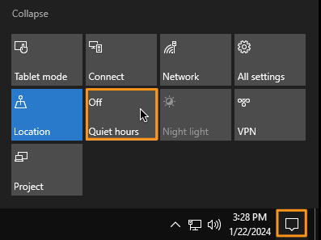

3.  Now on Microsoft Teams, go to **Calls** on the left side pane. Using
    the dial pad, dial the phone number (**MUST be a US Phone number**)
    in E.164 format. Example +19725556018 or if you do not have a US
    Phone number, you can dial Cisco support number **+18005532447**.

4.  Make sure the call is connected. Hang up the call after a few
    seconds.

    

    > **NOTE**: *You will experience one-way audio as you are using a virtual workstation and will not be able to use the microphone.*

5.  To make an inbound call, on **workstation 1**, go to
    **Lab_info.txt** and note down the DID number assigned for Charles
    Holland. Dial that number from your mobile. If you cannot make calls
    to a US number from your mobile phone, contact one of your proctors.

    

6.  The incoming call should ring on workstation 1. Answer the call and
    verify the call is connected. Hang up the call after a few seconds.

    

7.  This completes testing the calls from Microsoft Teams for Direct
    Routing.

This completes ***Module 1a -- Direct Routing with CUBE.*** Let's
proceed to **Module 1b -- Interworking between CUCM and Microsoft Phone
System using CUBE.**

## Module 1b: Interworking between Cisco Unified CM and Microsoft Phone System via CUBE \[Approx 15 min\]

> **IMPORTANT NOTE**: Make sure you have **COMPLETED Module 1a** (Direct
Routing with CUBE) before continuing. Module 1a is a
**mandatory/prerequisite** module to go through Module 1b.

Customers using Microsoft Phone System have the option of not only
connecting to the PSTN using CUBE, but also **to an internal phone
system such as Cisco Unified Communications Manager.**

The following topology uses a co-resident CUBE for Direct Routing. You
can also use a dedicated CUBE instance for Direct Routing and an
additional gateway for connection to the PSTN.

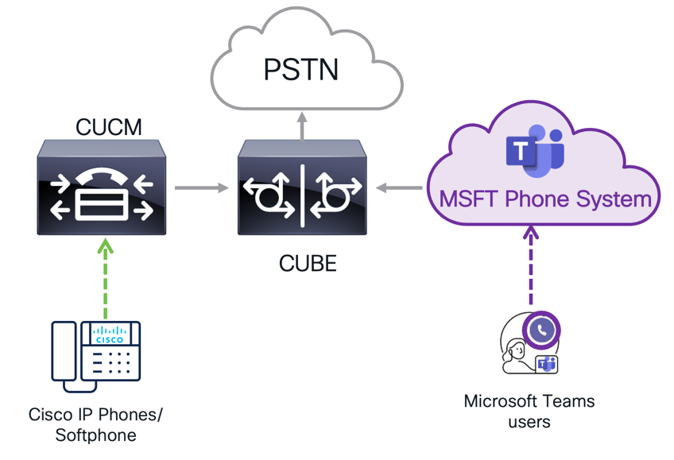

### Module 1b.1: Add required dial-peers on CUBE for Cisco UCM routing \[Approx 5 min\]

We need to add two dial-peers (inbound and outbound) on CUBE for routing
calls to/from CUCM.

1.  Continuing on Workstation 1, go to the putty session where you have
    logged into CUBE. If the previous login has timed out, log back in
    again as **admin** and **dCloud123!**

    > **NOTE**: *Like before, all the commands that you need to execute in
 this section are saved in a text file named **MSFT-To-UCM.txt** and
 put on Workstation'1 Desktop. We recommend copying the commands from
 that text file and pasting it onto Putty, to avoid any formatting
 issues from PDF/Word. You can still follow this guide for command
 explanations*.

    > **IMPORTANT NOTE**: *Be cautious of copying & pasting the
 commands/certificates as adding an extra space or leaving a character
 out would cause issues and that involves a lot of troubleshooting and
 redoing of those commands.*

2.  Add below voice class uri and an inbound dial-peer for accepting the
    inbound calls from CUCM (198.18.133.33)

        config t

            voice class uri 390 sip

                host ipv4:198.18.133.33

            end

        !

        config t

            dial-peer voice 390 voip

                description inbound dial-peer from Cisco UCM

                session protocol sipv2

                incoming uri via 390

                voice-class codec 1

                voice-class sip tenant 100

                dtmf-relay rtp-nte

                no vad

            end

        !

    

3.  Add outbound dial-peer to route calls to CUCM using the below
    commands.

    > **NOTE**: *By default, when you make an outbound call, Microsoft Teams
    adds **+1** to the dialed number. To make it easy for configuration in
    the lab we are adding the destination pattern with **+1** and we are
    adding dial-peer for only one user (Anita Perez). In production
    environments, you can use translation patterns on Microsoft Teams
    admin centre to not add +1 by default and you can generalize the
    dial-peer according to your organizational dial plan.*

        config t

        dial-peer voice 300 voip

            description outbound to UCM

            destination-pattern +16017$

            session protocol sipv2

            session target ipv4:198.18.133.33

            voice-class codec 1

            voice-class sip tenant 100

            dtmf-relay rtp-nte

            no vad

        end

    

Now cube configuration is complete for UCM calls. Save the
    configuration with following command & press **Enter** twice.

 `copy running-config startup-config`

### Module 1b.2: Configure SIP Trunk and Route Pattern on Cisco UCM to route calls to CUBE \[Approx 5 min\]

1.  Continuing on Workstation 1, open a new browser tab. From the
    browser home page go to **Collaboration Admin Links** \ **Cisco
    Unified Communications Manager** (or you can directly connect to
    <https://cucm1.dcloud.cisco.com>). Login as **administrator** &
    **dCloud123!**

2.  Once logged in to Cisco UCM go to **Device** \ **Trunk.** Click
    **Add New.** It will take you to Trunk Configuration page.

3.  On the Trunk configuration page drop down option for **Trunk Type**
    and choose **SIP Trunk.** Leave the rest of the options as is and
    click **Next**.

    

4. On the **Trunk Configuration** page populate the following information and click **Save** to save the configuration. You will need to scroll down to see the **Inbound Calls** and **SIP Information** sections on the Trunk Configuration page.

    ```
    -----------------------------------------------------------------------
    Parameter Name                             Parameter Value
    ------------------------------------------ ----------------------------
    Device Name                                Direct-Routing-Trunk

    Device Pool                                dCloud_DP

    Inbound Calls \ Significant Digits         4

    Inbound Calls \ Calling Search Space       Call_Everyone

    SIP Information \ Destination \            198.18.133.231
    Destination Address                        

    SIP Information \ SIP Trunk Security       Non Secure SIP Trunk Profile
    Profile                                    

    SIP Information \ SIP Profile              dCloud Standard SIP Profile
    -----------------------------------------------------------------------
    ```

    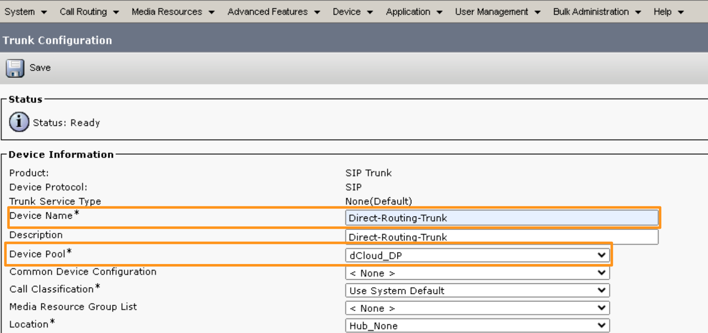
    
    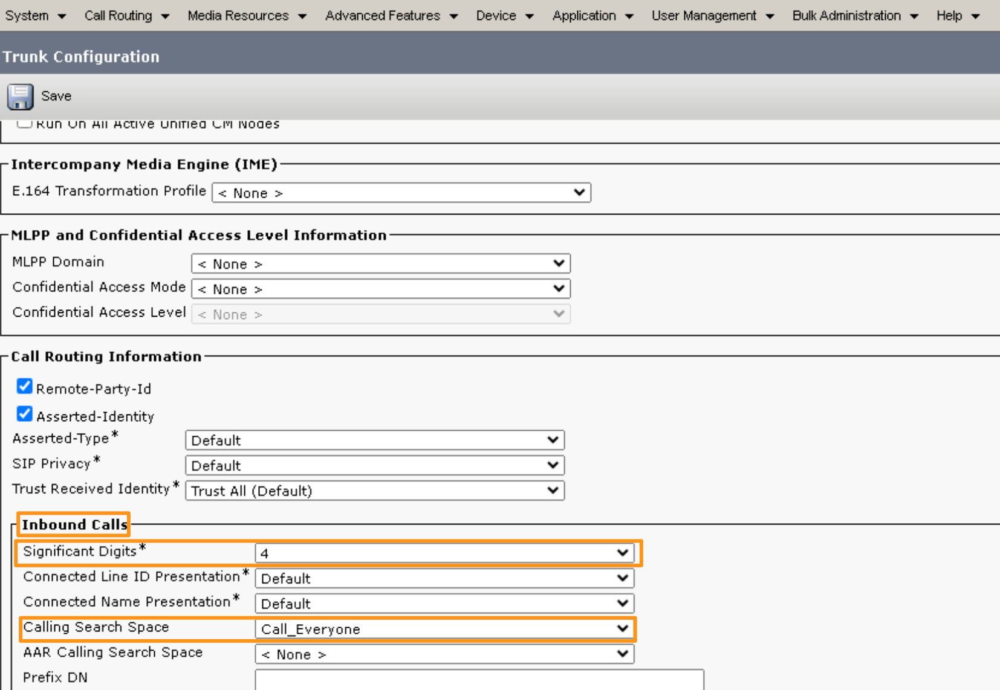

    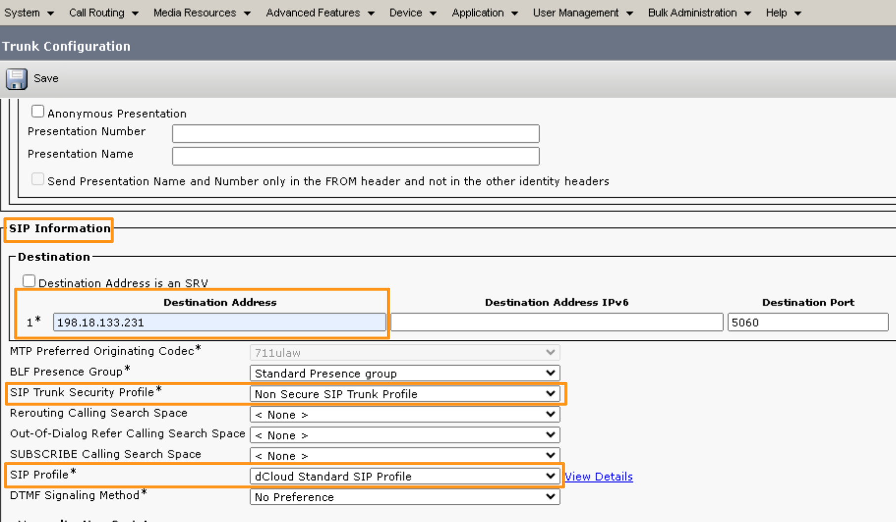
  
5. Once the Trunk is saved, click **Reset** and click **Reset again**
    on the pop-up window to confirm. Within two minutes the trunk should
    come into **Full Service** as shown below.

    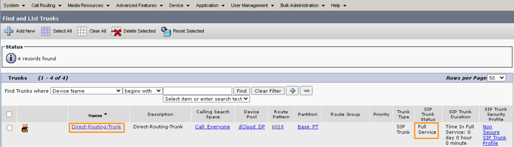

6.  Now, on the Cisco UCM go to **Call Routing** \ **Route/Hunt** \>
    **Route Pattern.** Click **Add New**

7.  On the Route Pattern Configuration page populate the following and
    Click **Save**. Click **OK** to accept any pop-up windows while
    saving the route pattern.

    ```
    -----------------------------------------------------------------------
    Parameter                     Value
    ----------------------------- -----------------------------------------
    Route Pattern                 6018

    Route Partition               Base_PT

    Gateway/Route List            Drop down and choose Direct-Routing-Trunk
    -----------------------------------------------------------------------
    ```

    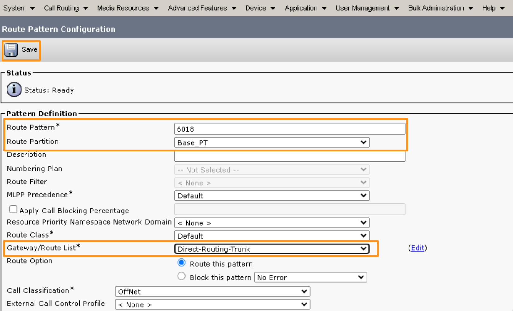

8.  This completes the configuring SIP Trunk and route patterns on Cisco
    UCM. Now, you have routing configured between Microsoft Teams &
    Cisco UCM (both ways) using CUBE.

### Module 1b.3: Testing the calls between Microsoft Teams and Cisco UCM using CUBE \[Approx 5 min\]

1.  Open RDP connection to Workstation 2 using the one of the methods
    described in **Accessing the lab section.** Credentials for
    workstation 2 (Anita Perez) are **dcloud\\aperez** & **dCloud123!**

2.  Once logged into workstation 2, open **Cisco Jabber** from the
    desktop. The Jabber application should auto login as **Anita
    Perez**. If not, enter the email address <aperez@dcloud.cisco.com>
    on Jabber and click **Continue**. ON the next screen, enter username
    as **aperez** and password as **dCloud123!** Click Login.

    

3.  Now, let's make inbound call towards Microsoft Teams. From **Cisco
    Jabber** (as **Anita Perez**), dial **6018** (extension number of
    **Charles Holland** on Microsoft Teams). Answer the call on
    **Workstation 1** Microsoft Teams (as **Charles Holland**). Make
    sure the call gets connected. Wait for few seconds and hang up the
    call.

    > **NOTE**: *You will not be able to hear the audio because we are using
    virtual workstations and microphone is not available.*

    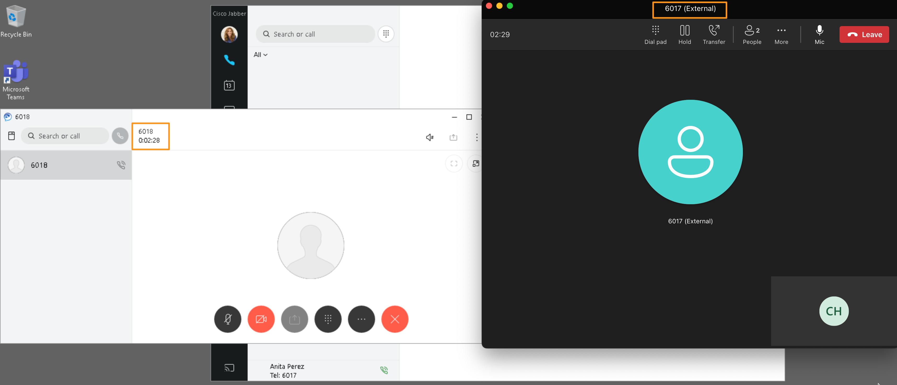

4.  Now, let's try to make outbound call from Microsoft Teams. From
    workstation 1 (as **Charles Holland**) dial extension number
    **6017** (extension number of **Anita Perez** on Cisco CUM). Answer
    the call on Workstation 2 Cisco Jabber (as Anita Perez). Make sure
    the call gets connected. Wait for few seconds and hang up the call.

5.  This completes testing the calling between Microsoft Teams and Cisco
    UCM using CUBE.
