# **Module 2: Webex Calling Integration for Microsoft Teams \[Approx 1 hr 40 min\]**

With Webex Calling for Microsoft Teams, the Microsoft Teams users can access the enterprise-grade Webex Calling experience directly in the Microsoft Teams app. With a single click from the Microsoft Teams interface, you can access a complete suite of Webex Calling features. The features include directory search, PSTN dialing, speed dial, voicemail, call history, and artificial intelligence-powered background noise removal.

This integrated app works with the Cisco Unified Communications Manager (UCM) call-control solution, Webex Calling for cloud deployment or the Dedicated Instance offering.

This would be the call flow diagram when using Webex Calling Multitenant as the call control:

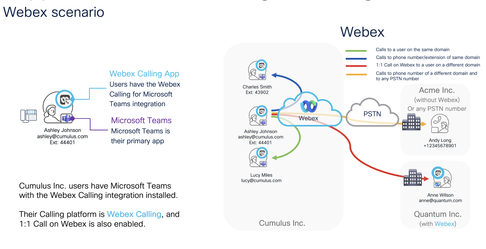

> **NOTE:** *Make sure you have added the domain (cbXXX.dc-YY.com) to Microsoft tenant in Add cbXXX.dc-YY.com domain to Microsoft Trial tenant section of the lab before you continue.*

## Module 2a: Configure Single Sign-On (SSO) for Control Hub \[Approx 15 min\]

**Microsoft tenant information for your lab:**

If you have your own identity provider (IdP) in your organization, you can integrate it with Control Hub for single sign-on (SSO). SSO lets your users use a single, common set of credentials for Webex App applications and other applications in your organization.

Cisco Webex supports a wide variety of IdPs for Single Sign-On configuration like Microsoft (both O365 and AD FS), Okta, PingFederate, Duo, etc.,

In this lab, we will explore the SSO configuration with **Microsoft O365**.

Integrating O365 with your Webex Control Hub you can also import/synchronize users and groups from Microsoft O365, Import Avatars (user profile pictures), define user attributes for mapping (like first name, email, etc.,) and configure SSO. In this lab, we will explore SSO configuration only.

1.  Open RDP connection to workstation 5 at 198.18.135, using one of the options mentioned in **Accessing your Lab** module. Use the credentials **dcloud\\kmelby** & **dCloud123!**

2.  Once connected to workstation, open the chrome browser from desktop and from home page go to **Cisco Webex Links** \> **Cisco Webex Control Hub** or you can directly go to <https://admin.webex.com> & log in with **cholland@cbXXX.dc-YY.com** and **dCloud*AAAA*!**

    > **NOTE:** You need to Replace XXX, YY *(in domain name) & AAAA (in password) with your session-specific details. If you haven\'t already done as explained in Accessing your lab section, go to Lab_info.txt file located on your **workstation 1** and copy the domain and password**. ***

    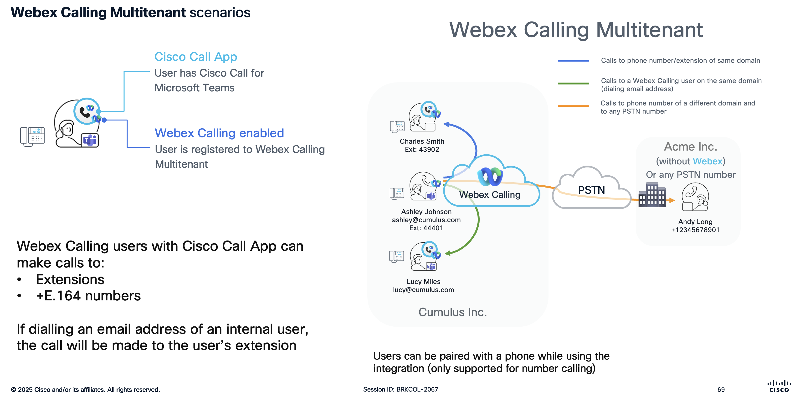

    > **NOTE**: *If you are asked for a PIN when signing to Control Hub or to the Webex App, you can get this pin by signing in to **Cloud Outlook Web Access** **using the Collaboration User Links** on your Chrome browser*

    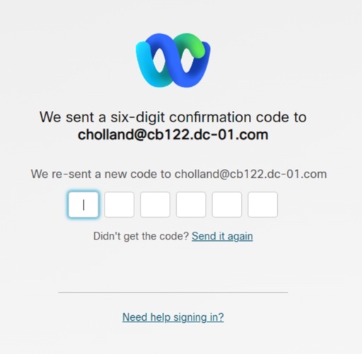

    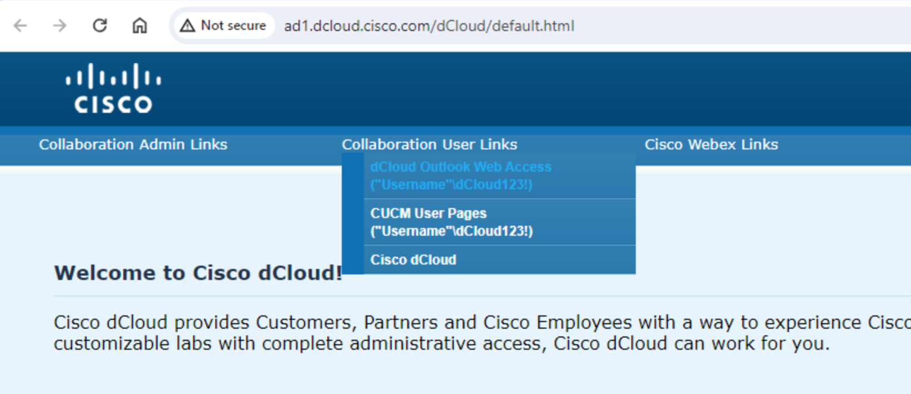

    *Insert **dCloud\\cholland** as the username (for Charles Holland) and **dCloud123!** as your password.*

    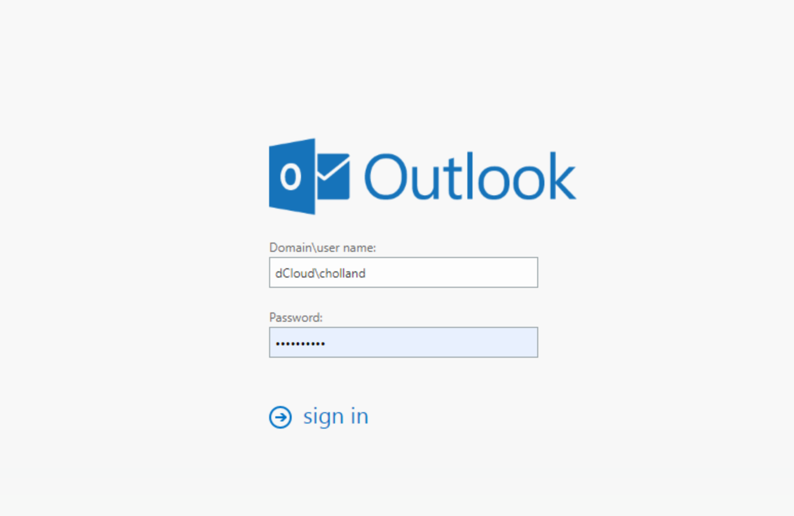

    *You will find the PIN requested in your Inbox:*

    

3.  For security reasons, Webex Control Hub signs out every 20 minutes (Idle timeout) by default. For this lab, let's make the idle time out longer so the Control Hub does not sign you out often during this lab. Go to **MANAGEMENT \> Organization Settings \> Control Hub's idle timeout.** Drop down the option for **Control Hub idle timeout** and select **12 hours** or **no timeout**. Click **Save**.

    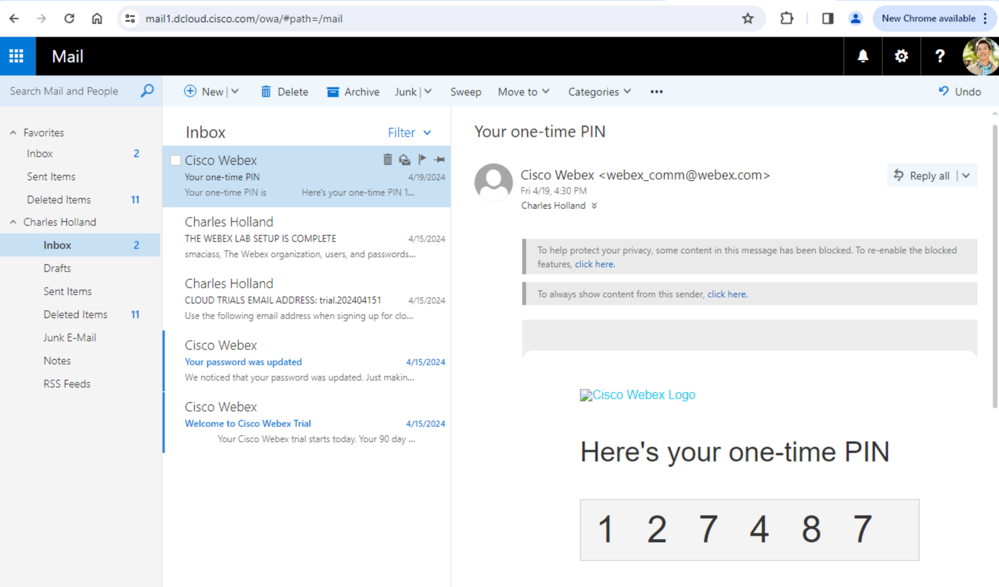

4.  Continuing on **Organization Settings** page, scroll down to the section **Microsoft Azure Active Directory Wizard App** and click **Set up.**

    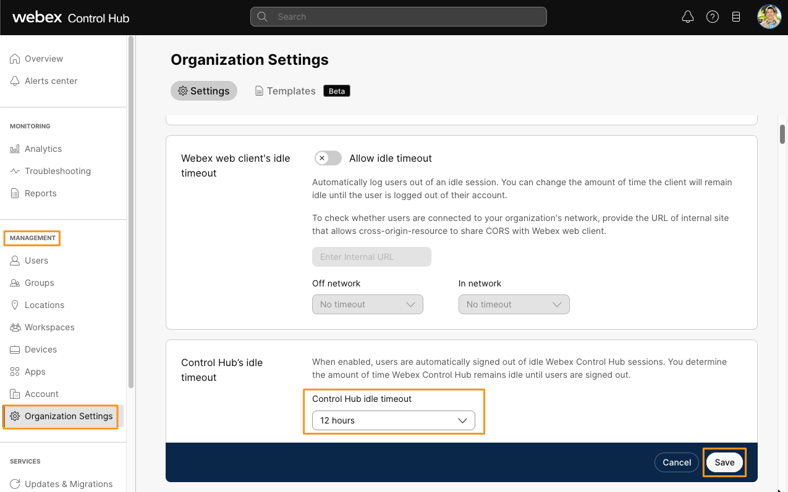

5.  It will take you to the Microsoft authentication page. Log in with the Microsoft credentials <cholland@cbXXX.dc-YY.com> & dCloud123! Click **Login**.

    > **NOTE:** *You need to replace XXX & YY in domain name with with your session-specific details. If you haven\'t already done as explained in Accessing your lab section, go to Lab_info.txt file located on your workstation 1 and copy the domain and password**.***

6.  On the following page, Microsoft login page will show you the permissions required. Review the permissions. Check mark option for **Consent on behalf of your organization**. Click **Accept**.

    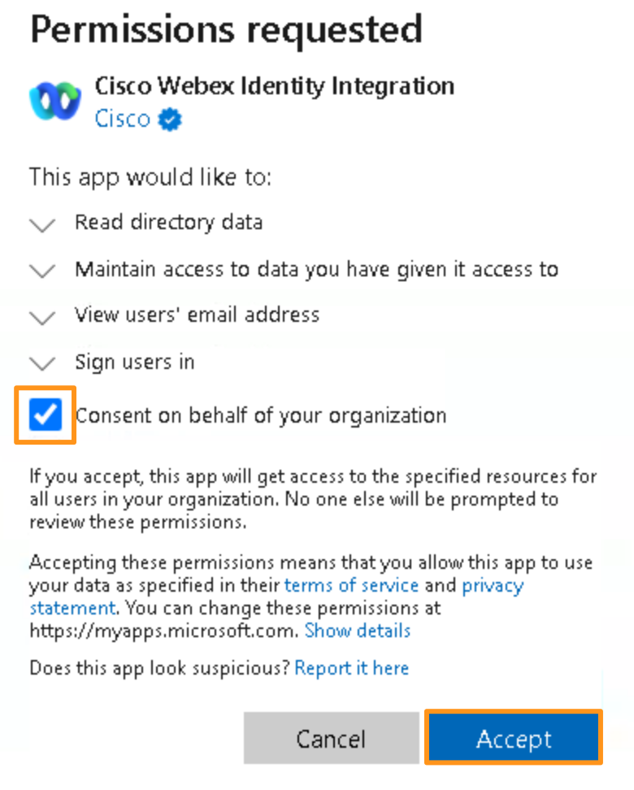

7.  On the following it will show you all details about permissions that are required for SSO configuration. **Click Accept**.

    

8.  You will be taken back to Webex Control Hub and a pop-up window will be displayed. Keep the radio button selected for **Sync defaults** and click **Proceed**.

    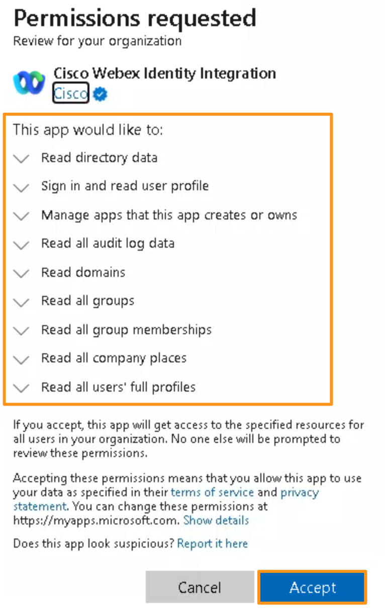

9.  It will create the instance/integration with Microsoft tenant. It will take around 2 to 3 minutes for the process to complete.

10. Once the integration process is completed, Job status will be displayed **NotRun**.

    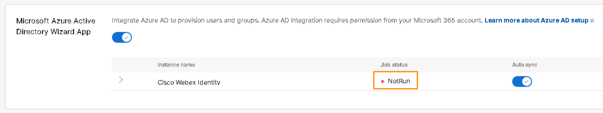

11. Within few min the Job status would change to **Active.** Wait until the job status is changed to **Active**. You need to refresh the page to see the updated status. At this point all users from your Microsoft tenant should be imported to Webex under **MANAGEMENT** \> **Users**. Notice few users with status **Verified** indicating they are imported from a trusted source (in this case the Microsoft tenant that we are integrating with).

12. Now go back to **MANAGEMENT** \> **Organization Settings** and scroll down to the **Microsoft Azure Active Directory Wizar App** section. Click the three dots on the right side and select **Edit Configuration**.

    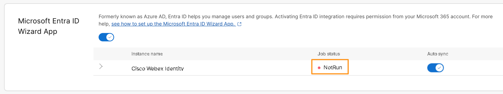

13. It will bring up the Microsoft Azure AD integration page, go to the **More** tab. Select the checkbox option for **Activate single sign-on** and click **Save**.

    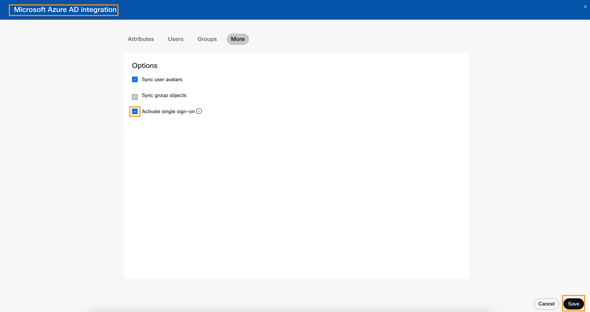

14. You have now successfully enabled single sign-on for your Webex tenant. From now on, all logins to this Webex tenant will be redirected to Microsoft for authentication & you will use <cholland@cbXXX.dc-YY.com> & dCloud123! for logging into Webex Control Hub.

15. This completes the SSO configuration!.

## Module 2b: Ordering PSTN Numbers for users \[Approx 10 min\]

For Webex Calling, the DID numbers and call control is controlled by Webex Cloud. We need to order 4 new DID numbers for calling scenarios in this module.

1.  Continuing on workstation 5, go back to the browser where you logged into **Cisco Webex Control Hub**. Login as <cholland@cbXXX.dc-YY.com> & dCloud123!, if the previous login is timed out.

2.  Go to **SERVICES** \> **Calling**. Click **+ Add Numbers**.

    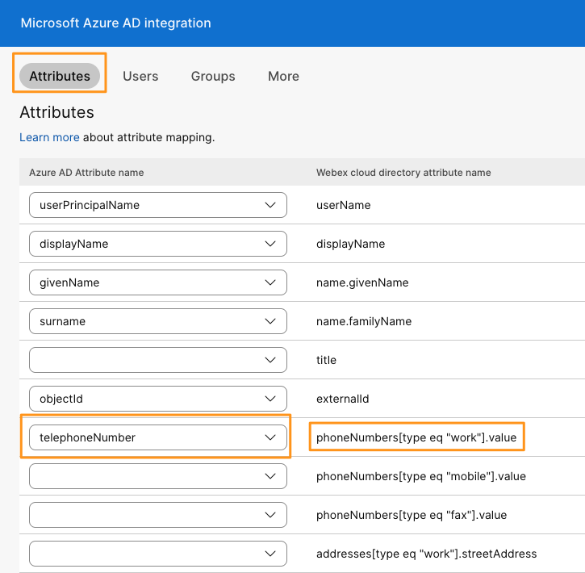

3.  On the **Add Numbers** page, drop down the option for Location and choose **dCloud.** Since we are setting up this location for the first time, first we need to select the PSTN Connection for this location. Click **Edit** **PSTN**.

    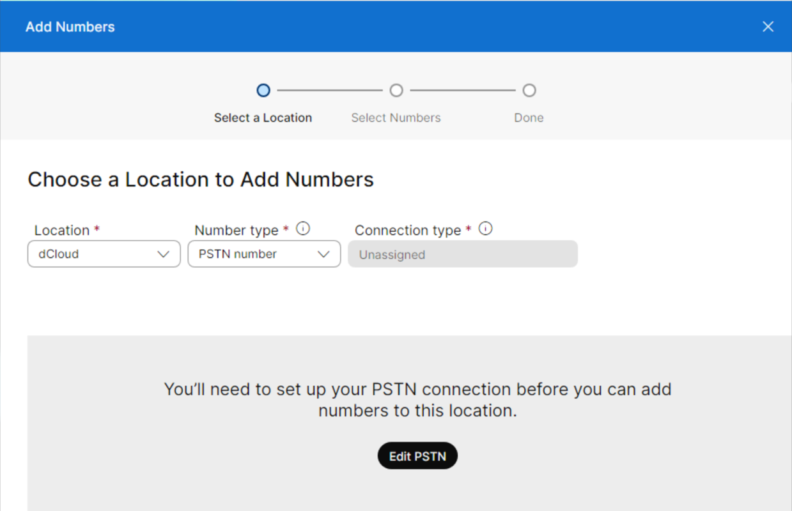

4.  You will be taken to **Edit PSTN connection for dCloud** (Location) and under the connection type choose **Cisco Calling Plans** and click **Next**.

    > **NOTE:** *If you do not see the option Cisco Calling Plans, close the page and repeat steps 2 through*

    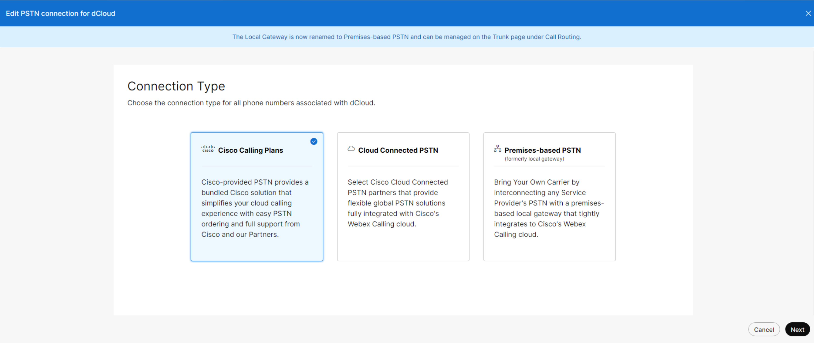

5.  Enter the following information & leave rest of the fields blank and click **Next**.

    | **Parameter**                       | **Value**                        |
    | ----------------------------------- | -------------------------------- |
    | First Name                          | Charles                          |
    | Last Name                           | Holland                          |
    | Email Address & Confirm Email Address | cholland@cbXXX.dc-YY.com         |

    > **NOTE:** *You need replace domain with the domain assigned for your session (from Lab_info.txt file)*.

    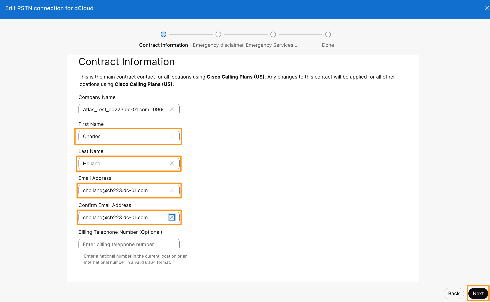

6.  On the pop up window click **Yes, Change**.

7.  Under the **Emergency disclaimer**, read & scroll the disclaimer information all the way down. Enter Authorized Contact as **Charles Holland** and title as **Engineer** & Click **Agree and Continue**.

    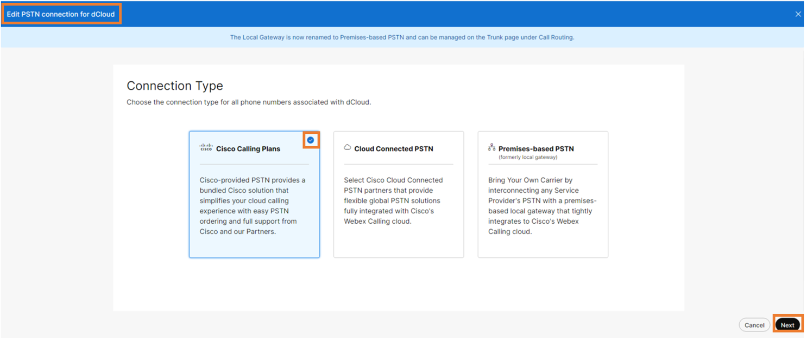

8.  Under **Emergency Services Address**, leave everything default and click **Save**.

9.  It will save all the information for PSTN connection we entered and take you summary page. On the following page, click **Add numbers.**

    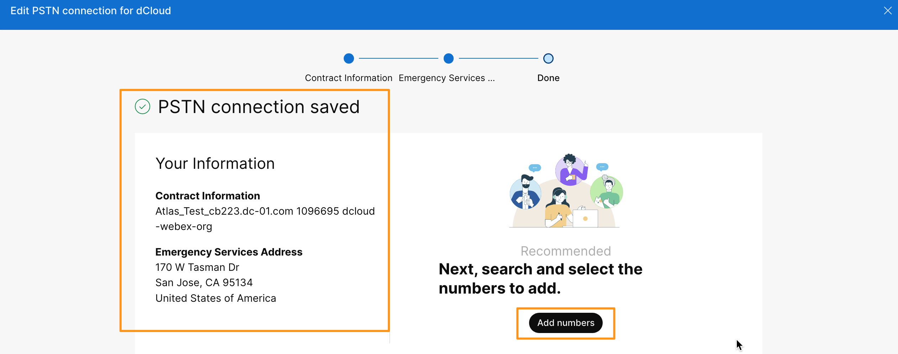

10. On the **Add Numbers** page, make sure location is selected as **dCloud** and the number type is selected as **PSTN number**. Keep the option **Order New Numbers** is selected and click **Next.**

    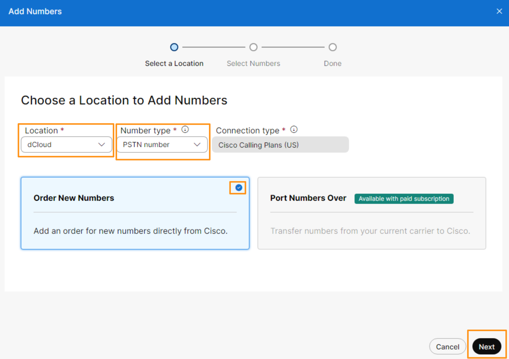

11. On the **Specify numbers you want to order page**, drop down the option for **State/Province/Region** and choose any of the available states in United States (In this lab we support Cisco PSTN **ONLY** for **United States**).

12. Keep the search by option as **Area Code** and drop down the option for **Area Code** & choose any of area code of your choice. For **How may numbers do you want auto-selected for you?** Enter **5** and click **Search.**

    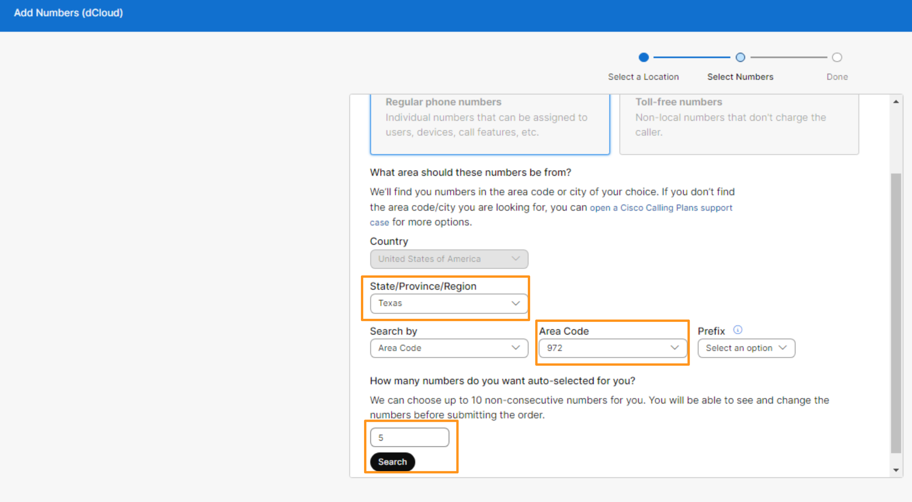

13. On the next page, it will show you list of available number in that area code that you specified above. It will auto select four numbers. If you like any specific number from list that is not auto selected, you can unselect one of the auto selected number and select that number you like. For now, just keep the auto selected numbers as is and click **Order**.

    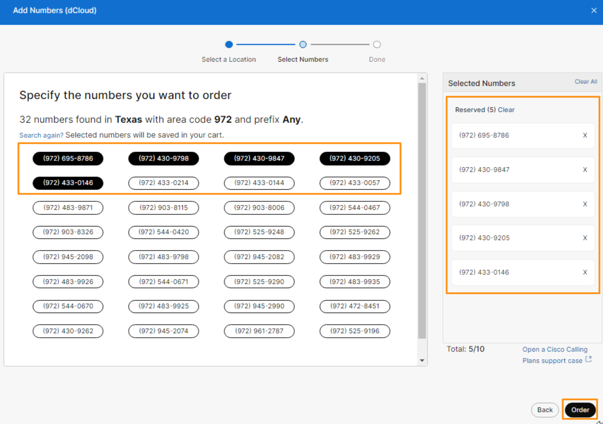

14. Order will be submitted for these numbers. On the following page, click **View orders**. The status will read **Pending** then change to **Provisioned** in few seconds. You may need to refresh the page to see the correct/accurate state or select the order to view the slide out window.

15. Click on the order you placed (Order ID) \> Phone Numbers to verify all phone numbers are provisioned.

    

Webex will not let incoming or outgoing PSTN calls until a **Main phone number** is assigned to the location. So first we need to assign one of these number to the location.

16. On **Webex Control Hub page** Navigate to **MANAGEMENT** \> **Locations**.

17. On the locations page select the existing location **dCloud**

18. On the **dCloud** location page, go to **Calling** tab

19. Observe, under Main number drop down option, there is a warning saying **You will not be able to make or receive calls until this number is added**.

20. Drop down the Mian number option and choose one of the numbers we ordered above and click **Save**.

    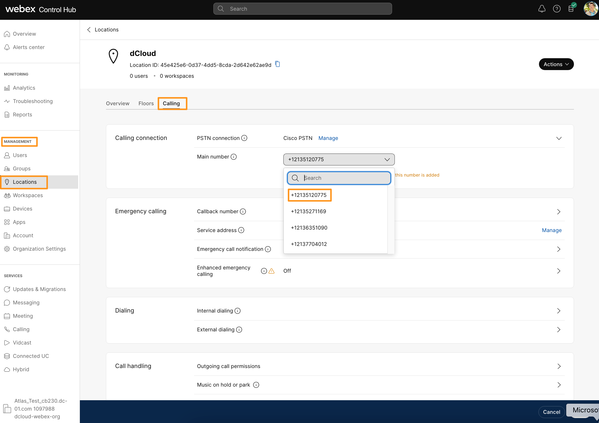

21. Observe that as soon as main number is assigned to location, the warning will be gone. Indicating now you will be able to make and receive calls from this location.

## Module 2c: Configure users for Microsoft Presence Sync, Webex Calling licenses & Publish the Webex Calling app on Microsoft tenant. \[Approx 15 min\]

In this section of lab we will use **Kellie Melby** and **Taylor Bard** users. So, lets enable presence (with Microsoft) and assign Calling Licenses for both users on Webex Control Hub

1.  Continuing on Workstation 5, go to the browser tab where you had the **Webex Control Hub** open.

2.  We can enable **Presence Sync** either for whole organization or individual users. In this section we will enable for whole organization.

3.  On the Control Hub, go to **SERVICES** \> **Calling**. On the Calling page to **Client Settings** tab.

4.  Scroll down on the Client Settings page to Microsoft Teams Integration section and toggle the radio button **Presence Sync** & **Hide Webex windows**. If the option **Set Microsoft Teams as the default app for calling dock** is checked, uncheck it for now. We will explore this option later

    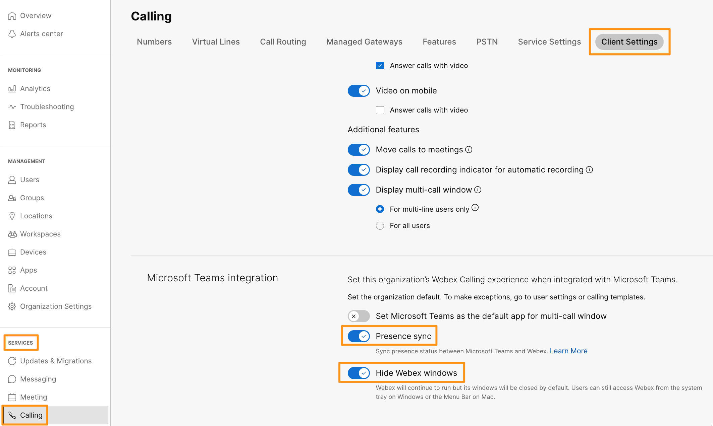

5.  Now, let's assign Webex Calling license for users, go to **MANAGEMENT** \> **Users** and choose **Kellie Melby** from the list**.**

6.  Scroll down on the summary page, click **Edit Licenses**

    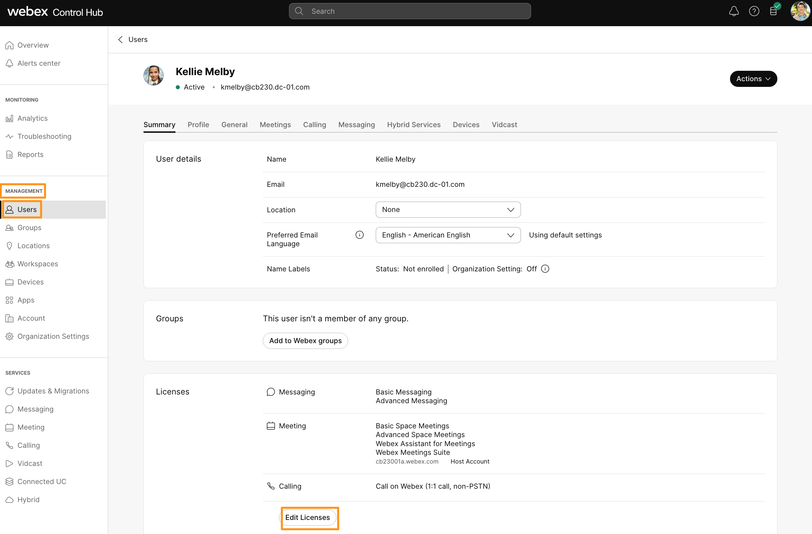

7.  On the **Edit services for <kmelby@cbXXX.dc-YY.com>** page, click **Edit Licenses** again.

8.  On the next page go to **Calling tab**. Check mark both options for **Webex Calling** & **Professional**. Click **Save**.

    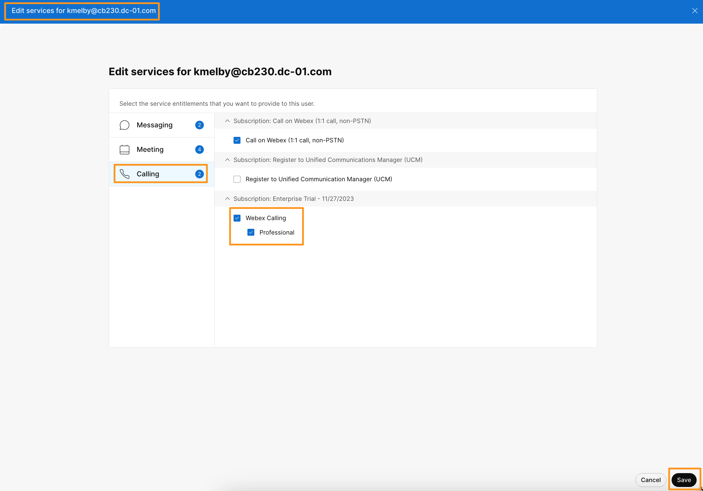

9.  On the next page, drop down the option for location and choose **dCloud** & drop down the option for **Phone Number** and choose one of the available numbers (that we ordered in above section). Make sure you select a number other than the number you assigned to location **Main Number**. Click **Save**. Click **Close**.

    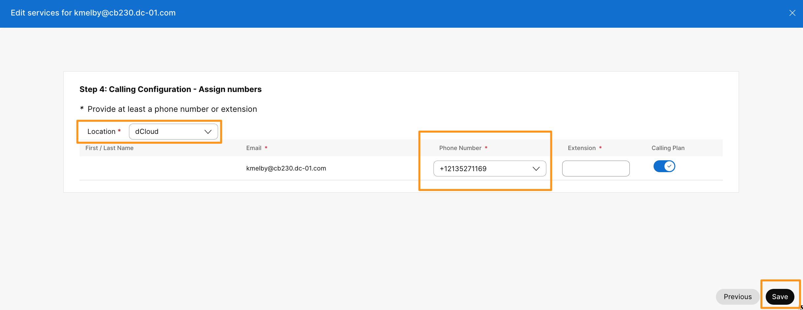

    > **NOTE**: *Take note of the phone number being assigned to Kellie and Taylor, we will add this number to contact information on Microsoft in the following steps.*

10. Go back to **MANAGEMENT** \> **Users** again and on users page choose <tbard@cbXXX.dc-YY.com> & repeat steps 5 through 9.

    > **NOTE**: *Once both users are assigned the licenses and phone numbers. Let's add these newly phone numbers to user contacts on Microsoft, users can use click to dial feature in Microsoft Teams.*

11. Continuing on Workstation 5, open a new browser tab and from home page go to **Collaboration Admin Links** \> **Microsoft Admin Center** or directly open Admin Center at <https://admin.microsoft.com>. Login with credentials <cholland@cbXXX.dc-YY.com> & dCloud123!

12. Once logged in go to **Users** \> **Active Users** on left side pane

13. On the active users page select **Kellie Melby**. It will bring up fly-out window for user configuration window. On the fly-out window, scroll a little down and click **Manage contact information**.

14. On the **Manage contact information** page, scroll down and find **Office phone** & enter the same phone number you assigned to Kellie on Webex. Enter the phone number in E.164 format, Example: +19725556038. Click **Save changes**. Click **Close** \[x\] to close out the fly-out window.

    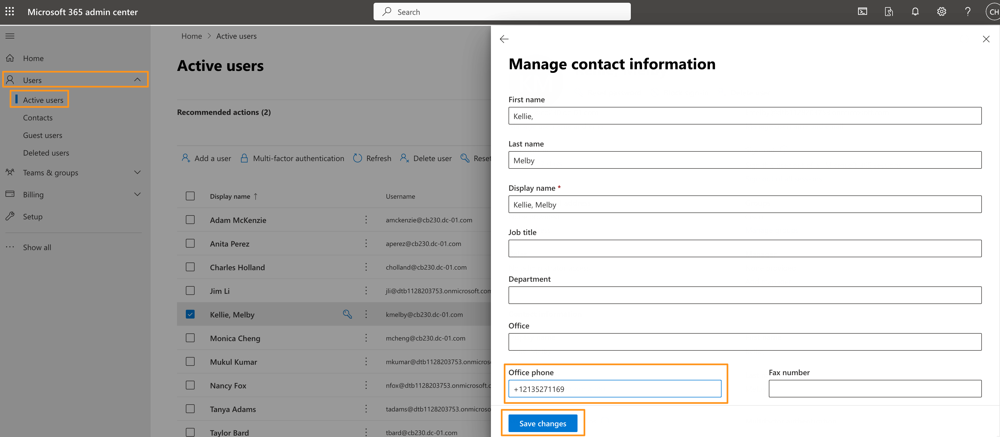

15. Similarly assign the number to **Taylor Bard** (same phone number you assigned to Taylor on Webex, remember to enter the phone number in E.164 format. Example +19725556023).

    > **NOTE**: *Sometimes Microsoft takes long time to update contact information and would not be able to find on Microsoft teams. This is not limitation of the lab or Webex it's just Microsoft Cloud taking longer time to update contact information.*

    Now let's publish and authorize the **Webex Calling app** for whole Microsoft Organization. So, each user is not prompted for authorization. Also, we will disable Microsoft Native calling option so users would not get confused between Microsoft Native calling and Webex Calling.

16. Continuing on Microsoft admin center, on left side page, click **Show all** to see all admin centers. Under **Admin centers** select **Teams**.

    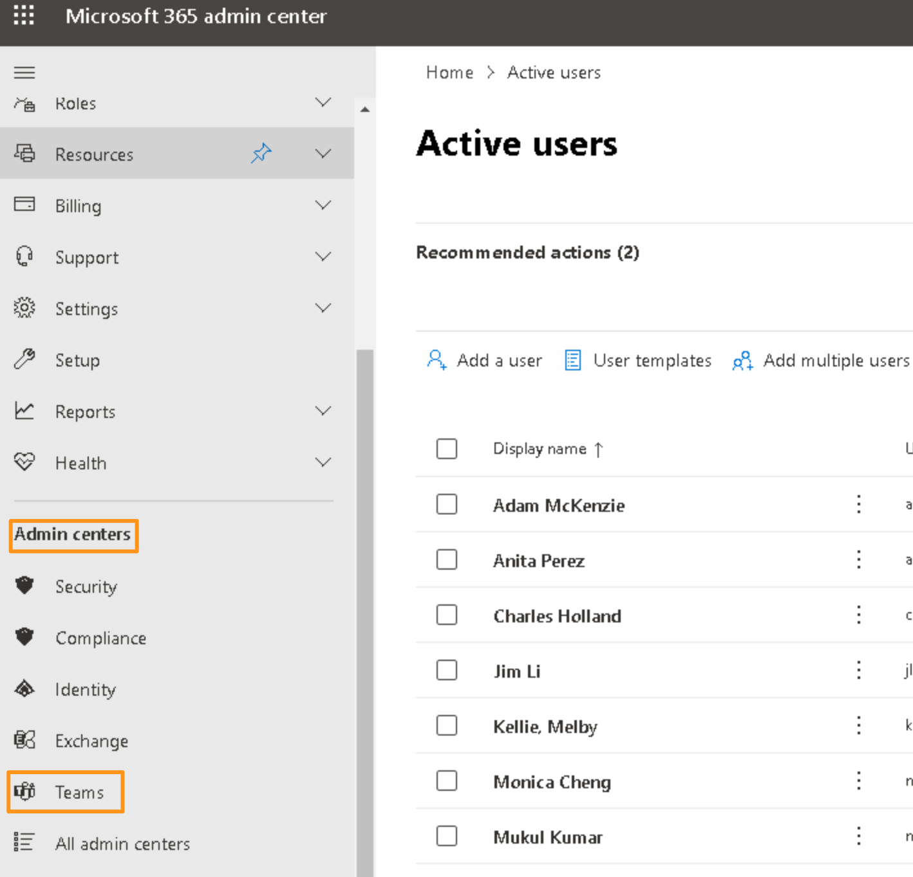

17. It will open **Microsoft Teams admin center** in a new tab. Once the Teams Admin center is opened go to **Voice** \> **Calling policies**. On the Calling policies page select **Global (Org-wide default).**

18. On the **Global (Org-wide default)** policy page toggle **off** the option for **Make private calls** and click **Save**. Click **Confirm** on the pop-up window.

    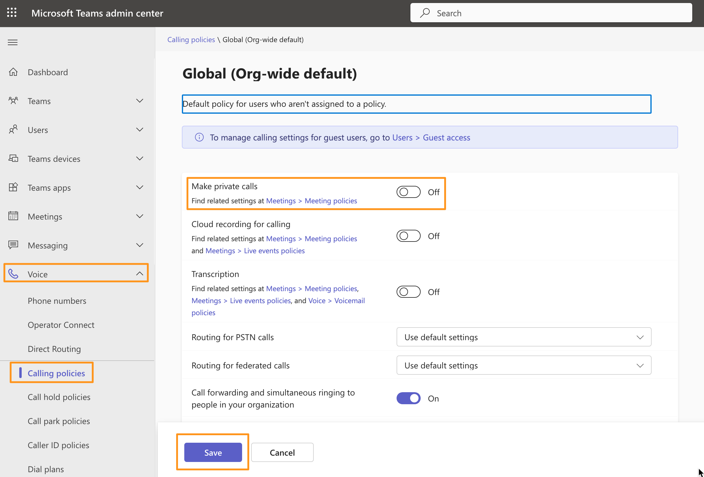

19. Finally lets publish the Webex Calling app for organization so that each user would not need to request admin authorization. Continuing on Teams admin center, on left side page go to **Teams apps** \> **Manage apps**

20. On the Manage apps page, towards right search for **Webex Calling**. Select the **Webex Calling** app that is listed.

    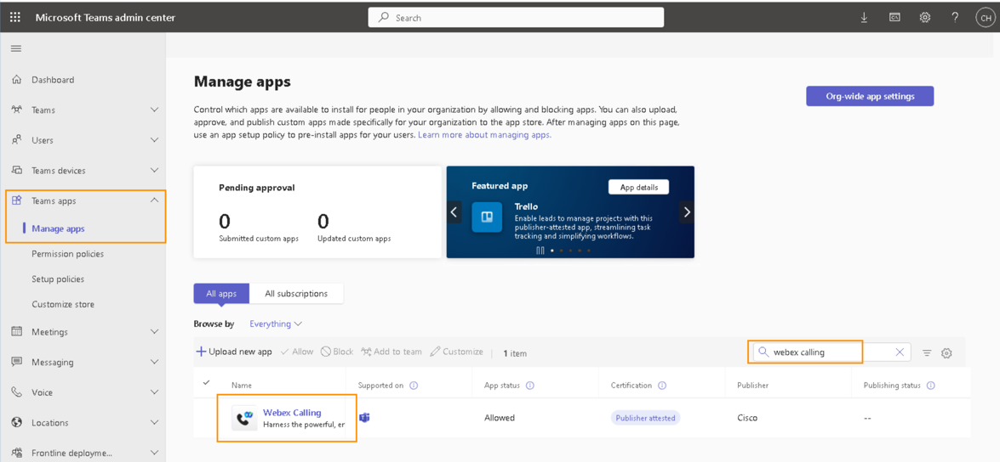

21. On the Webex Calling app page, go to **Permissions tab**. Under permissions tab click **Grant admin consent**. It will bring up a pop-up window to authorize as admin. Login as <cholland@cbXXX.dc-YY.com> & dCloud123!. It will prompt you to accept some permissions. Click **Accept**.

    

    

22. Now any user in the organization can go to Apps on **Microsoft Teams** and add **Webex Calling** app from store.

    > **NOTE**: As *Organization admin, you can also install/publish this app for all users. If you want to publish the app for all users, go to **Teams apps** \> **Setup policies** and update **Global (Org-wide default)** to have **Webex Calling** app.*

    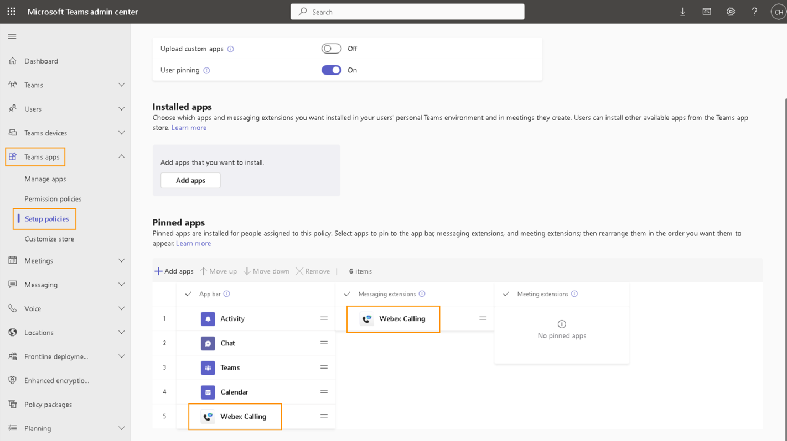

23. Now Microsoft and Webex tenants & users are ready for use.

## Module 2d: Testing the calls for Microsoft Integration with Webex (Webex Calling) \[Approx 60 min\]

In this module we will make some test calls to internal, PSTN & also configure multiple, watch list and Call Queues. This module consists of total 8 testing scenarios that are described below.

### Logging into Clients \[Approx 10 min\]

1.  Continuing on Workstation 5, open Webex on Desktop. Login as <kmelby@cbXXX.dc-YY.com> & password dCloud123!. You will be redirected to Microsoft website for authentication as SSO has been configured.

2.  Once logged in, there would be a **Webex Emergency Calling Notification**, click **OK**.

    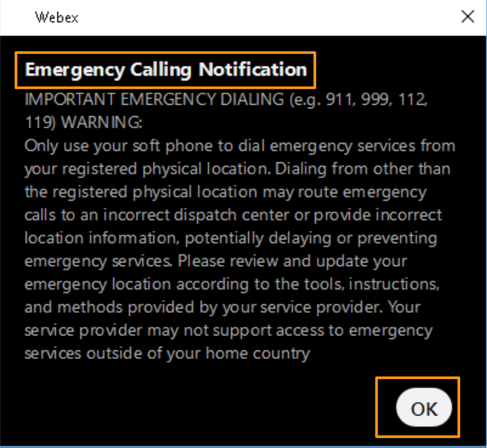

3.  By default Webex will be minimized, to bring it up go to bottom right corner (where you see the time) and click Up Arrow and select Webex from the available applications.

    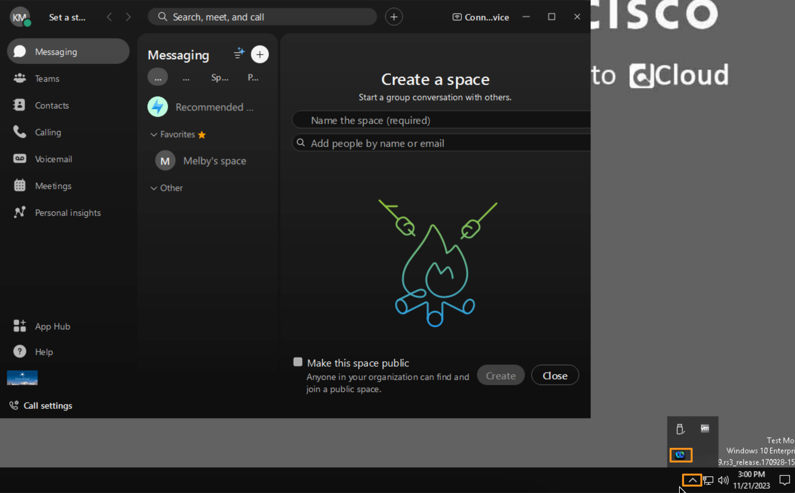

4.  On the Webex bottom left corner click **Call** **settings** \> **Open Call Preferences.** It will bring up Webex **settings** page go to **Phone Service** & make sure Phone service is connected.

    > **NOTE**: *If you do not see **Call settings** option quit (Click on profile picture and select Exit) the Webex and relaunch.*

    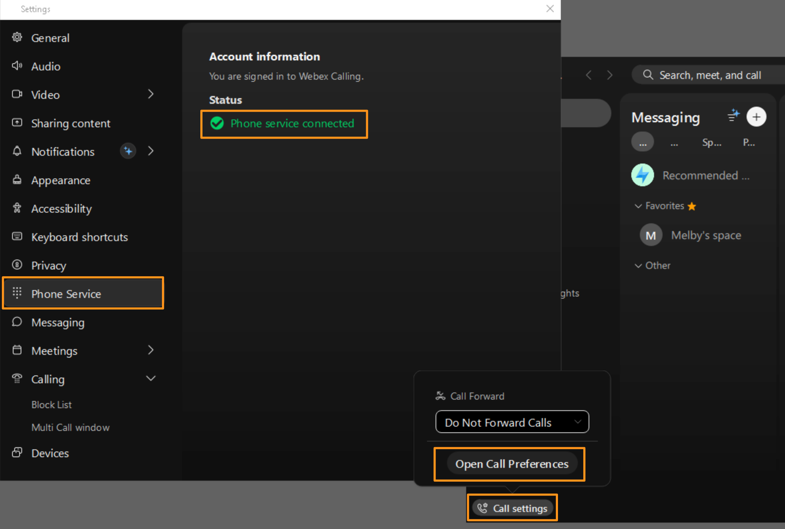

5.  Now, open Microsoft Teams from desktop and login with same credentials that you logged into Webex (<kmelby@cbXXX.dc-YY.com> & dCloud123!). Click **OK**. Click **Done**.

    > **NOTE**: *DO NOT click **No, sign into this app only**.*

    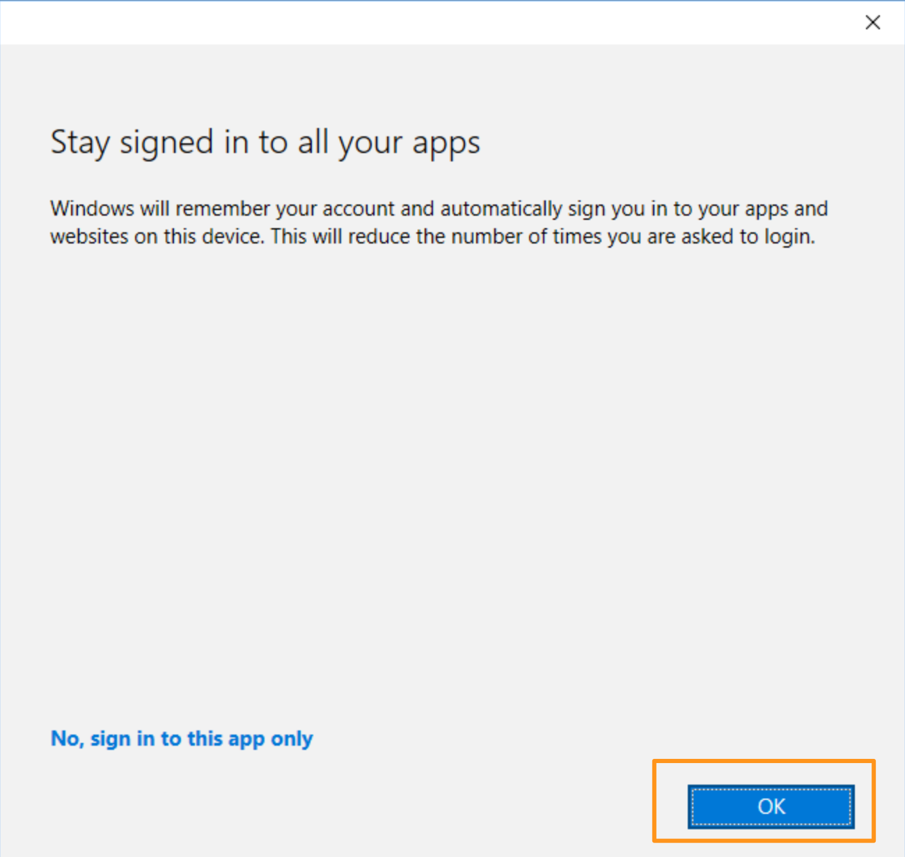

6.  Accept any information/warning messages while logging in. Once logged in click eclipse icon (three dots) on the left side pane. On the new fly-out window search for **Webex Calling**. It will list the Webex Calling app. Click **Add**.

    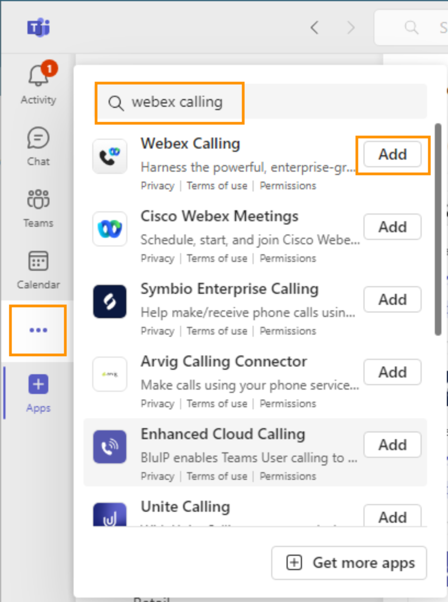

7.  It will add **Webex Calling app** to Microsoft teams and take you to login screen. Click **Continue.**

    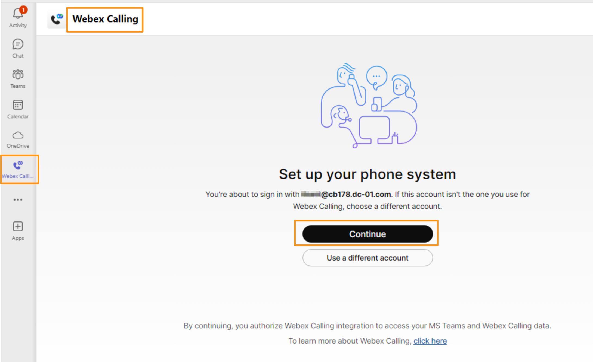

8.  You will be signed into **Webex Calling** on Microsoft Teams.

9.  Finally right click on **Webex Calling app** on left side page and click **Pin**. So it will be always visible for easier access. If you have published Webex Calling app for entire organization under setup policies on Microsoft Teams Admin center, you will see the Webex Calling app pinned already.

    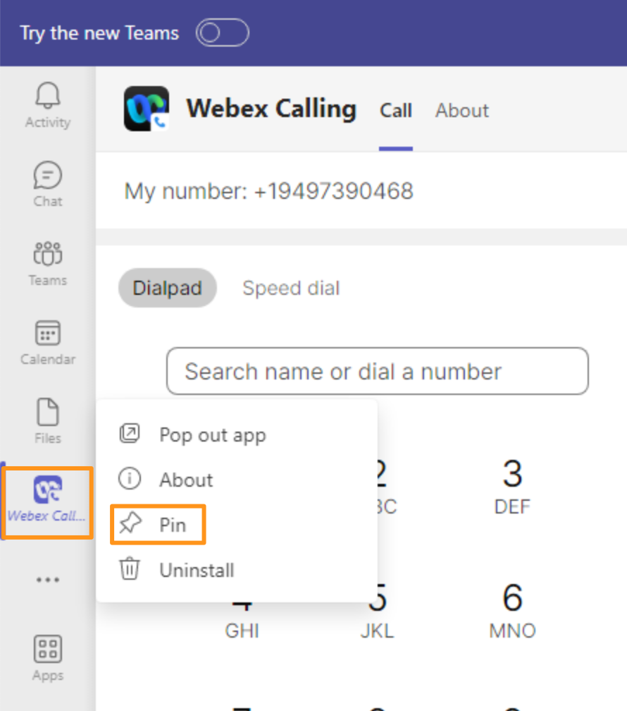

    > **NOTE**: *If you do not see the Webex Calling app on left side, click on the three dots on the left side pane again & right click on the Webex Calling app and select **Pin** so the application always displays on left side pane for easier access.*

    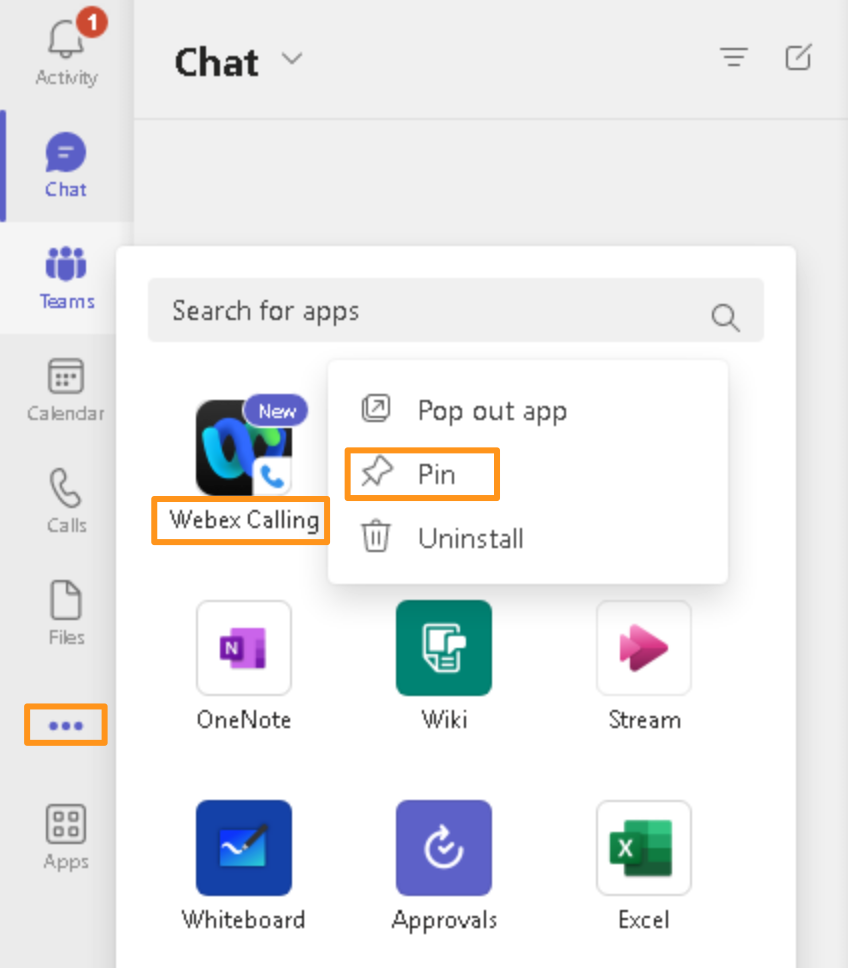

10. Now both of your clients are on workstation 5 are ready for use.

11. Open RDP connection to Workstation 6 using one of the methods described in **Accessing your Lab** module above. Repeat the steps above (1 through 11) on Workstation 6 and login to both clients Webex & Microsoft Teams. Use the credentials <tbard@cbXXX.dc-YY.com> & dCloud123!

### Module 2d.1: **Calling Scenarios 1 of 8** -- Making an internal call \[Approx 5 min\]

> **NOTE**: *Make sure you are logged in to both clients on both workstations 5 and 6 before continuing*. Similarly you can dial any PSTN number in E.164 format (+1AAABBBCCCC).

1.  Continuing on workstation 5 as **Kellie Melby**, go to **Webex Calling app** on Microsoft Teams (On left side pane) & Search for **Taylor Bard** (right above dial pad)

2.  It will search the directory for **Taylor Bard** and display options to call (either phone number or email) using either **Audio** or **Video**. Click on any of the options to place the call.

    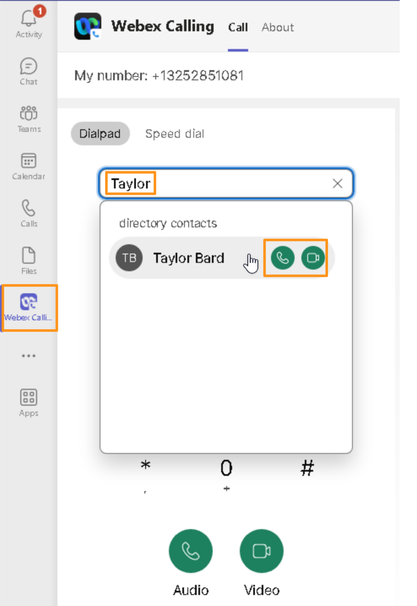

3.  Answer the call on workstation 6 (as **Taylor Bard**). Verify that call gets connected. Wait for few seconds and hang up the call. Also verify the call status reflects as shown below.

    > **NOTE**: *You will not be able to hear audio in either direction as we are using virtual workstations and microphone is not available.*

    > **NOTE**: *If you do not see the correct status, try to bring the Microsoft Teams into foreground or initiate a chat conversation between **Kellie** and **Taylor**.*

    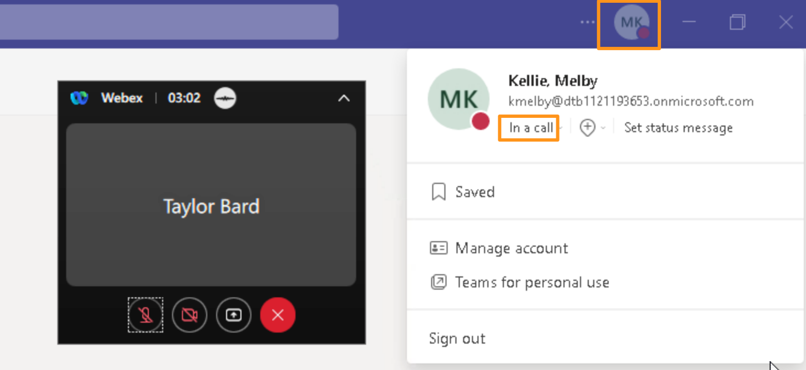

4.  As soon as the call is hung up, verify that Kellie's availability status changes to **Available**.

    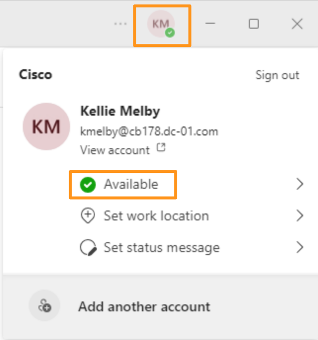

5.  You will see the up to date call history is synchronized/reflected to Webex Calling app on Microsoft Teams. To verify the call history go to **Webex Calling app** \> **Recent Calls** as shown below.

    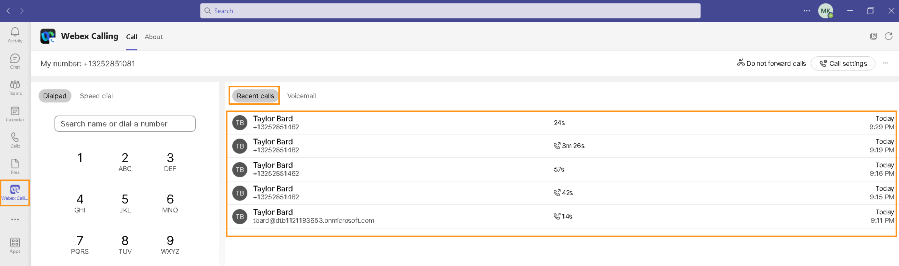

6.  Similarly you can dial any PSTN number in E.164 format (+1AAABBBCCCC). Or you can dial the Cisco support number +**18005532447**

### Module 2d.2: **Calling Scenarios 2 of 8** -- making calls from Microsoft Teams chat window \[Approx 5 min\]

1.  Continuing on Workstation 5, go to **Microsoft Teams app** and go to **Chat** on left side page. On the top search window search for **Taylor Bard**.

    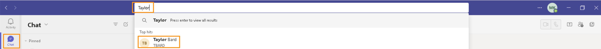

2.  Initiate a chat conversation with **Taylor** **Bard** and send few messages back and forth.

3.  Click on the + sign towards right side of typing window for chat and select Webex Calling from available options.

    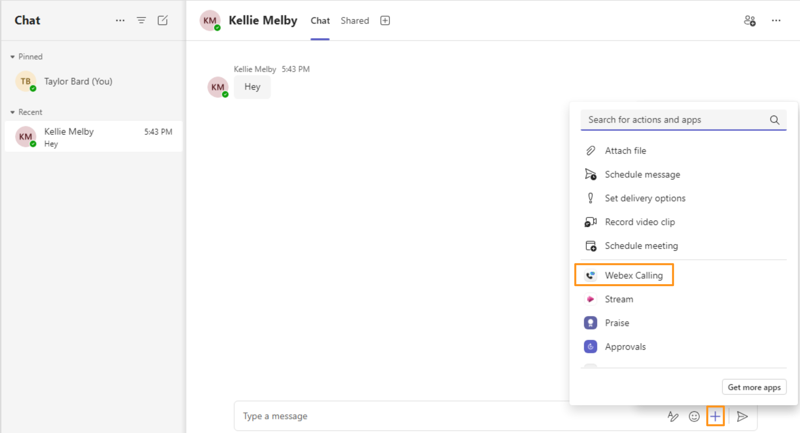

4.  It will bring up available calling options for **Taylor Bard**. Choose either Phone number or Email Address from the drop down option. Then choose either **Audio** or **Video** option to make the call.

    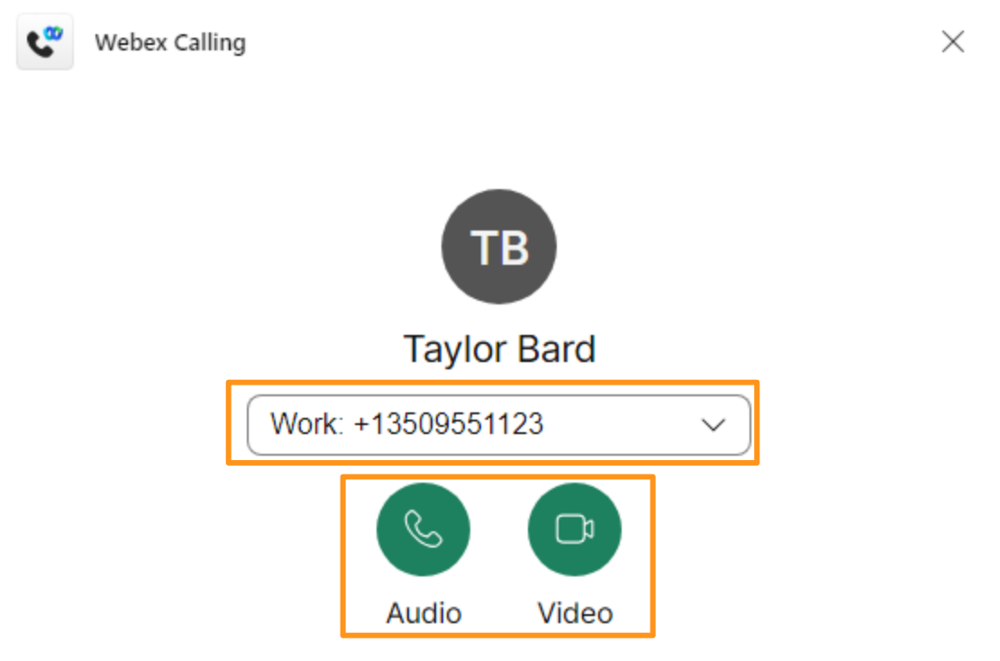

5.  Answer the call on Workstation 6, verify that call is connected and presence status is updated to show that Taylor (and Kellie) **In a call**. Hang up the call after few seconds.

    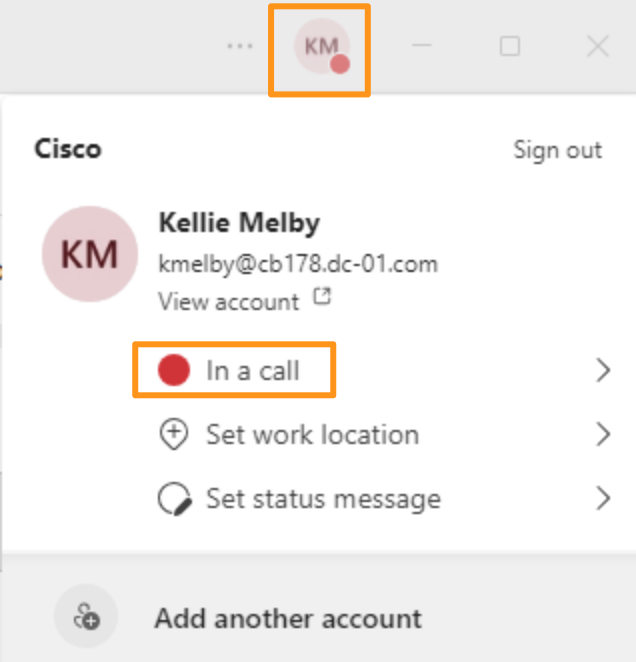

### Module 2d.3: **Calling Scenarios 3 of 8** - Pushing Do Not Disturb (DND) status from Microsoft \[Approx 5 min\]

Presence sync is supported between Microsoft Teams and Webex for the following status:

When being on DND on **Microsoft Teams**, we want to avoid receiving calls. As these calls come on Webex, it is important to push the DND status from **Microsoft Teams** to **Webex**.

When you enable/set **Do Not Disturb** status on **Microsoft Teams** the status is automatically synchronized to **Webex**. Please note that the first time you configure the integration, Microsoft might take up to 40 minutes to sync the presence status to Webex.

1.  Continuing on Workstation 5, go to **Microsoft Teams**. Click on the profile picture & drop down option for availability and choose **Do not disturb**.

    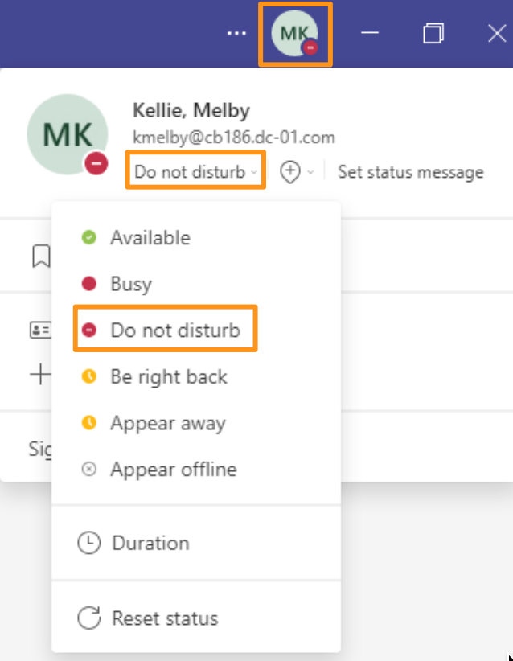

2.  Verify that user status on **Webex** is also updated to **Do Not Disturb**.

    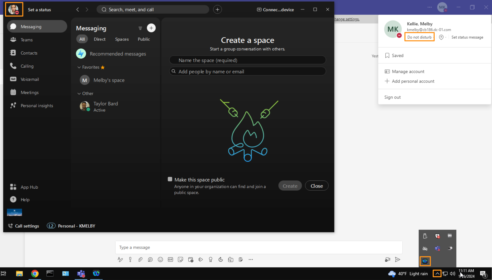

3.  To clear the status, go to Microsoft Teams & click on the profile picture again and choose **Reset status**.

    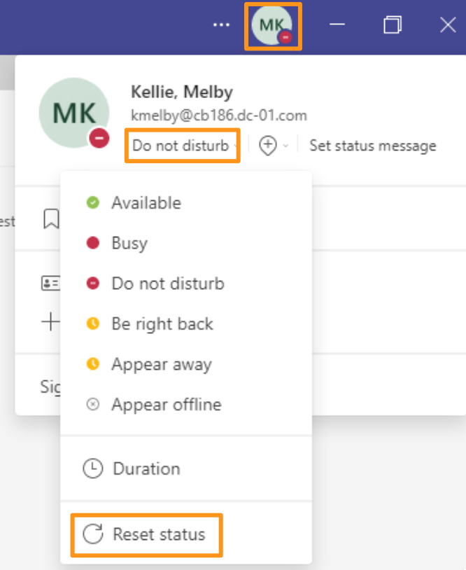

### Module 2d.4: **Calling Scenarios 4 of 8** -- Multi-Line \[Approx 5 min\]

You can set up a profile with multiple lines with different phone numbers for calling. You can switch lines if you need to make outgoing calls from different lines, such as a front desk line, support team line, or an individual line with a different caller ID.

1.  Continuing on Workstation 5, go back to the browser tab where you logged into to **Webex Control Hub** go to **SERVICES** \> **Calling** & on the Calling page go to **Virtual Lines.** Click **Create**.

    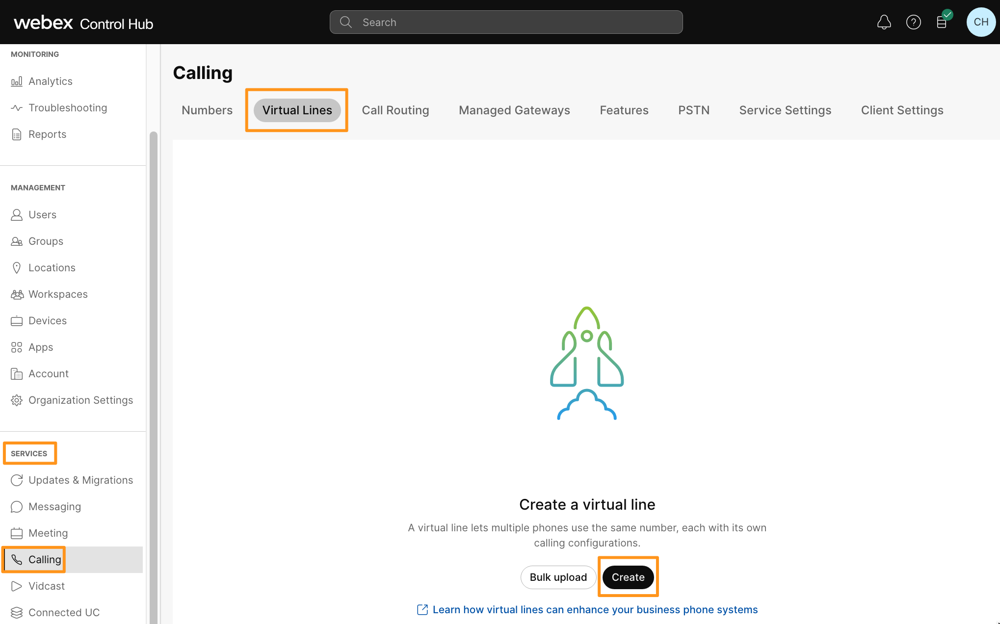

2.  On the **Add virtual line** page, populate the following and click **Add**.

    | **Parameter Name** | **Value** |
    | ------------------ | --------- |
    | First name         | Kellie    |
    | Last name          | Melby     |
    | Display Name       | Kellie Melby -- Personal |
    | Location           | Drop down and choose **dCloud** |
    | Phone Number       | Drop down and choose the number other than what we assigned to Main number and users Kellie and Taylor. |

    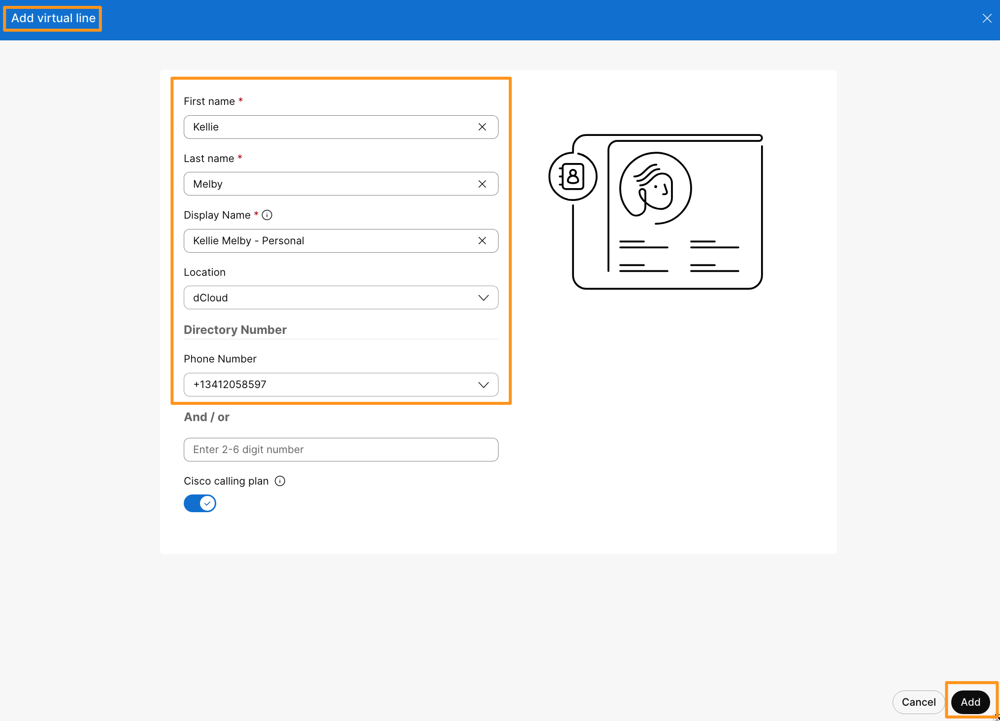

3.  It will add the Virtual Line and take you to next page with couple of options. We need to assign this line to **Kellie**, so on the next page choose **Assign**.

    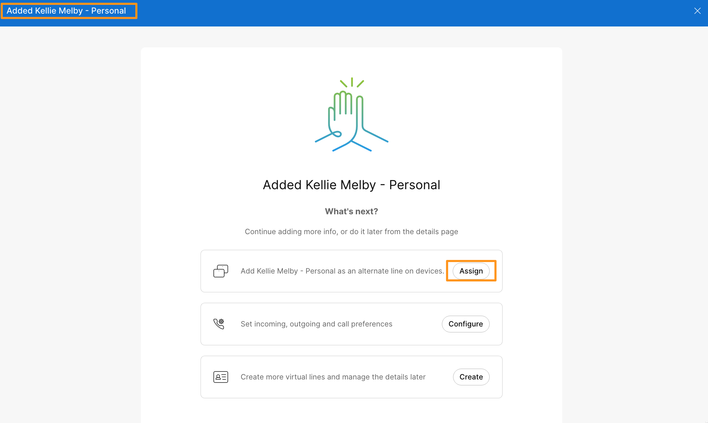

4.  It will take you to available devices, drop down the option for **Assign device** & again drop down option for **Select device** and from the available options choose **Kellie, Melby. Webex App.dCloud.+1XXXXX** as shown below. Click **Assign**

    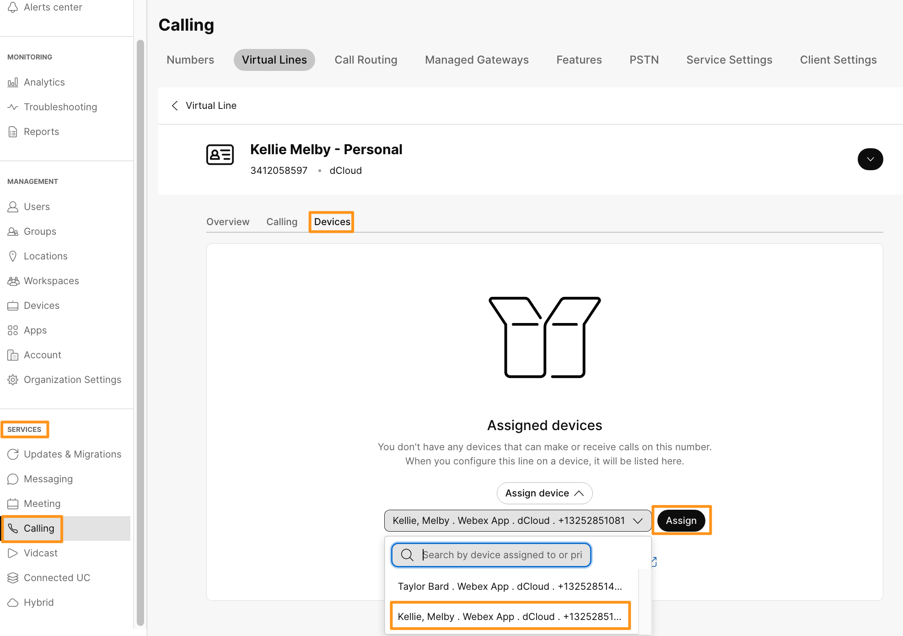

5.  On the next page, for **Line Label** give a name like **Personal Line** or something descriptive of your choice. Click **Save**.

    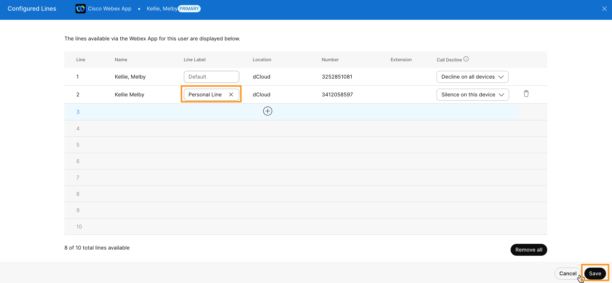

6.  Now Webex will have two lines configured. If you do not see the second line yet, just quit (Click on Profile picture & select **Exit Webex**) & reopen Webex from desktop.

7.  Once you bring up Webex (it may be minimized by default, click up arrow on bottom right corner and choose Webex app), you will now have two Lines configured. On the Webex go to left bottom corner and select the **secondary line** (Personal Line that you added above) to make out bound calls.

    > **NOTE**: *If you see an additional window (Calling dock) just press **Ctrl + Shift + x** to close it. We will explore Calling dock in later sections.*

    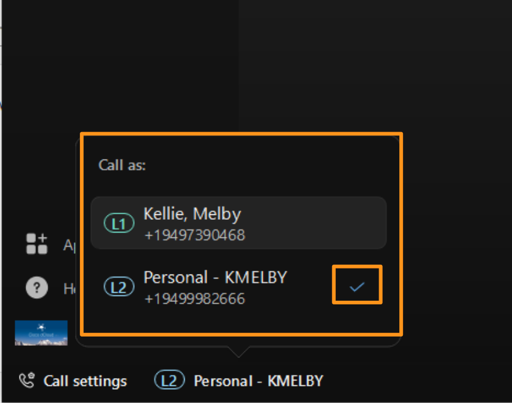

8.  Now, go to **Microsoft teams** \> **Webex Calling app**. Call **Taylor Bard** either using phone number or email address. Answer the Call on workstation 6. Verify that call gets connected. Also on workstation 5, observe that the call is made from Line 2 (**Personal Line**) of Kellie Melby.

    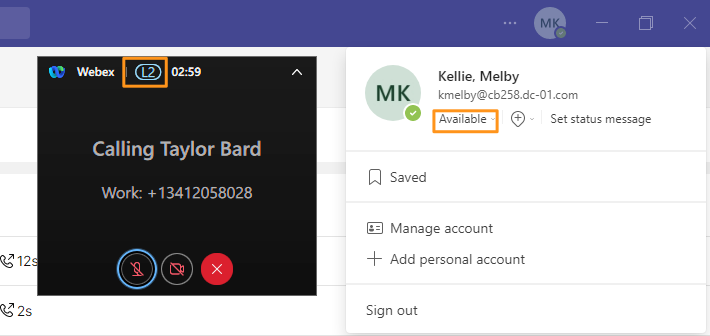

    > **NOTE**: *Call Presence status is currently not supported on secondary line.*

9.  Hangup the call after few seconds. On workstation 5, go to Webex and click on lines (towards bottom left corner) and choose the **primary line** (L1 Kellie, Melby) .

    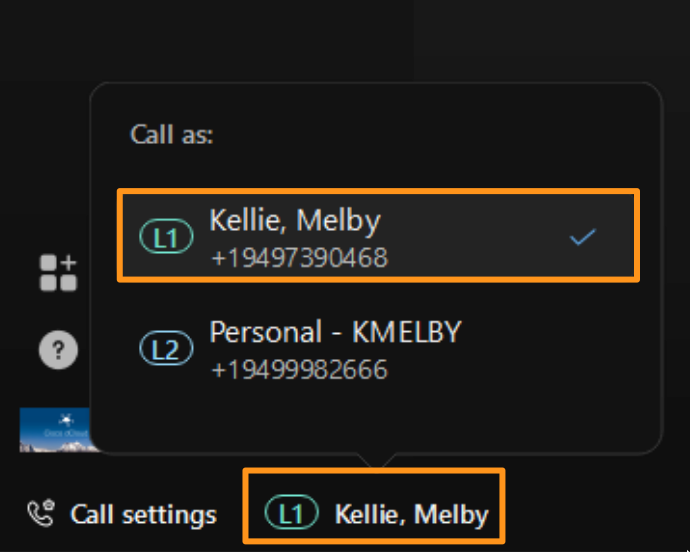

    > **NOTE**: *Make sure you switch to primary line before continuing to next module.*

### Module 2d.5: **Calling Scenarios 5 of 8** -- Calling Dock \[Approx 5 min\]

The Webex Calling Dock (formerly multi call window) is a user enabled setting to maximize calls for multiple lines and manage calls effectively. It can act as a companion app for Microsoft Teams. Also helps to hide the Webex app during calls.

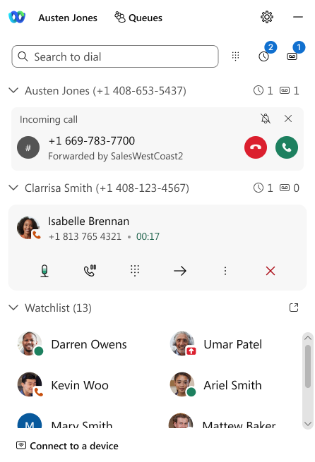

1.  Continuing on Workstation 5, on Microsoft Teams go to **Webex Calling** app on left side pane. On the Webex Calling window click **Call settings** (towards top right corner of the app)**.**

2.  It will bring up **Settings** pop-up window. On the **Settings** pop-up window go to **Calling** \> **Calling dock**. Check mark for both options **Turn on Calling dock** & Use **Ctrl+Shift+X** **to to toggle Calling dock on or off**. **Uncheck** the option for **Keep Calling dock in front**. Click **Save**.

    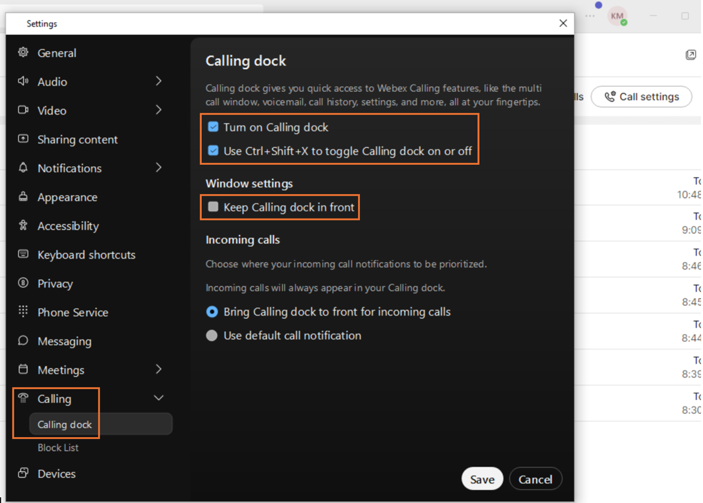

3.  Notice that Webex will bring a small call window (called as Calling Dock) as shown below. You can close the main call window & use this Calling dock for any calling functions like, making call, answering call, recent calls, dial pad and accessing voicemail etc.,

    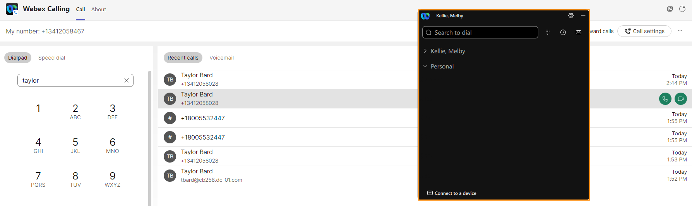

4.  Drag and drop the Calling Dock to the right side of the screen to notice it minimizes itself (docking feature).

    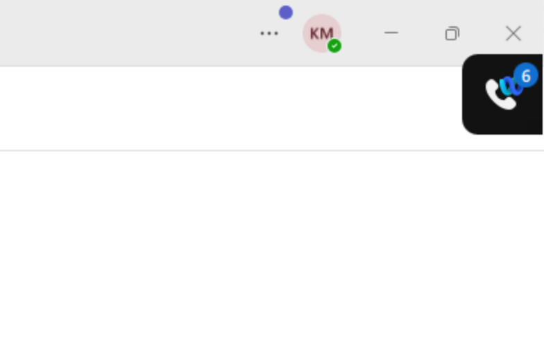

5.  Hover your mouse over the new dock icon on the right to see the Calling Dock without keeping it open. Click on the dock to maximize the Calling Dock again.

    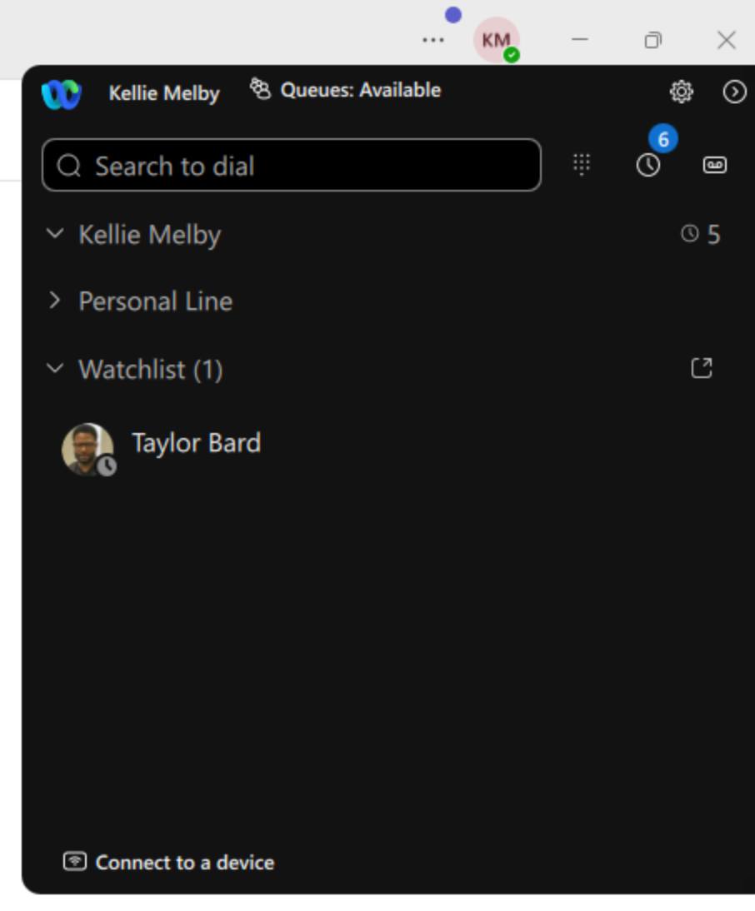

    These are the current supported features:

    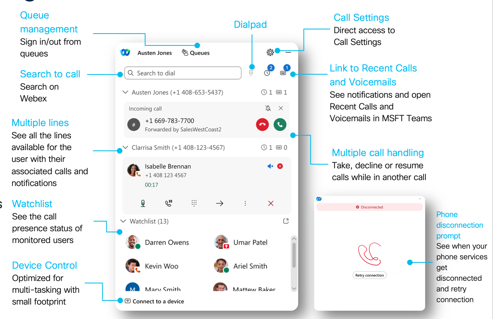

6.  On Workstation 5, Go to **Microsoft Teams** \> **Webex Calling app** and call **Taylor Bard** either using phone number or email address**.** Answer the call on workstation 6 (as **Taylor**). Verify that call is connected.

7.  Swith back to workstation 5 and observe that the Calling Dock reflects the current call, its status, option for dial pad, transfer, hold etc., Also, observe that presence status is reflected correctly (**In a call**) with the Webex Calling Dock. Hang up the call after few seconds.

    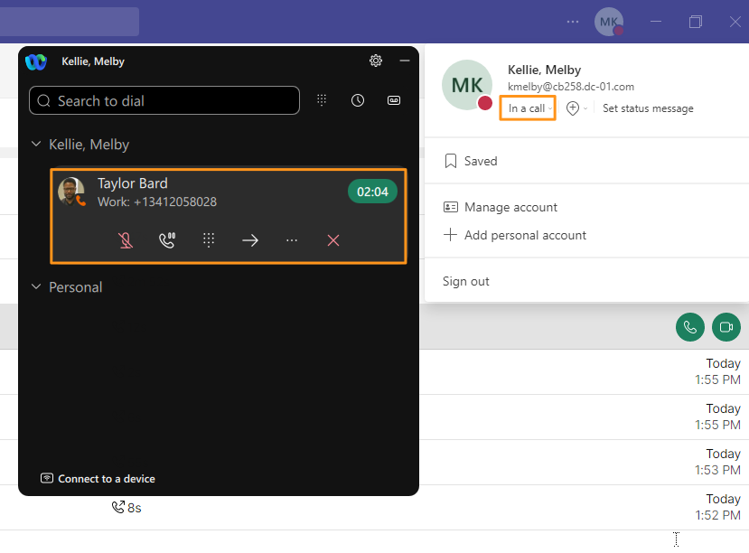

### Module 2d.6: **Calling Scenarios 6 of 8** - Set Microsoft Teams as default app from Webex Calling Dock \[Approx 5 min\]

**Microsoft Teams as the default App for Calling Dock**

The Webex Calling Dock is normally linked to the Webex App. This means that, when clicking on "Call History" or "Voicemail" notifications, they will take us to the Webex App. There is an option to make Microsoft Teams the default App for the Calling Dock. When enabling this, if we click on "Call History" on the Calling Dock it will take us now to the Microsoft Teams client where Call History for Webex Calling is located.

1.  Continuing on Workstation 5, go back to browser tab where you logged into **Webex Control Hub**. On the Control Hub, go to **MANAGEMENT** \> **Users**, choose user **Kellie Melby.** On user page, go to **Calling** tab. On the calling tab, scroll down to **User call experience** \> **Microsoft Teams integration**

    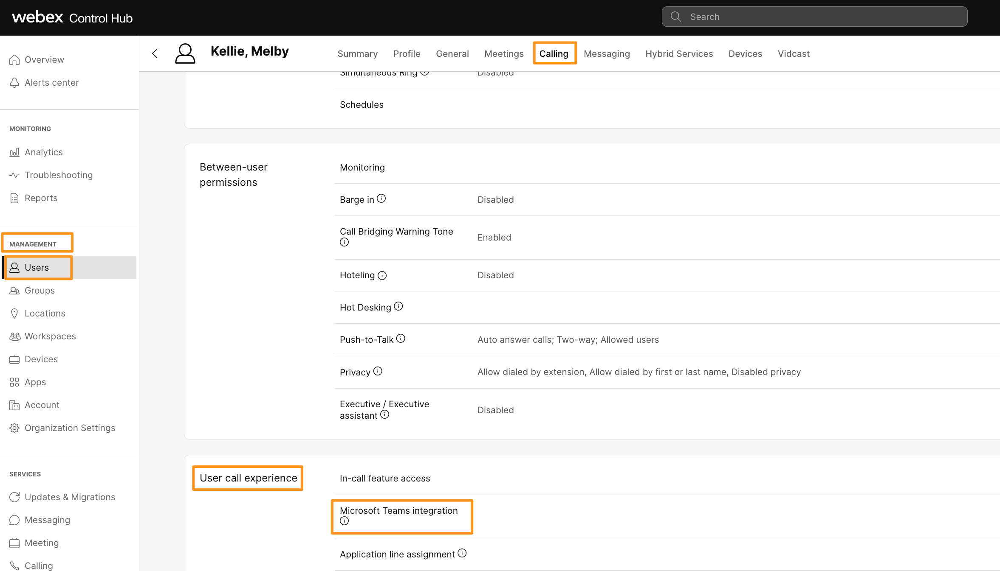

2.  On the calling page, under **MS Teams Integration**, toggle **ON** the option for **Set Microsoft Teams as the default app for calling dock**. Click **Save**

    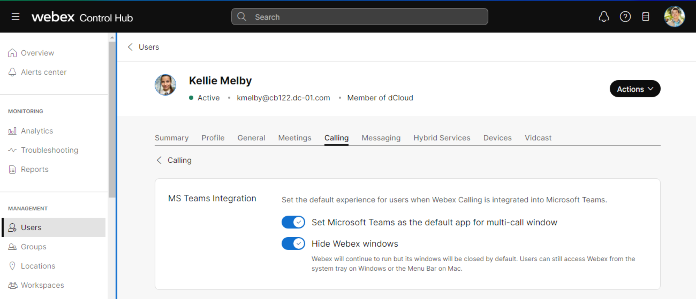

    > **NOTE**: *You can also toggle this option for entire organization by going to **SERVICES** \> **Calling** \> **Client Settings** & Microsoft Teams Integration.*

3.  Now go to the Webex Calling Dock and click on Call history (clock/history) icon & notice that it will take you to call history on the Microsoft teams.

    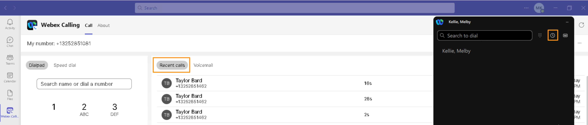

4.  Similarly you can click on voice mail icon on the Calling Dock and it will you to the voicemails on Microsoft teams. FYI, voicemail is not part of this lab.

    > **NOTE**: *Sometimes it might take few minutes for the change to take effect and until then you will be still redirected to Webex.*

### Module 2d.7 (OPTIONAL): **Calling Scenarios 7 of 8** - Create a Call Queue & Assing Users/Agents to Call Queue \[Approx 10 min\]

We can create a call queue and assign users (agents) to it. Those users will have visibility of the Call Queues they have been assigned to on the Calling Dock. They can sign in/out of the queue and set their status.

1.  Continuing on Workstation 5, go back to browser tab where you logged into **Webex Control Hub**. On the Control Hub, go to **SERVICES** \> **Calling**, and click on the tab **Features**. Then, click on the tab **Call Queue**.

2.  On the bottom, click on **Create Call Queue**

    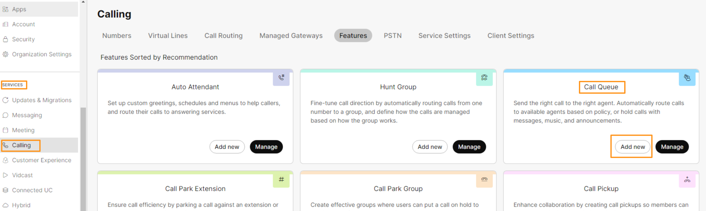

3.  Assign the location **dCloud** and name the call queue as **dCloud Call Queue.**

4.  Drop down the option for Phone Number and choose one of the available PSTN numbers. Make sure to select the number other than the number assigned to **Main Number**. You can add last 4 digits of the DID number for extension field or you can choose to ignore that field.

    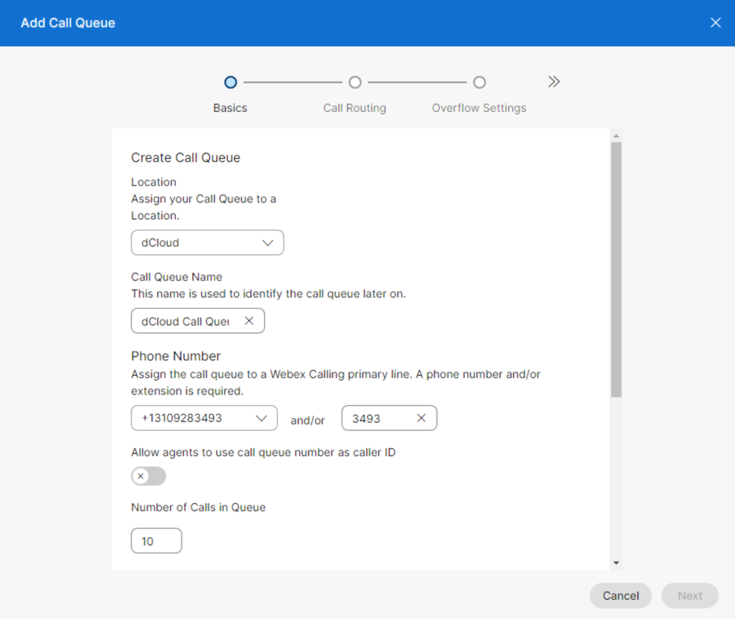

    > **NOTE**: *Make a note of the phone number assigned to the Queue here, we will need this number to dial later.*

5.  Scroll down a little and for the **Caller ID**, select **Direct Line** under **External caller ID phone number**. Click **Next.**

    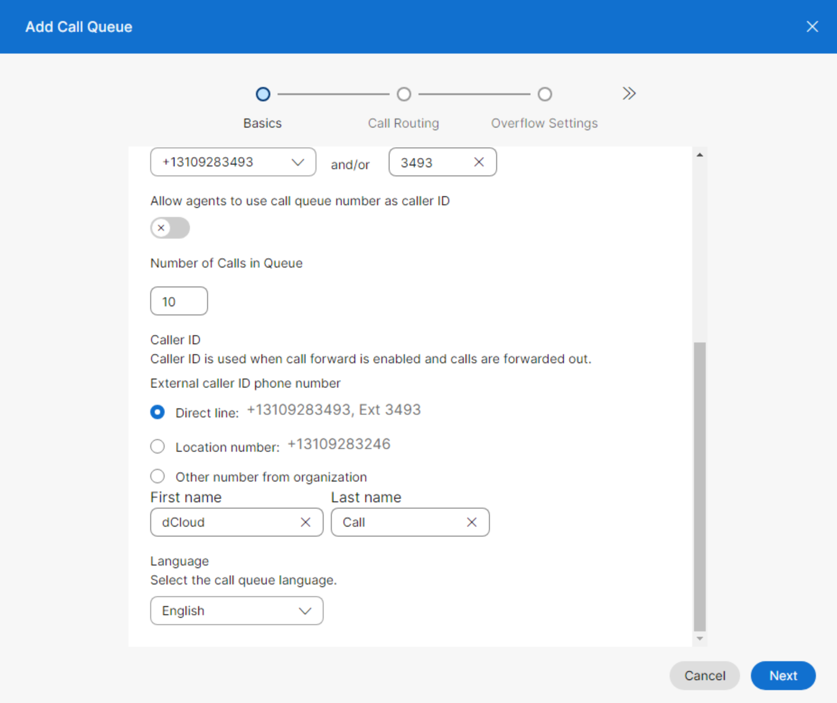

6.  Keep defaults and click **Next** for the three next steps

    -   Call Routing type: **Circular**
    -   Overflow Settings: **Perform busy treatment**
    -   Announcements: **Welcome Message** (checked) and **Comfort Message** (checked)

7.  On the **Select Users to Add to the Call Queue**: Drop down the option **Add user, workspace, or virtual line** and select **Kelly Melby** (with primary line) and **Taylor Bard**. Check the option **Allow agents to join or unjoin the queue.** Click on **Next.**

    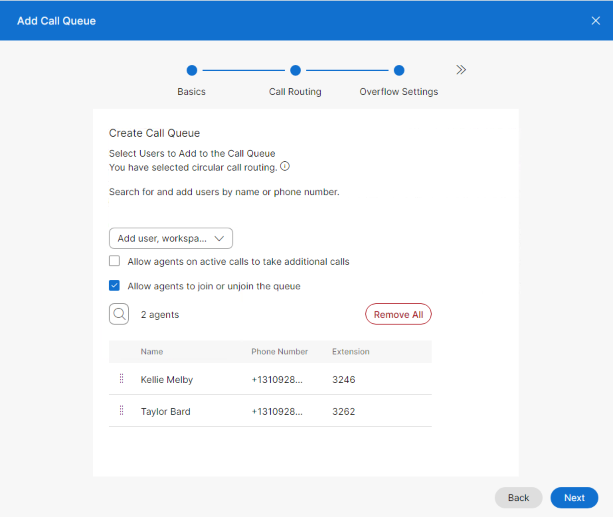

8.  Review the options selected and click on **Create.** Click on **Done** on the next screen.

    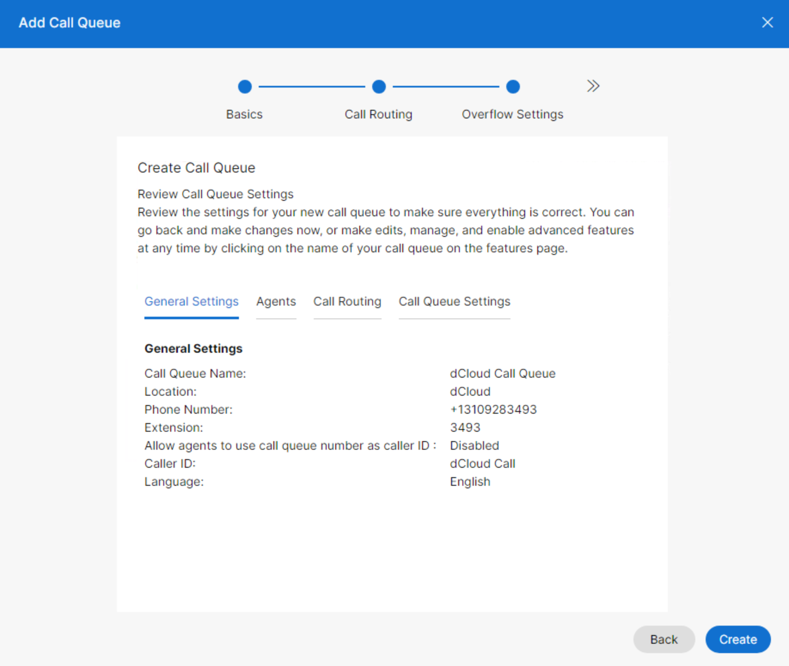

9.  You will be taken back to **Calling** \> **Features** \> **Call Queue** & will see newly created Call Queue.

    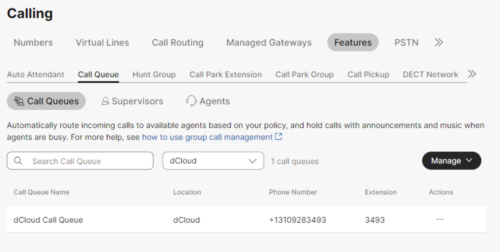

10. Now go to the Webex Calling Dock for Kelly Melby (Workstation 5). You will find there a new icon: "**Queues: Available"**

    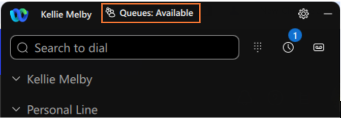

    > **NOTE**: *If you do not see Queue Available status, quit the Webex (Profile Picture \> Exit) & Relaunch Webex App.*

11. Click on the Queues icon to explore the available options

    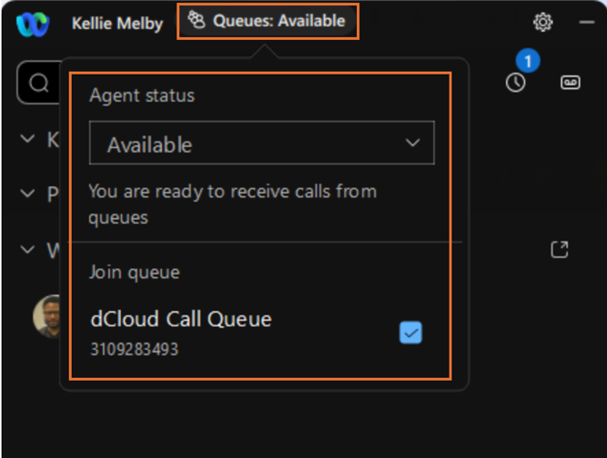

12. Dial the DID number that is assigned to the **Call Queue** number from your personal phone or ask one of the proctors to make the call for you. Notice the **incoming** call for **Kelly Melby. Decline** the Call for Kellie on Workstation 5.

    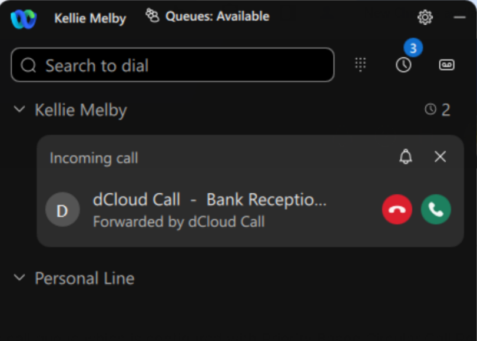

13. Switch to Workstation 6 (as Taylor) & notice the incoming call for Taylor Bard.

    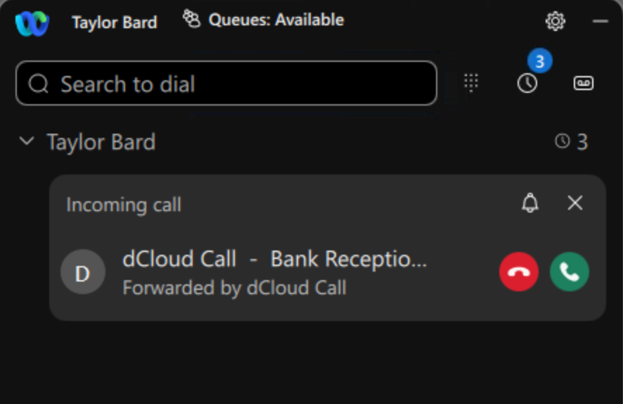

14. Either Answer the call on Workstation 6 (as Taylor) or decline. If you choose decline the call again, it will go back to **Kelly Melby**, as the **Queue behaviour** is configured as **Circular**. Hang up the call from your personal/proctor phone or workstation that you answered it on.

### Module 2d.8 (OPTIONAL): **Calling Scenarios 8 of 8** - Enable Watchlist \[Approx 10 min\]

**Watchlist**

Users can have a list of monitored users (**Busy Lamp Field** -- BLF). They will see the presence status of the monitored users and they can pick up their calls from the Calling Dock.

You must ensure that members have been added to your **Busy Lamp Field** (BLF) list to monitor.

In the Watchlist you'll see a list of people in your BLF list and can monitor their availability. If someone in your list has an incoming call, you have the option to pickup the call on their behalf. You can check if someone is available before you transfer a call to them.

1.  Continuing on Workstation 5, go back to browser tab where you logged into **Webex Control Hub**. On the Control Hub, go to **MANAGEMENT** \> **Users**, choose user **Kellie Melby.** On user page, go to **Calling** tab. On the calling tab, scroll down to **Between-user permissions** \> **Monitoring.**

    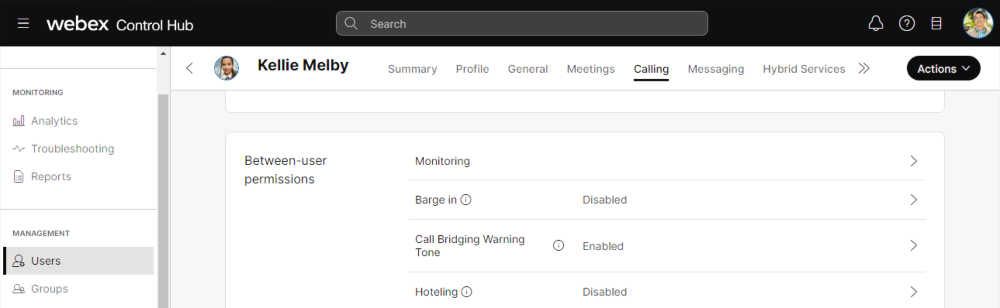

2.  Drop down the option **Add Monitored Line** and choose **Taylor Bard** from available list

    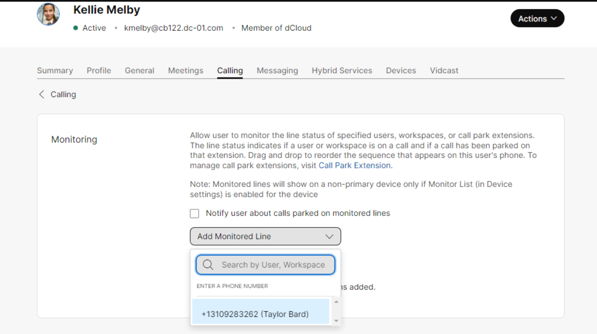

3.  You will see now **Taylor Bard** as part of the Monitoring List for **Kellie Melby**. Click on **Save**

    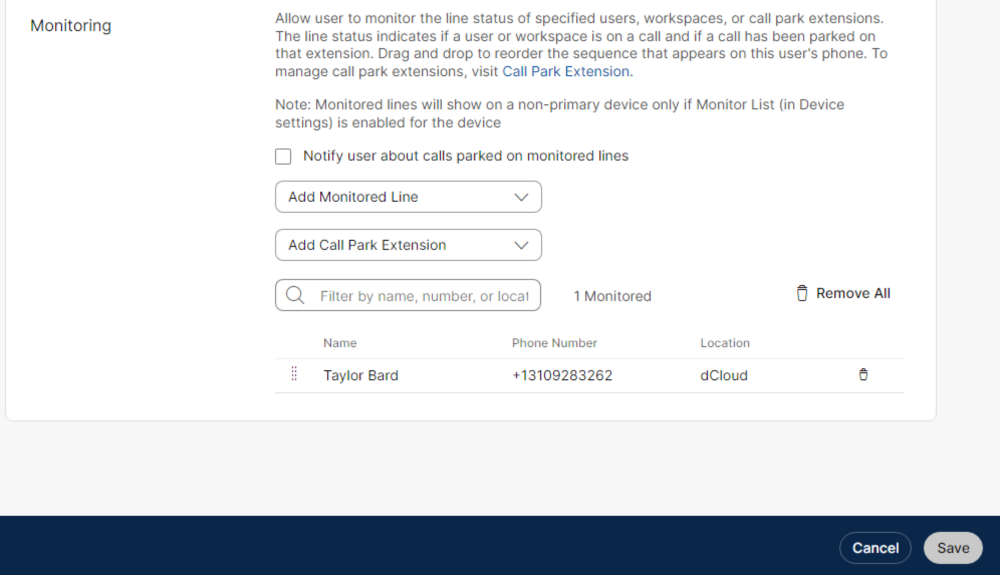

4.  Now go to the **Webex Calling Dock** for **Kellie Melby** (Workstation 5) and click on the **Call Settings** (the wheel icon). This will open the **Call Settings** for the Webex App for **Kelly Melby**.

    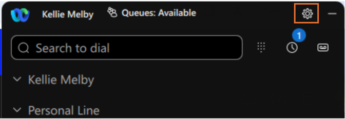

5.  Click on the menu **Notifications** and then, on **Calls**. Under **Call Pickup**, uncheck the option **Mute**. This will allow you to do Call Pickup from your monitored users. Click on **Save** and close the Call Settings window.

    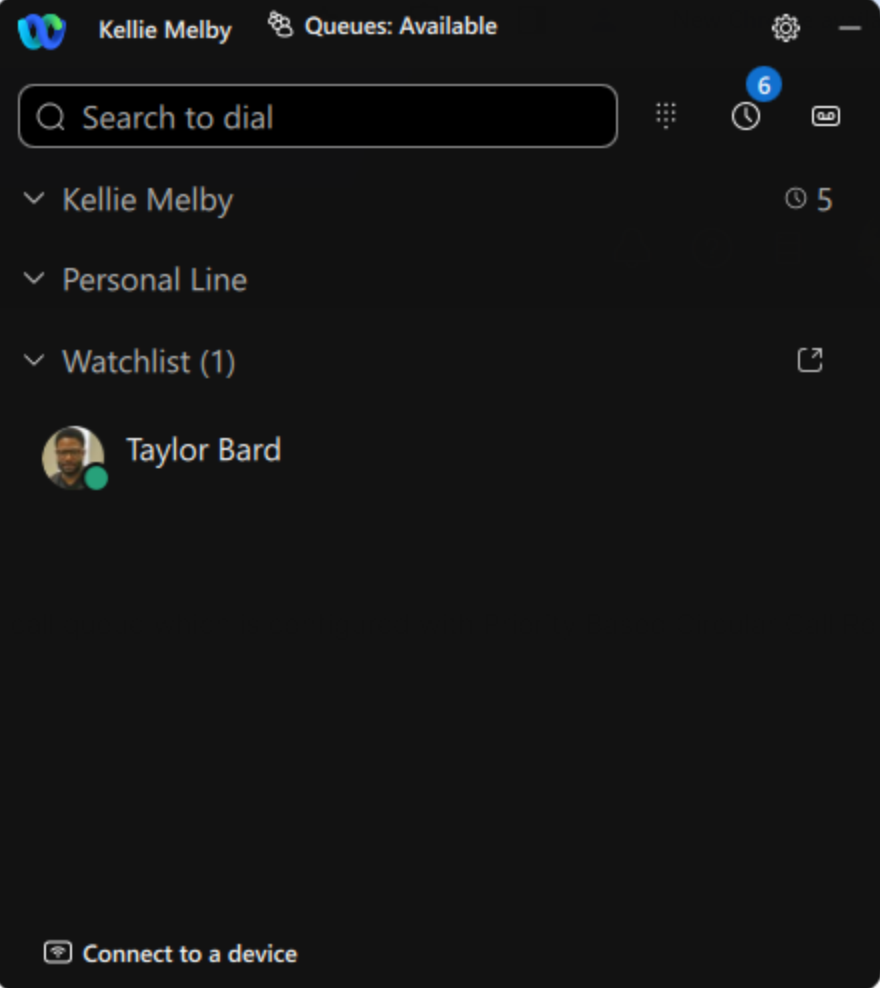

6.  Go back to the Calling Dock for **Kelly Melby** and notice that **Taylor Bard** is now part of the **Watchlist**

    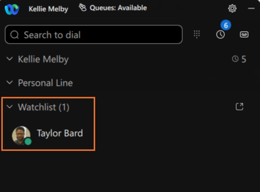

7.  Make a phone call to **Taylor Bard's phone number** (check the phone number on Control Hub) from your personal phone or ask one of the proctors to make the call for you. **Don't answer this call as Taylor (Workstation 6).**

8.  Switch to Workstation 5. Wait few seconds and notice the **Call Pick-up** coming to **Kellie Melby**

    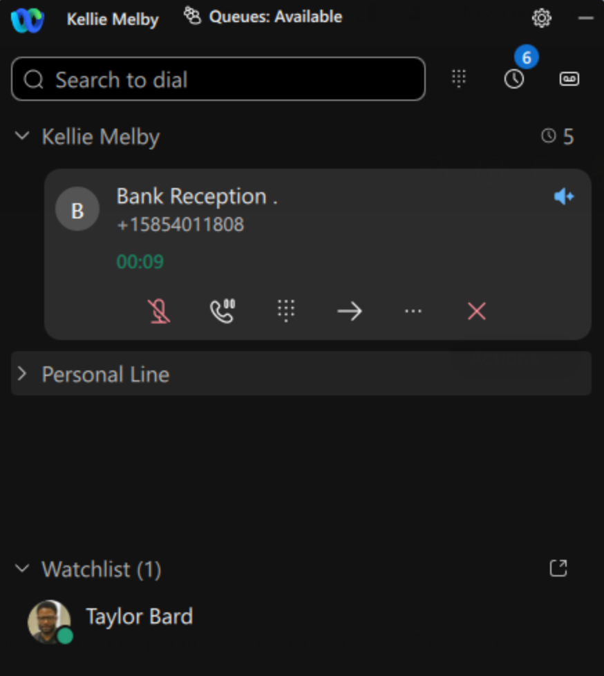

9.  Click on **Pick-up** to pick-up the incoming call. Notice the call has been established with **Kellie Melby**

    

This Completes entire module 2 -- ***Webex Calling Integration for Microsoft Teams***