# **Module 3: Webex Calling (UCM Calling) Integration with Microsoft Teams** \[Approx 1 hour 45 min\]

With Webex Calling for Microsoft Teams, the Microsoft Teams users can access the enterprise-grade Webex Calling experience directly in the Microsoft Teams app. With a single click from the Microsoft Teams interface, you can access a complete suite of Webex Calling features. The features include directory search, PSTN dialing, speed dial, voicemail, call history, and artificial intelligence-powered background noise removal.

This integrated app works with the Cisco Unified Communications Manager (CUCM) call-control solution, Webex Calling for cloud deployment or the Dedicated Instance offering.

This would be the call flow diagram when using CUCM as the call control:

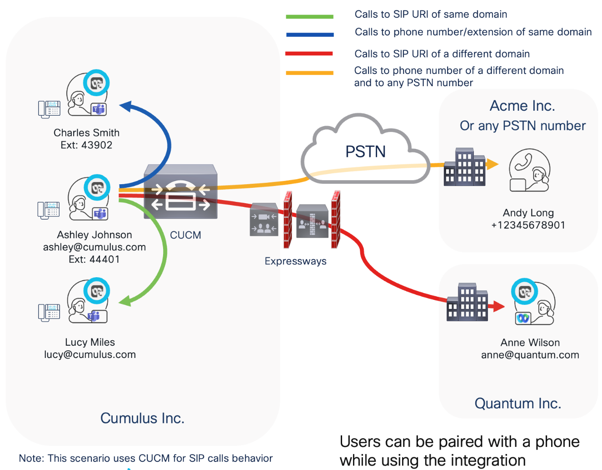

> **IMPORTANT NOTE:** Make sure you have added the domain (cbXXX.dc-YY.com) to Microsoft tenant in **Add cbXXX.dc-YY.com domain to Microsoft Trial tenant** section of the lab before you are continuing.

**Webex Cloud-Connected UC (CCUC) Overview \[Approx 5 min Read\]:**

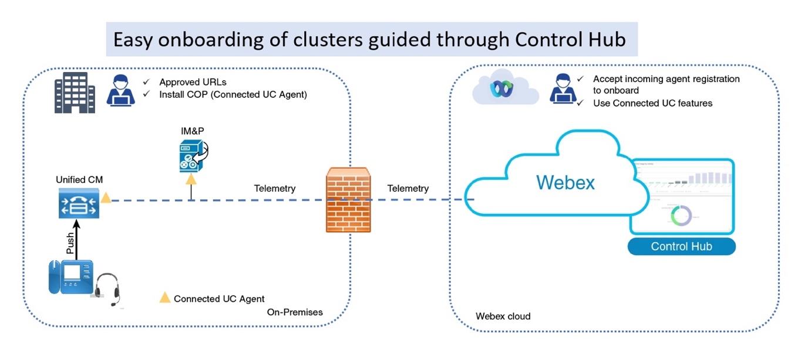

Webex Cloud-Connected UC (CCUC) is a suite of Webex cloud services with a single global view to manage on-premises UC and Unified CM cloud services. CCUC is an efficient, cloud-based managed services product for an on-premises Unified CM deployment. It provides a centralized cloud-based tool for analytics and troubleshooting. It allows customers to leverage the benefits of the Webex cloud while keeping critical calling workloads on premises.

Customers can subscribe to the UC management services on Control Hub. Customers can access the Control Hub to get a single global view and host the entire on-premises Unified CM network from a single operation control panel that supports the Cisco cloud services. Cloud-Connected UC helps manage multiple clusters, for both Unified CM and Unified CM Cloud deployments. Cloud-Connected UC achieves this with plugins that are installed on individual Unified CM applications that send telemetry data to the Webex cloud. Plugins register with the Webex cloud during onboarding and are authenticated to the cloud using the Webex Common Identity framework. Subsequent updates to these plugins are automatically managed through the cloud.

CCUC can also help to perform automated device firmware migration from Enterprise Firmware to MPP Firmware. The MPP firmware can run on certain models of the Cisco IP Phone 6800, 7800, and 8800 series. However, only the Cisco IP Phone 7800 and 8800 series can run either MPP firmware or Enterprise firmware. When an appropriate license is applied to the IP Phone, you can migrate between MPP and Enterprise firmware on the Cisco IP 7800 and 8800 series phones.

## Module 3a: Get the Organization ID from Webex Control Hub \[Approx 5 min\]

1.  Open RDP connection to Workstation 3 at 198.18.1.39, using one of the options mentioned in **Accessing your Lab** module. Use the credentials **dcloud\\amckenzie** and **dCloud123!**

2.  Open Chrome Browser from the taskbar or Desktop

3.  From Home Page, select **Cisco Webex Links** \> **Cisco Webex Control Hub**. Log in
    with **cholland@cbXXX.dc-YY.com** and **dCloud*AAAA*!**

    > **NOTE:** You need to Replace **XXX** and **YY** *with your session-specific details. If you haven\'t already done as explained in **Accessing your lab** section, go to **Lab_info.txt** file located on your workstation 1 and copy the domain.*

    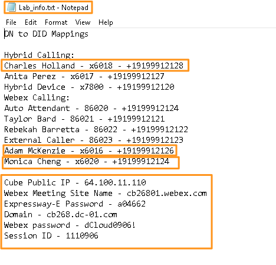

    > **NOTE:** *If you have completed module 3, you may have already configured SSO with Microsoft, in that case the password for <cholland@cbXXX.dc-YY.com> would be **dCloud123!***

4.  For security reasons, Webex Control Hub signs out every 20 minutes (Idle timeout) by default. For this lab, let's make the idle time out longer so the Control Hub does not sign you out often during this lab. Go to **MANAGEMENT \> Organization Settings \> Control Hub's idle timeout.** Drop down the option for **Control Hub idle timeout** and select **12 hours** or **no timeout**. Click **Save**.

    > **NOTE**: *If you have completed module 3, you may have already set the idle time out as part of that module. If so, you can skip step 4.*

    

5.  Now, go to **MANAGEMENT** \> **Account** and copy the **Organization ID** to a notepad on the Workstation 3 Desktop.

    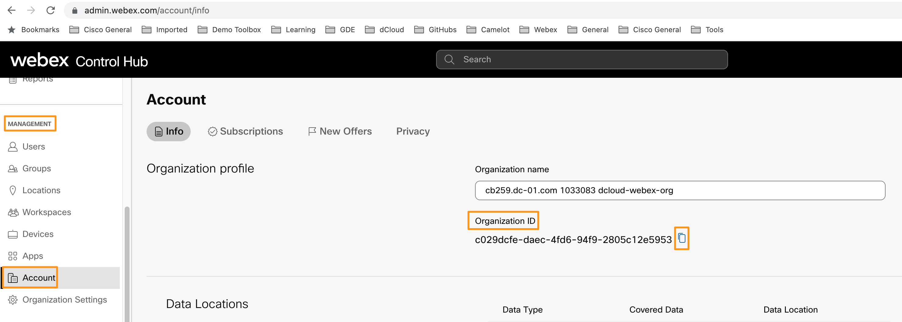

## Module 3b: Onboard a UC Nodes (UCM & CUC) using the Administrator CLI \[Approx 5 min -- Review Only\]

**IMPORTANT NOTE:** *When you onboard an on-prem Unified Communications device (like Cisco UCM or Cisco Unity Connection) with Webex Cloud, it takes around 30 to 45 min for the cloud to see it. Instead of making attendees onboard and wait for 45 min to sync up during the lab, we have pre-onboarded Cisco UCM and Unity Connection for this Lab. Below steps are your reference purpose only, you DO NOT need to execute any steps. After reviewing below steps you can directly move to next module 3c.*

1.  Continuing on Workstation 3, open the **Putty** application located on the Desktop.

2.  Open SSH connection to Cisco Unified Communications Manager at **198.18.133.33.** Accept any security warnings, if prompted.

3.  Log in as **administrator** and **dCloud123!** when prompted, and accept any security warnings.

4.  Once logged in, at the admin prompt, execute the below command, to start onboarding **Cisco UCM** with Webex.

    ```
    utils ucmgmt organization organization_id
    ```

    > **NOTE:** *Replace **organization_id** with the Organization ID you copied in above module Step 4.*

5.  Now run the following command to enable the CCUC agent.

    ```
    utils ucmgmt agent enable
    ```

    

6.  Run the following command to verify that the CCUC agent is **running**. The Agent process should show the status to be **running.**

    ```
    utils ucmgmt agent status
    ```

    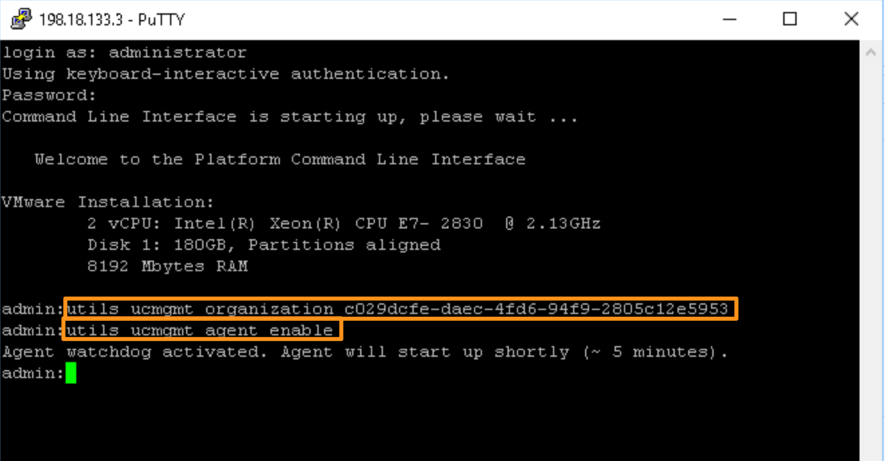

7.  If the agent process is **not running**, run the following command to kick-start or restart the agent process.

    ```
    utils ucmgmt agent restart
    ```

    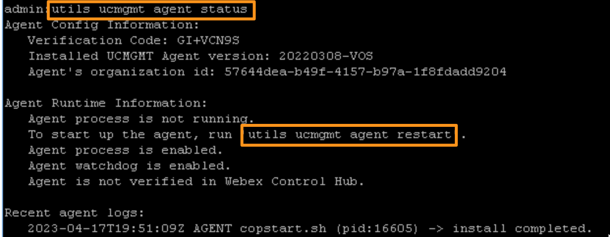

    

8.  Check the agent status again with the command, to make sure the agent process status is **running**

    ```
    utils ucmgmt agent status
    ```

9.  When you see agent process status is **running,** you have initiated the onboarding process successfully. **Make a note of the time that the process moved to the running state, you may need to reference it later.**

10. Now, lets onboard **Cisco Unity Connection** (CUC) node. Open new **Putty** session/window and open SSH connection to **198.18.133.5**, accept any security warnings.

11. Login as **administrator** and **dCloud123!**

12. Repeat steps 4 through 9 for **Cisco Unity Connection** node.

    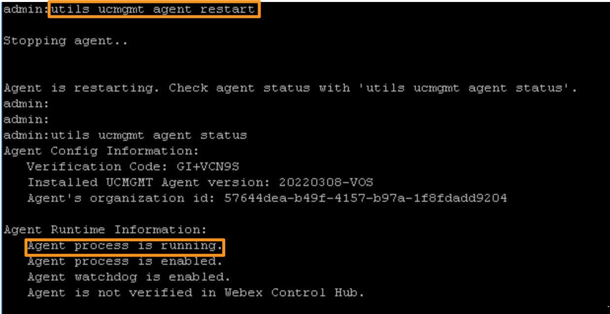

13. Go back to browser tab where you had **Webex Control Hub** opened. Go to **SERVICES** \> **Connected UC** and click **Enable Connected UC**

    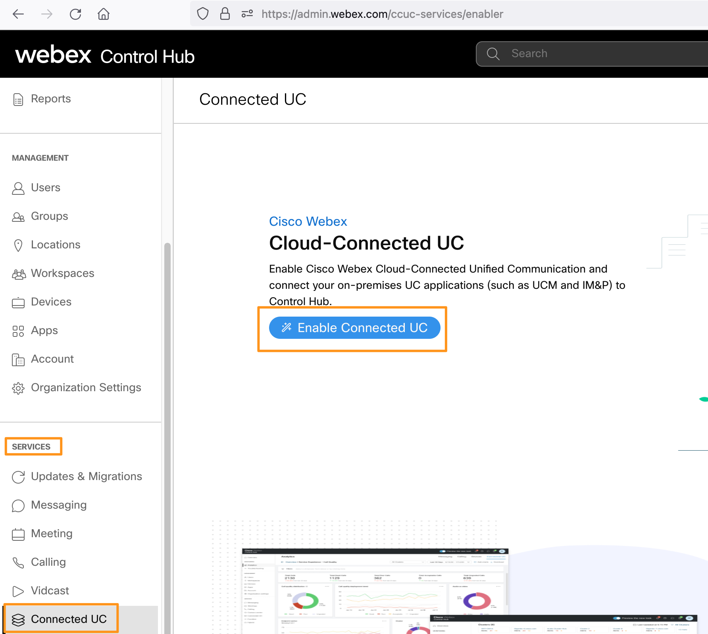

14. Once Enabled, click **Get Started** on the **UC Management** tab

    

15. It will pop-up the **Getting Started** window, which will walk you through creating an agent file for Cisco On-Premises devices.

16. Click **Next** on the **Getting Started** Page.

17. Give the "CCUC-Agent" name in File Name. You can see in this page that if in your real live scenario you have a proxy you can define here the information of that proxy.

18. Click **Save**. You have to wait a couple of minutes while the file agent is created.

    > **NOTE**: This Agent file does not need to be downloaded in this lab as it\'s already bundled with this version of Cisco UCM (14.0 SU3) but we will create it to get familiar with the process.

19. Click **Next**.

20. We need to create a new cluster group for Cisco UCM.

21. Give the Cluster Group a **Name** and a **Group Description** of your choice. Example: **dCloud-UCM** and **UCM Group**.

    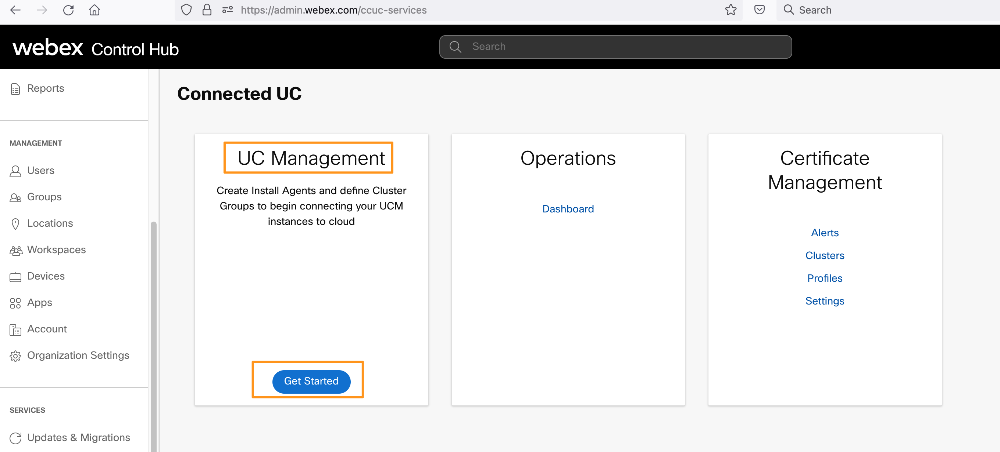

22. Click **Next** and then click **Finish**.

23. Go to Inventory under UC Management & Click **Add Cluster Group** again and give Cluster Group Name & Group Description for CUC. Example: **dCloud-CUC** & **CUC Group**. Click **Save**.

    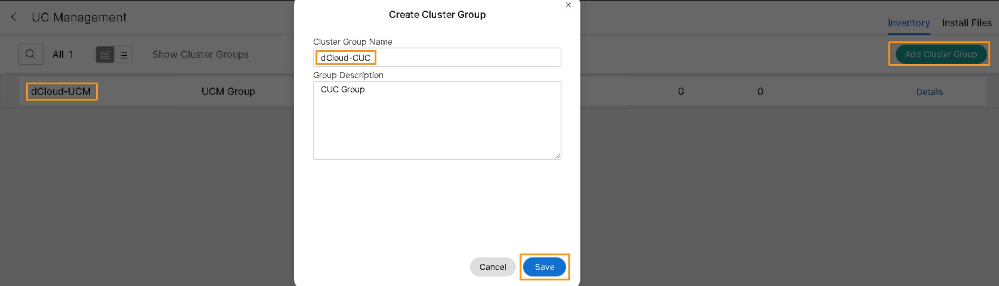

## Module 3c: Verify the onboarded UCM & CUC nodes on Webex Control Hub \[Approx 10 min\]

1.  Continuing on Workstation 3, go back to the browser tab where **Webex Control Hub** was opened and refresh the browser page. Go to **SERVICES** \> **Connected UC**.

2.  On the Connected UC page click **Inventory** under **UC Management.**

3.  You will see there are two **Unassigned** nodes/clusters that needs assignment to a cluster group.

4.  Click **Resolve**.

    

5.  On the next page, click **Verify** for cucm1.dcloud**.**cisco.com

    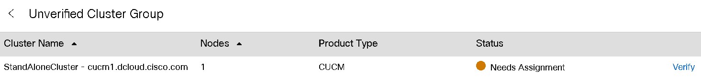

6.  It will bring up a new pop-up window for the node. Drop down the option for **Change Cluster Group** and choose **dCloud-CUCM.** Now check mark (towards right side of the node list) option for the product CUCM to confirm Verification and Click Save and Click **Save**.

    

7.  You will be taken back to Unverified Cluster Group. Now, click Verify for cuc1.dcloud.cisco.com. Drop down the option for **Change Cluster Group** and choose **dCloud-CUC.** Now click the check mark for the product CUCM to confirm Verification and Click Save and Click **Save**.

    

8.  Lastly, on the Control Hub, go to **SERVICES** \> **Connected UC** \> **Inventory** & choose **Details** for dCloud-CUCM. Click **Details** (again). Click on the eclipse icon (three dots) in the top right corner and choose **Service Management**.

    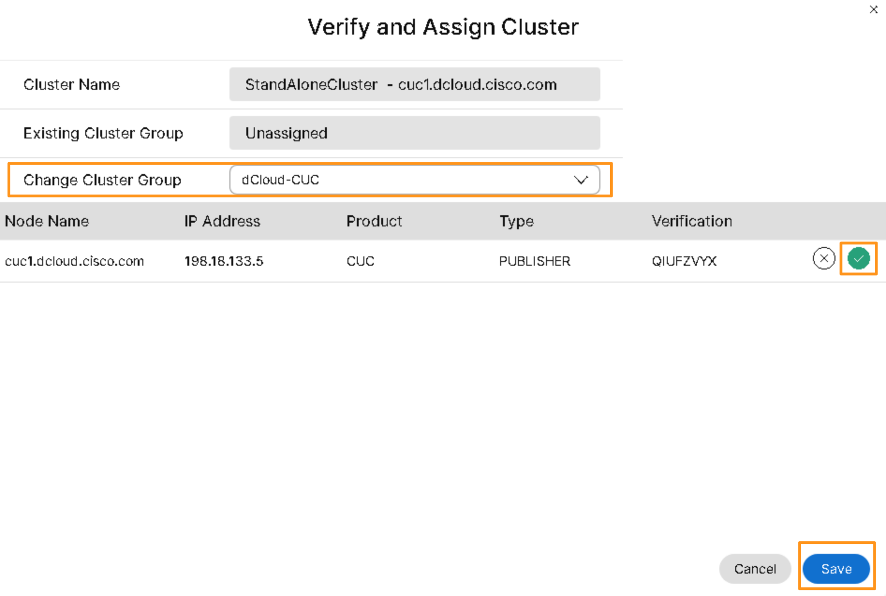

9.  Toggle all the settings under Service Management and select the option for **Yes, I agree** and click **Submit**.

    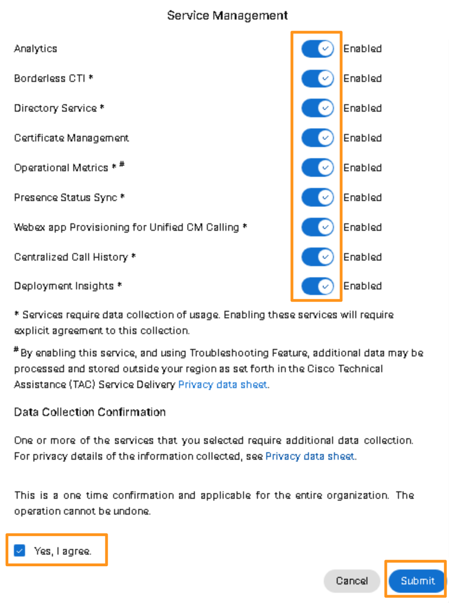

10. Repeat steps 8 & 9 for dCloud-CUC cluster.

    

11. Now the Cisco UCM & CUC servers are successfully onboarded with Cisco Webex Cloud. This completes the **Onboard a UC Node using the Administrator CLI** section.

## Module 3d: Configure Single Sign-On (SSO) for Control Hub \[Approx 15 min\]

> **NOTE**: *If you have completed module 3, you would have configured the SSO already as part of that module. So, you can skip this module and go to next module. If you have not run through module 3 yet, you can continue to configure SSO*.

If you have your own identity provider (IdP) in your organization, you can integrate it with Control Hub for single sign-on (SSO). SSO lets your users use a single, common set of credentials for Webex App applications and other applications in your organization.

Cisco Webex supports a wide variety of IdPs for Single Sign-On configuration like Microsoft (both O365 and AD FS), Okta, PingFederate, Duo, etc.,

In this lab, we will explore the SSO configuration with **Microsoft O365**.

Integrating O365 with your Webex Control Hub you can also import/synchronize users and groups from Microsoft O365, Import Avatars (user profile pictures), define user attributes for mapping (like first name, email, etc.,) and configure SSO. In this lab, we will explore SSO configuration only.

1.  Continuing on Workstation 3 and go to the browser tab where you had the **Webex Control hub** open.

2.  On the **Webex Control Hub** page go **MANAGEMENT** \> **Organization Settings** and scroll down to the section **Microsoft Azure Active Directory Wizard App** and click **Set up.**

    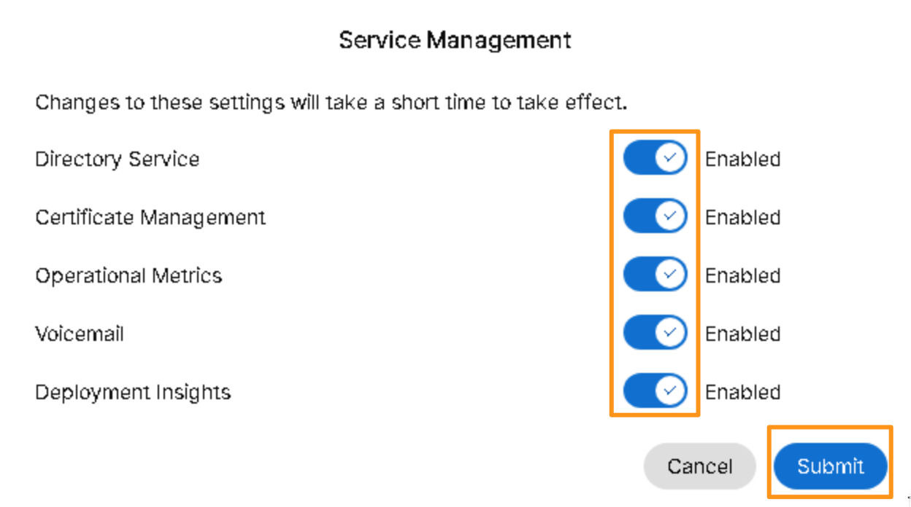

3.  It will take you to the Microsoft authentication page. Log in with the Microsoft credentials <cholland@cbXXX.dc-YY.com> & dCloud123! Click **Login**.

    > **NOTE**: *You need to Replace XXX and YY with your session-specific details. If you haven\'t already done as explained in Accessing your lab section, go to Lab_info.txt file located on your workstation 1 and copy the domain.*

    

4.  On the following page, Microsoft login page will show you the permissions required. Review the permissions. Check mark option for **Consent on behalf of your organization**. Click **Accept**.

    

5.  On the following it will show you all details about permissions that are required for SSO configuration. **Click Accept**.

    

6.  You will be taken back to Webex Control Hub and a pop-up window will be displayed. Keep the radio button selected for **Sync defaults** and click **Proceed**.

    

7.  It will create the instance/integration with Microsoft tenant. It will take around 2 to 3 minutes for the process to complete.

8.  Once the integration process is completed, Job status will be displayed **NotRun**.

    

9.  Within few min the Job status would change to **Active.** Wait until the job status is changed to **Active**. You need to refresh the page to see the updated status. At this point all users from your Microsoft tenant should be imported to Webex under **MANAGEMENT** \> **Users**. Notice few users with status **Verified** indicating they are imported from a trusted source (in this case the Microsoft tenant that we are integrating with).

10. Now go back to **MANAGEMENT** \> **Organization Settings** and scroll down to the **Microsoft Azure Active Directory Wizar App** section. Click the three dots on the right side and select **Edit Configuration**.

    

    It will bring up the Microsoft Azure AD integration page.

    On the **Attributes** page, click on the drop down menu for phoneNumbers\[type eq "work"\].value and select the option **telephoneNumber**.

    

    With this, we are bringing our phone number from Entra ID, populating the field "Work Number" from the User Profile. This number will later be shown in the integration next to "My number".

    Now, go to the **More** tab. Select the checkbox option for **Activate single sign-on** and click **Save**.

    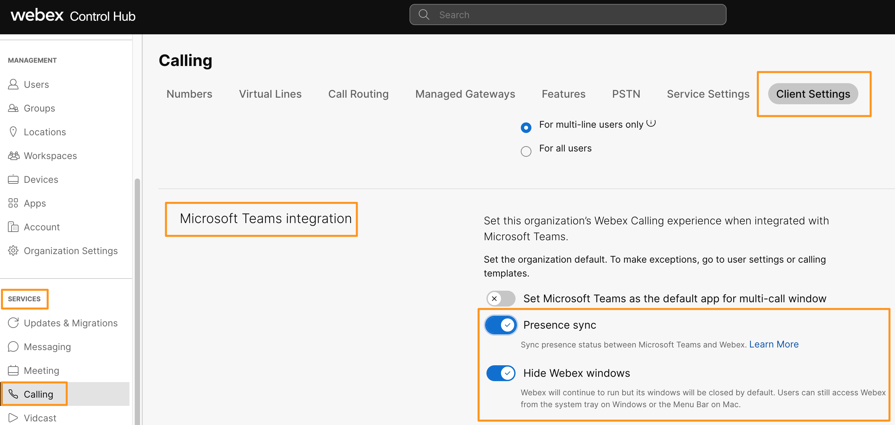

11. You have now successfully enabled single sign-on for your Webex tenant. From now on, all logins to this Webex tenant will be redirected to Microsoft for authentication & you will use <cholland@cbXXX.dc-YY.com> & dCloud123! for logging into Webex Control Hub.

12. This completes the SSO configuration and verification.


## Module 3e: Assign Licenses & configure users for Microsoft Presence Sync \[Approx 5 min\]

In this section of lab we will use **Adam Mckenzie** and **Monica Cheng** users. So, lets configure Microsoft & Webex integration parameters for presence & assign Calling Licenses to both these users.

1.  Continuing on Workstation 3, go to the browser tab where you had the **Webex Control Hub** open.

2.  On the Control Hub, go to **SERVICES** \> **Calling**. On the Calling page to Client Settings

3.  On the **Client Settings** page scroll down to Microsoft Teams Integration section and toggle the radio button **Presence sync** & **Hide Webex windows.** If the option **Set Microsoft Teams as the default app for calling dock** is checked, uncheck it for now. We will explore this option later.

    > **NOTE**: *If you have completed module 4, you may have already toggled on the Presence Sync and Hide Webex Windows option*.

    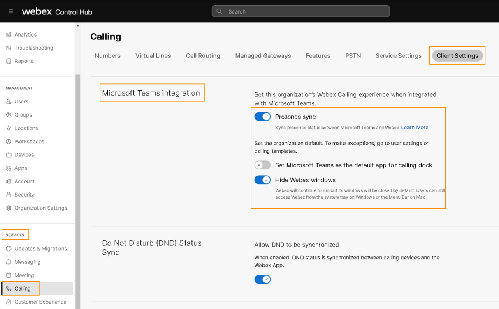

4.  Now, let's assign Webex Calling licenses for users, go to **MANAGEMENT** \> **Users** and choose **Adam McKenzie** (amckenzie@cbXXX.dc-YY.com).

5.  Scroll down on the summary page, click **Edit Licenses**

6.  On the Edit services for <amckenzie@cbXXX.dc-YY.com> page, click **Edit Licenses** again.

7.  On the next page go to **Calling** tab. Check mark option for **Register to Unified Communications Manager (UCM)** & click **Save**. Click **Close**.

    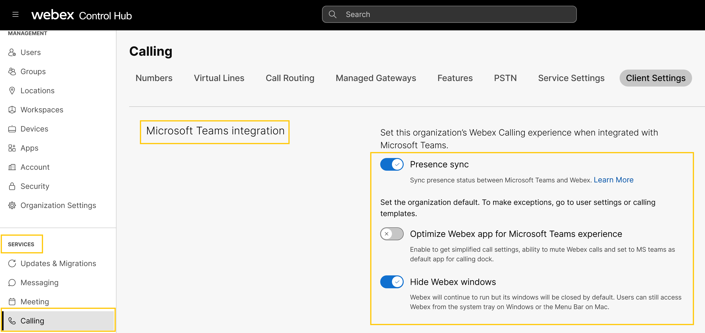

8.  Go back to **MANAGEMENT** \> **Users** again and on users page choose <mcheng@cbXXX.dc-YY.com> & repeat steps 6 through 8 & assign **Register to Unified Communications Manager (UCM)** License for calling.

## Module 3f: Update user contacts and disable Microsoft native calling \[Approx 5 min\]

Now let's update contact phone numbers for users **Adam McKenzie** & **Monica Cheng** on Microsoft trial tenant, so users will be able to call with click to call feature from Teams. Also, as we are using Webex Calling (UCM Calling) for calling services, let's disable native Microsoft calling option so users would not be confused between both calling options.

1.  Continuing on Workstation 3, open a new browser tab and from home page go to **Collab Admin Links** \> **Microsoft Admin Center** or directly go to <https://admin.microsoft.com>. Login with credentials <cholland@cbXXX.dc-YY.com> & dCloud123!

2.  Once logged in go to **Users** \> **Active Users** on left side pane

3.  On the active users page select **Adam Mckenzie**. It will bring up fly-out window for user configuration window. Scroll down a little and click **Manage contact information**.

    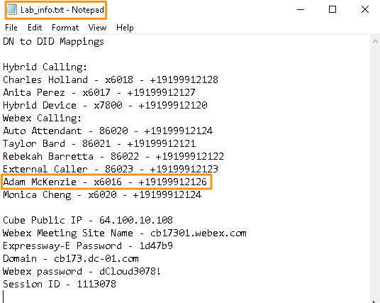

4.  On the **Manage contact information** page, scroll down and find **Office phone** & enter the DID phone number assigned to **Adam McKenzie** (associated with extension 6016) in ***Lab_info.txt*** on **Workstation 1**. Make sure you enter the phone number in E.164 format (add +1 at the beginning of the number). Click **Save changes**. Click **Close** \[x\] to close out the fly-out window.

    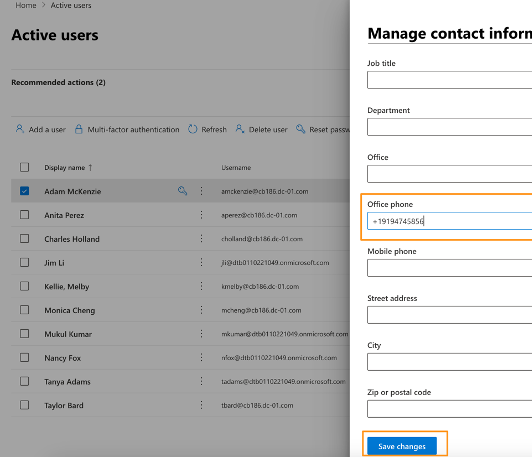

5.  Similarly repeat the steps (3 & 4) for **Monica Cheng** & update the contact number with the DID number associated with extension 6020 under session details tab.

    > **NOTE:** *Sometimes Microsoft takes long time to update contact information and would not be able to find on Microsoft teams. This is not limitation of the lab or Webex its just Microsoft Cloud taking longer time to update contact information*.

6.  To disable the Microsoft native calling, on the Microsoft admin center on left side page, click **Show all** to see all admin centers. Under **Admin centers** select **Teams**.

    

    > **NOTE:** *If you have completed module 4 you may have already disabled Microsoft native calling & published the Webex Calling app as part of that module. If so, you can skip below steps (7 through 13) and move on to next module*.

7.  It will open **Microsoft Teams admin center** in a new tab. Once the Teams Admin center is opened go to **Voice** \> **Calling policies**. On the Calling policies page select **Global (Org-wide default).**

8.  On the **Global (Org-wide default)** policy page toggle **off** the option for **Make private calls** and click **Save**.

    

9.  Finally lets publish the **Webex Calling** app for organization so that each user would not need to request admin authorization. Continuing on **Teams admin center**, on left side page go to **Teams apps** \> **Manage apps.**

10. On the Manage apps page, towards right search for **Webex Calling**. Select the **Webex Calling** app that is listed.

    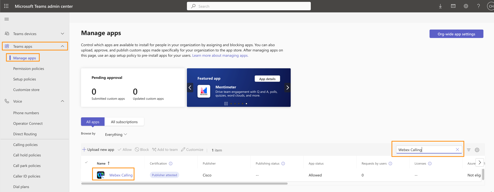

11. On the Webex Calling app page, go to **Permissions tab**. Under permissions tab click **Grand admin consent**. It will bring up a pop-up window to authorize as admin. Login as [cholland@cbXXX.dc-YY.com](mailto:cholland@dtbXXXX.onmicrosoft.com) & dCloud123!. It will prompt you to accept few permissions. Click **Accept**.

    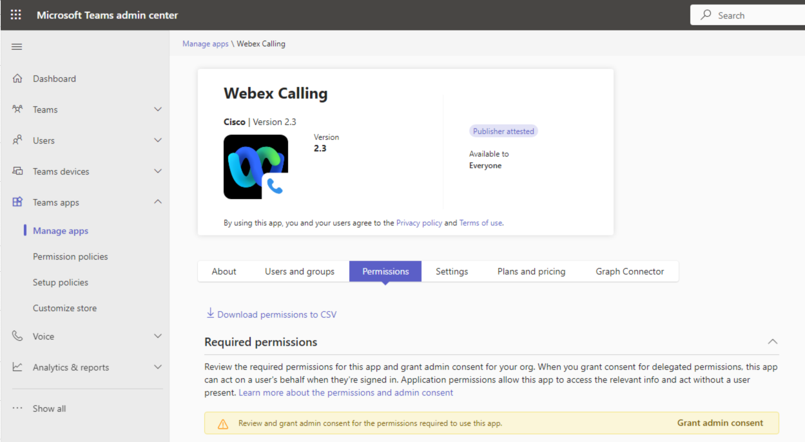

    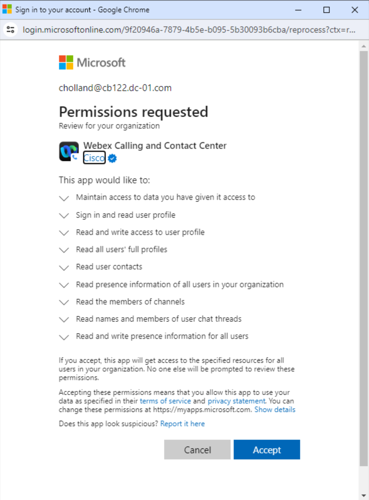

12. Now Microsoft and Webex tenants/users are ready for use.

13. This completes **Update user contacts and disable Microsoft native calling**

## Module 3g: Testing the calls for Microsoft Integration with Webex (UCM Calling) \[Approx 60 min\]

In this module we will make some test calls to internal, PSTN & also configure multiple, watch list and Call Queues. This module consists of total 8 testing scenarios that are described below.

### Login to Webex & Microsoft Teams Clients \[Approx 10 min\]

1.  Continuing Workstation 3, open Webex on Desktop. Login as <amckenzie@cbXXX.dc-YY.com> & password dCloud123!. You will be redirected to Microsoft website for authentication as SSO has been configured.

    > **NOTE**: *If the new version of Webex is detected it might prompt you to upgrade.*

2.  Once logged in, it should prompt you to enter credentials for UCM phone services, as shown below. Enter the credentials as **amckenzie** (JUST username, **NO** domain) & **dCloud123!** Click Login. You will be prompted with Emergency notification popup. Click **OK**.

    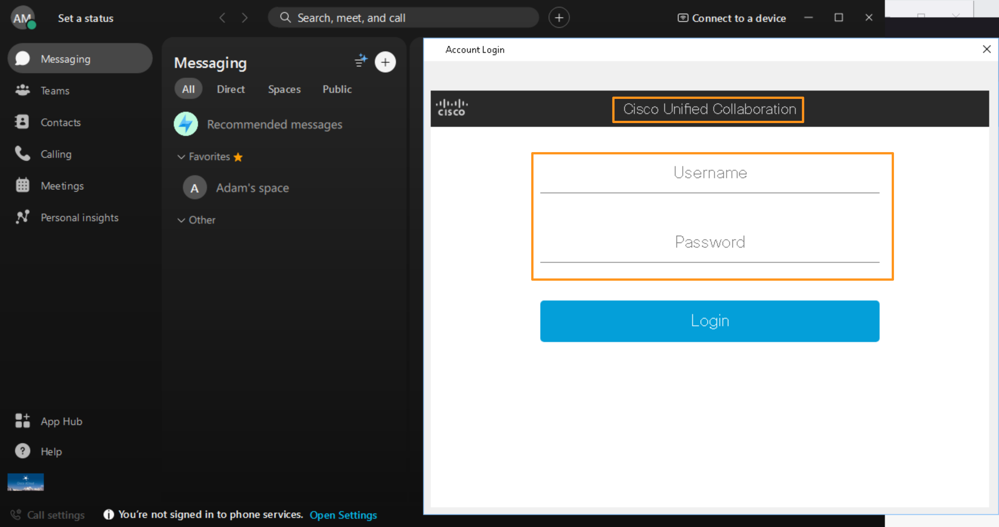

    > **NOTE**: *For any reason, if the credentials for UCM window is not prompted. Go to the bottom left corner of the Webex app you will be prompted saying "You're not signed in to phone services. Open Settings". Click Open Settings. It will take you to Phone Services tab. Verify that UC Domain is populated as cbXXX.dc-YY.com (or enter the domain cbXXX.dc-YY.com manually). Click Connect*.

    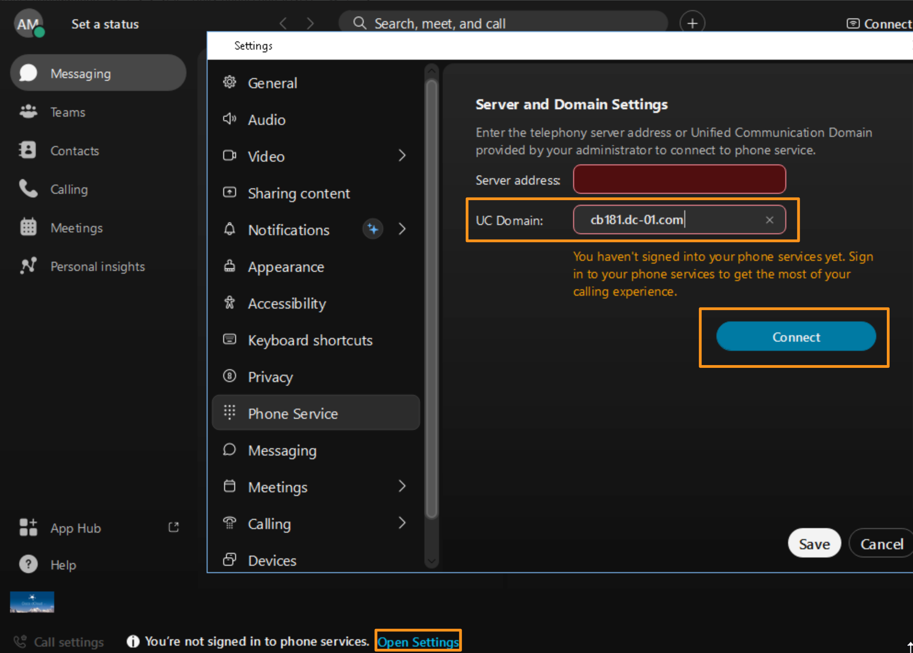

    You will be taken to **Cisco Unified Collaboration** page, login as **amckenzie** (JUST username, **NO** domain) & **dCloud123!** Click **Login**. You will be prompted with Emergency notification popup. Click **OK**.

3.  Bring up the **Webex** & go to **Call Settings** (on the bottom left corner) \> select **Open call preferences**. It will bring up Settings pop-up window, go to **Phone services** and make sure the **Phone service** and the **Voicemail** service both are connected as shown below.

    

4.  Minimize Webex & open Microsoft Teams from desktop and login as <amckenzie@cbXXX.dc-YY.com> & password **dCloud123!** (it's the same email ID that you logged into Webex). Click **OK**. Click **Done**. Accept and close any pop-up are warning messages during signin.

    > **NOTE**: *DO NOT click **No, sign into this app only**.*

    

5.  Once logged into Microsoft Teams, click eclipse icon (three dots) on the left side pane. It will bring up a fly-out window. On the fly-out window search for **Webex Calling**. It will list the **Webex Calling** app (that we published and authorized for entire organization in above section). Click **Add**.

    

6.  It will add **Webex Calling app** to Microsoft teams and take you to login screen. Click **Continue**.

    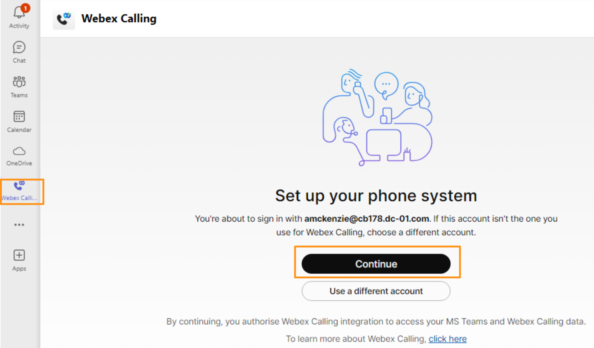

7.  You will be signed into Webex Calling on Microsoft Teams.

8.  Now, right click on the **Webex Calling** app on the left side pane of Microsoft Teams & select **Pin** it so it will always be visible on the left side pane, for easy access.

    > **NOTE**: *If you do not yet see the Webex Calling app on left side pane, click on the three dots on the left side pane & right click on the **Webex Calling** app and then select **Pin** so the application always displays left side pane for easy access.*

    

9.  Now both the clients on workstation 3 (for **Adam McKenzie**) are ready for Calling Services.

10. Open RDP connection to Workstation 4 at 198.18.1.38, using one of the options mentioned in **Accessing your Lab** module. Use the credentials **dcloud\\mcheng** and **dCloud123!**

11. Once connected to workstation 4, repeat the steps (2 through 9) above on Workstation 4 and login to both clients Webex & Microsoft Teams. Use the credentials <mcheng@cbXXX.dc-YY.com> & dCloud123! (**mcheng** and **dCloud123!** For UCM services).

    > **NOTE**: *If you see a **Windows Security** pop-up on during Webex login on workstation 4, you can safely ignore and click **Cancel**.*

    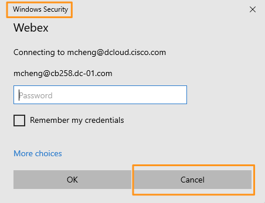

12. Now both users/clients and workstations are ready for making some test calls.

### Module 3g.1: **Calling Scenarios 1 of 8** -- Making calls \[Approx 5 min\]

> **NOTE**: *Make sure you are logged in to both clients on both workstations 5 and 6 before continuing*.

After configuring Cloud Connected UC, we should have Presence sync, Call History and Voicemail populated on our landing page. However, please notice these settings take up to 8 hours to apply, so you might not see this working.

Optional reading: reason why this process takes 8 hours explained in the following diagram:


1.  Make sure you are logged in to both clients on both workstations 3 and 4 before continuing. From workstation 3 as **Adam McKenzie**, go to Webex Calling app on Microsoft Teams (On left side pane) & Search for **Monica Cheng** (right above dial pad). OR you can dial extension number 6020.

2.  It will search the directory for **Monica Cheng** and display options (Phone number or email address) to call using either **Audio** or **Video**. Click on any of the options to place the call.

    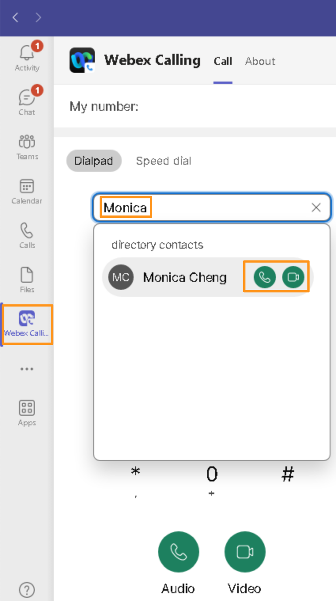

3.  Answer the call on workstation 4. Verify that call gets connected. Wait for few seconds and hang up the call.

    > **NOTE**: *You will not be able to hear audio in either direction as we are using virtual workstations and microphone is not available.*

**Once the 8 hour has been passed after onboarding UCM cluster**:

4.  Once the 8 hours has been passed after onboarding UCM Cluster, you will see the call presence status on Microsoft Teams as **In a call**, as shown below.

    > **NOTE**: *If you do not see the correct status, try to bring the Microsoft Teams into foreground or initiate a chat conversation between Adam and Monica.*

    

5.  As soon as the call is hung up, you will see that Adam's status changes to **Available**.

    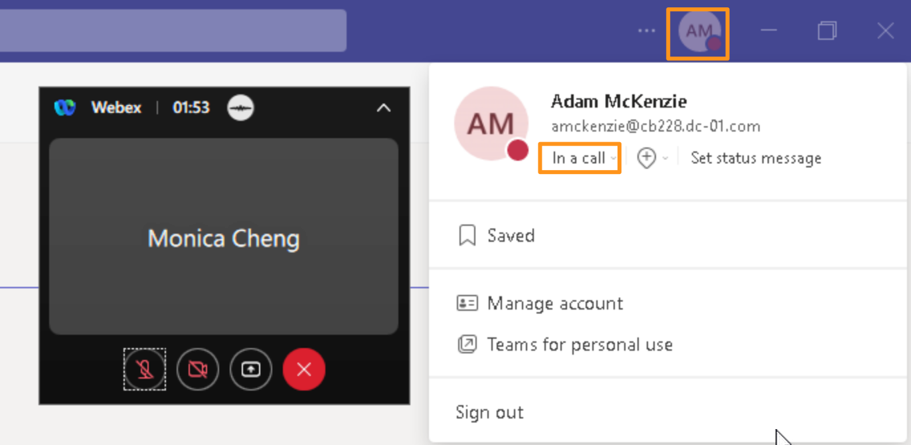

6.  Similarly you can dial any PSTN number in E.164 format (+1AAABBBCCCC). Or you can dial the Cisco support number +**18005532447**.

7.  Also, Once the 8 hours has been passed after onboarding UCM Cluster, you will be able to observe that up to date call history is synchronized/reflected to Webex Calling app on Microsoft Teams. To verify the call history go to **Webex Calling app** \> **Recent Calls** as shown below.

    

### Module 3g.2: **Calling Scenarios 2 of 8** -- making calls from Microsoft Teams chat Window \[Approx 5 min\]

1.  Continuing on Workstation 3, go to Microsoft Teams app and go to **Chat** on left side pane. On the top search window search for **Monica Cheng**.

    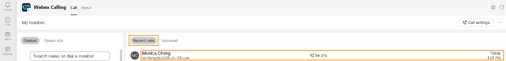

2.  Initiate a chat conversation with Monica and send few messages back and forth.

3.  Click on the + sign towards right side of typing window for chat and select Webex Calling from available options.

    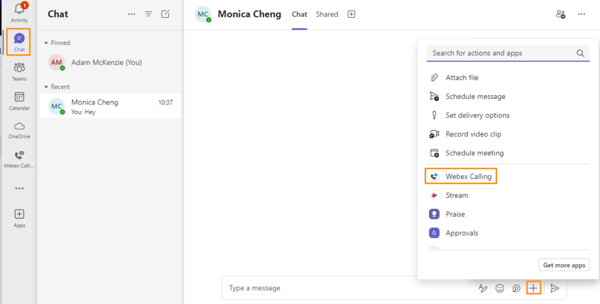

4.  It will bring up available calling options for **Monica Cheng**. Choose either **Phone number** or **Email Id** from the drop down option. Then choose either **Audio** or **Video** option to make the call.

    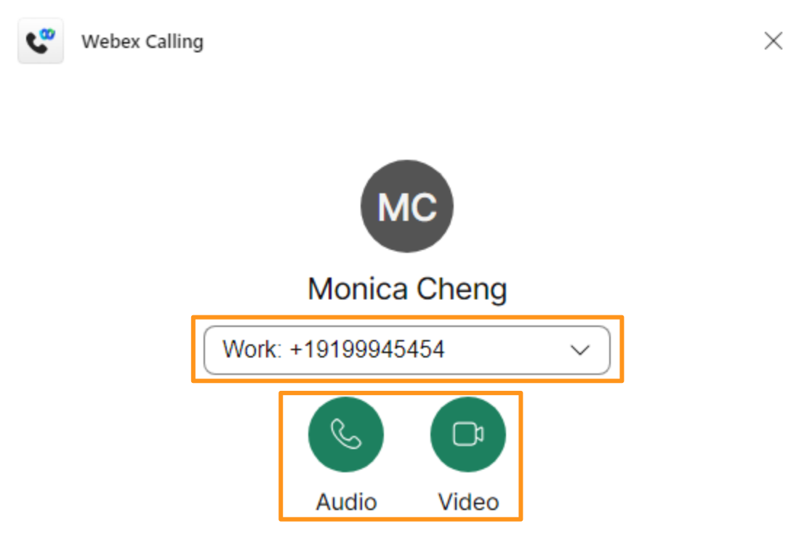

5.  Answer the call on Workstation 4 and verify that call is connected. Hang up the call after few seconds.

    > **NOTE**: *As explained before once the 8 hours for the initial sync has passed, you will see the presence status updated to show that Adam (and Monica) **In a call**.*

    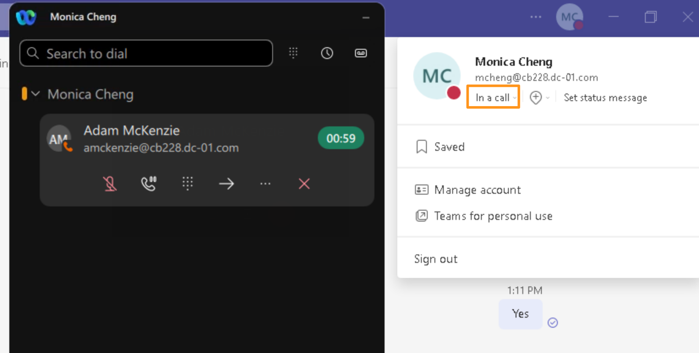

### Module 3g.3: **Calling Scenarios 3 of 8** - Pushing Do Not Disturb (DND) status from Microsoft \[Approx 5 min\]

Presence sync is supported between Microsoft Teams and Webex for the following status:

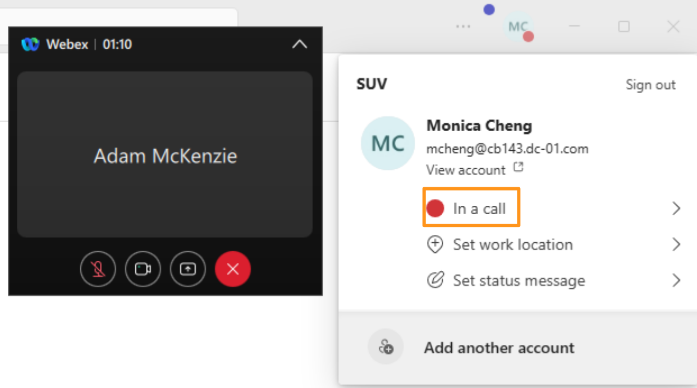

When being on DND on **Microsoft Teams**, we want to avoid receiving calls. As these calls come on Webex, it is important to push the DND status from **Microsoft Teams** to **Webex**.

When you enable/set **Do Not Disturb** status on **Microsoft Teams** the status is automatically synchronized to **Webex**. Please note that the first time you configure the integration, Microsoft might take up to 40 minutes to sync the presence status to Webex.

1.  Continuing on Workstation 3, go to **Microsoft Teams**. Click on the profile picture & drop down option for availability and choose **Do not disturb**.

    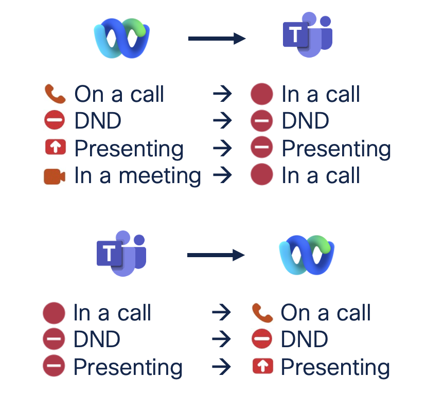

2.  Verify that user status on **Webex** is also updated to **Do Not Disturb**.

    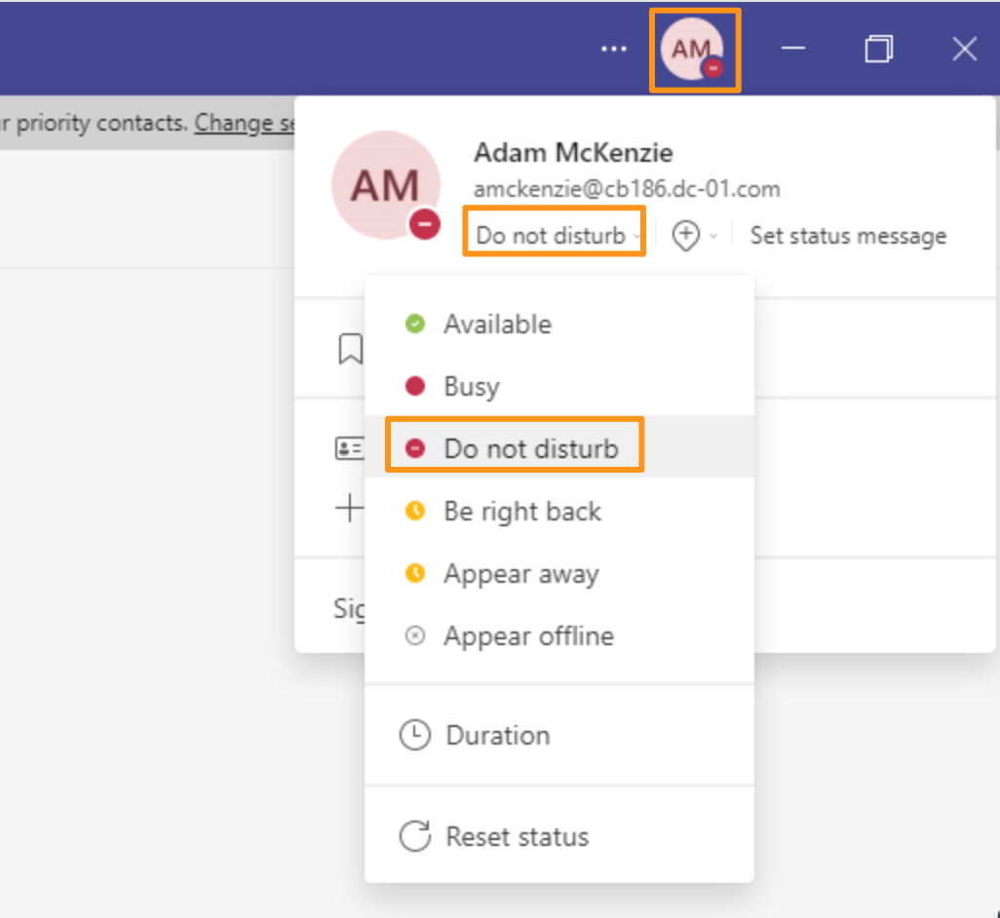

3.  To clear the status go to Microsoft Teams & click on the profile picture again and choose Reset status.

    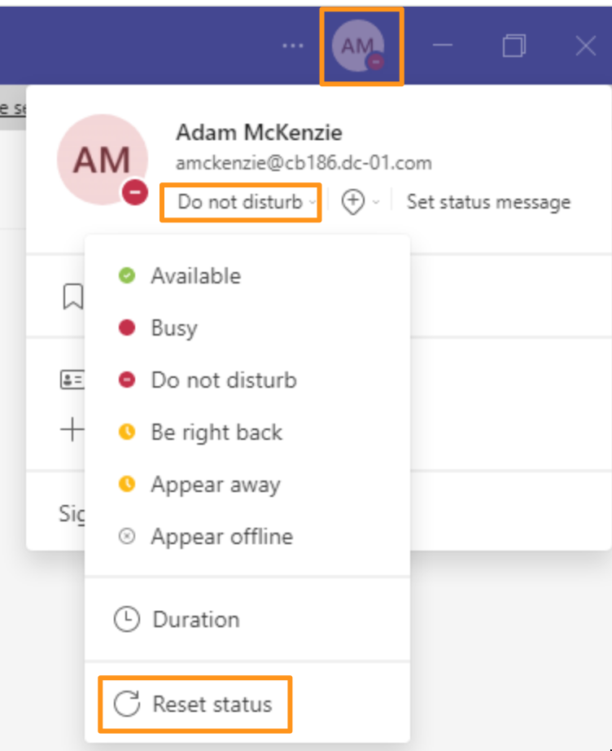

### Module 3g.4: **Calling Scenarios 4 of 8** -- Multi-Line \[Approx 10 min\]

You can set up a profile with multiple lines with different phone numbers for calling. You can switch lines if you need to make outgoing calls from different lines, such as a front desk line, support team line, or an individual line with a different caller ID.

Let's add a multi-line (secondary line) to **Adam McKenzie**.

1.  Continuing on Workstation 3, go back to browser page where you have signed into Cisco UCM. Log back in as administrator/dCloud123! if the previous login is timed out.

2.  Once logged in go to **Device** \> **Phone**. On the Find and List Phones page, drop down option for Find Phone where to **Description**, **contains** & in the search field type **mckenzie** (Adam's last name) and click **Find**.

    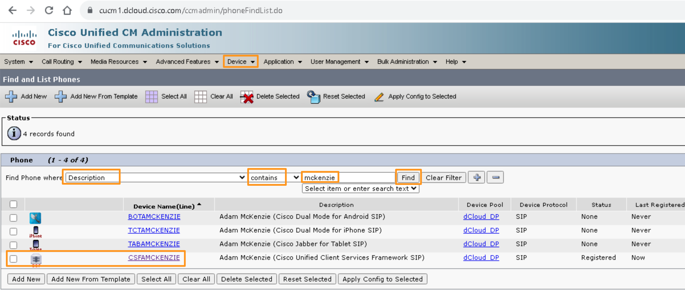

3.  From the search results choose/click the device **CSFAMCKENZIE**

4.  On the phone page, click on **Line \[2\] -- add a new DN** (towards top left corner)

    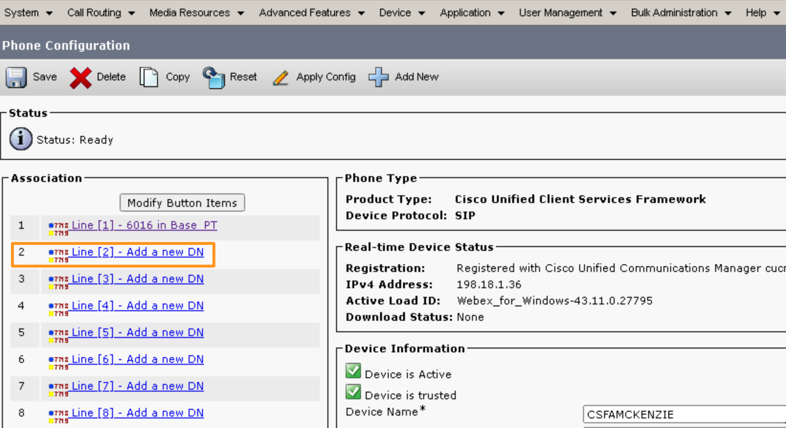

5.  It will take you to the new **Directory Number Configuration** page. On the page populate the following details and click **Save**.

    | **Parameter Name**            | **Value**               |
    | ----------------------------- | ----------------------- |
    | Directory Number              | 7016                    |
    | Route Partition               | Base_PT                 |
    | Voice Mail Profile            | Default                 |
    | Calling Search Space          | Call_Everyone           |
    | Display (Caller ID) & ASCII Display (Caller ID) | Adam McKenzie -- x7016 |
    | Line Text Label               | Adam McKenzie -- x7016  |
    | Check mark options for        | Caller Name & Dialed Number |

    

    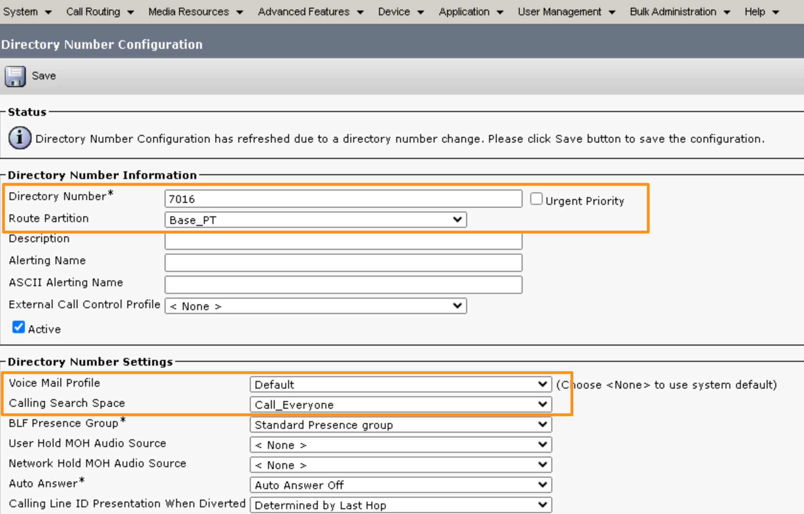

6.  Once saved, scroll down all the way down on the directory number page, you will see option called **Users Associated with Line**. Click on **Associate End Users**. It will bring up Find and List Users page, in the search field enter **Adam** and click **Find**. It will list userid **amckenzie**. Check mark the user and click **Add Selected**.

    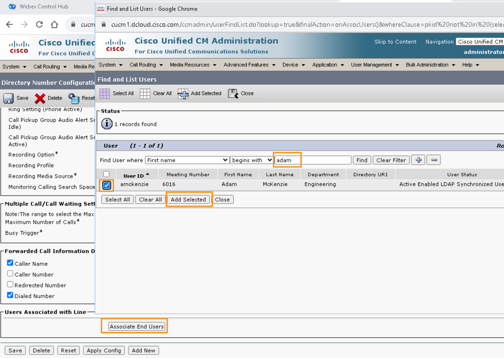

7.  It will associate the user and take you back to the **Directory Number Configuration** page. Click **Save**. Click **Apply Config**. Click **OK** on the pop-up window.

    > **NOTE**: *If you see an additional window (Calling dock) just press **Ctrl + Shift + x** to close it. We will explore Calling dock in later sections.*

8.  Now go to Webex app and you will have two lines configured. If you do not see the second line yet, just quit (Click on Profile picture & select Exit Webex) & reopen Webex from desktop.

9.  Once you bring up Webex (it may be minimized by default, click up arrow on bottom right corner and choose Webex app). Observe on the Webex you now have two Lines configured.

    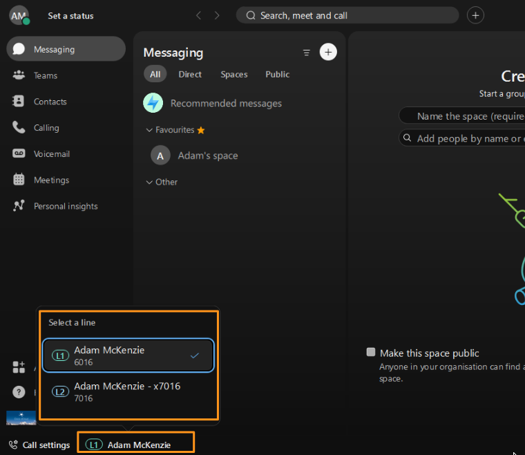

13. Go to Workstation 4 (as **Monica Cheng**). On the Microsoft Teams go to Webex Calling app and dial **7016** (the **secondary line** that we configured). Answer the call on Workstation 3. Verify that the call is connected, wait for few seconds and hang up the call.

14. As explained before once the 8 hours for the initial sync has passed, you will see the presence status updated to show that Adam **In a call** when second line is in use just like primary line.

    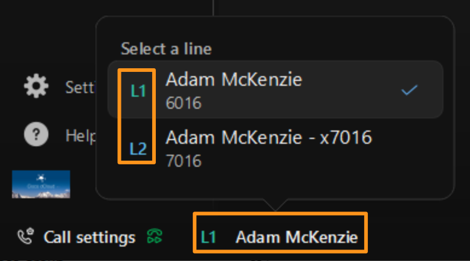

### Module 3g.5: **Calling Scenarios 5 of 8** -- Calling Dock \[Approx 5 min\]

The Calling Dock is a user enabled setting to maximize calls for multiple lines and manage calls effectively. It can act as a companion app for Microsoft Teams.


1.  Continuing on Workstation 3, on Microsoft Teams go to **Webex Calling** app on left side pane. On the Webex Calling window click **Call settings** (towards top right corner of the app).

2.  It will bring up **Settings** pop-up window. On the **Settings** pop-up window go to **Calling** \> **Calling dock**. Check mark for both options **Turn on Calling dock** & Use **Ctrl+Shift+X** to toggle the Calling dock on or off. **Uncheck** the option for **Keep Calling dock in front**. Click **Save**.

    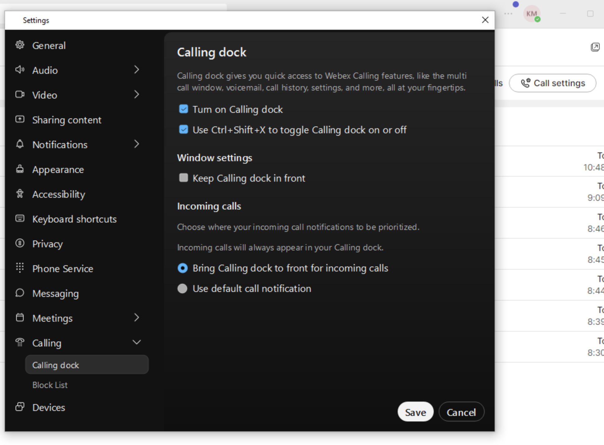

3.  Notice that Webex will bring a small call window (called as Calling Dock) as shown below. You can close the main call window & use this Calling dock for any calling functions like, making call, answering call, recent calls, dial pad and accessing voicemail etc.,

    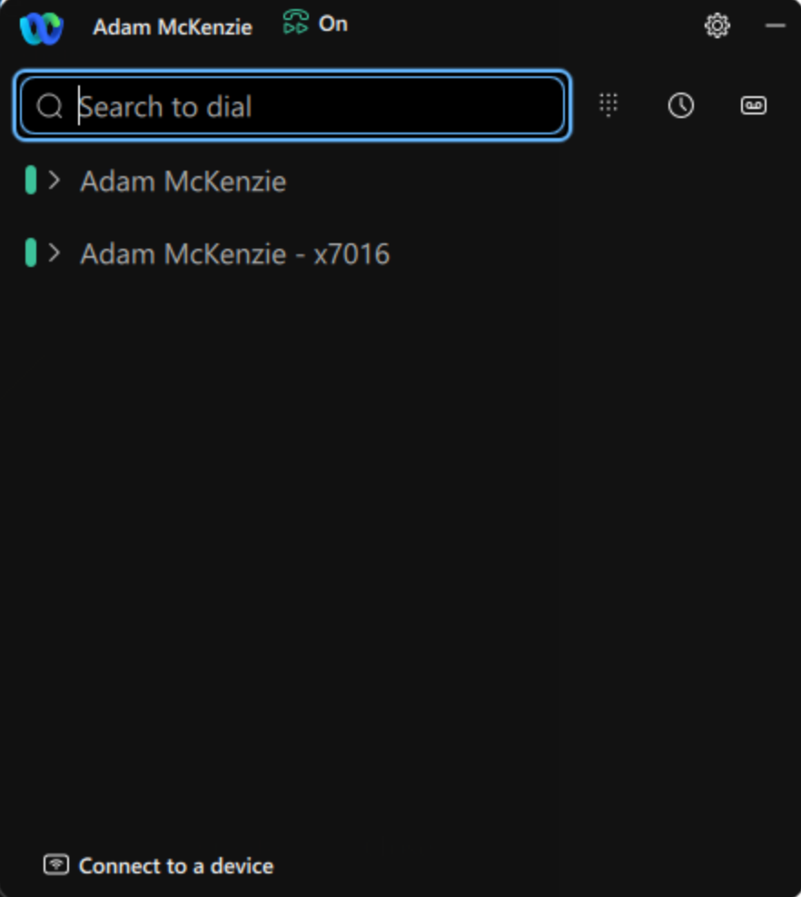

4.  Drag and drop the Calling Dock to the right side of the screen to notice it minimizes itself (docking feature)

    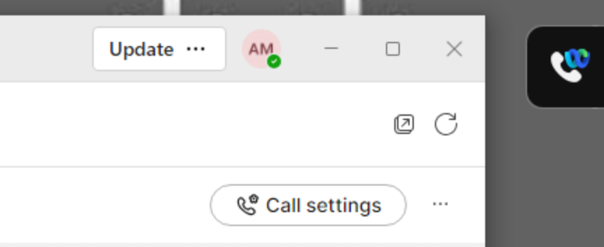

5.  Hover your mouse over the new dock icon on the right to see the Calling Dock without keeping it open. Click on it to maximize the Calling Dock again.

    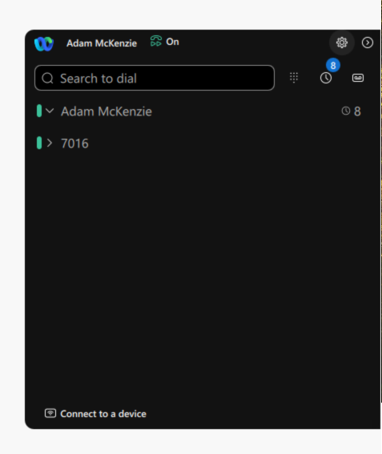

    These are the current supported features for CUCM:

    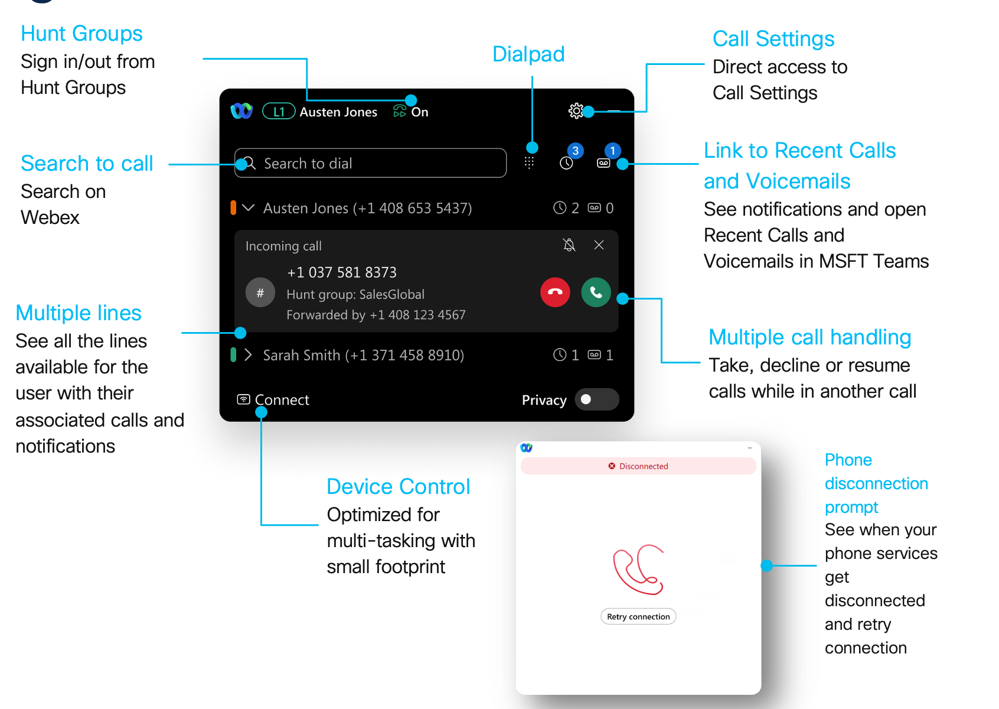

6.  On Workstation 3, go to **Microsoft Teams** \> **Webex Calling app** and call **Monica Cheng** either using phone number or email address. Answer the call on workstation 4. Verify that call is connected.

7.  Switch back to workstation 3, and observe that the Calling dock reflects the current call, its status, option for dial pad, transfer, hold etc. Also, observe that (once 8 hours of initial sync has passed) presence status is reflected correctly (**In a call**) with Webex Calling dock. Hang up the call after few seconds.

    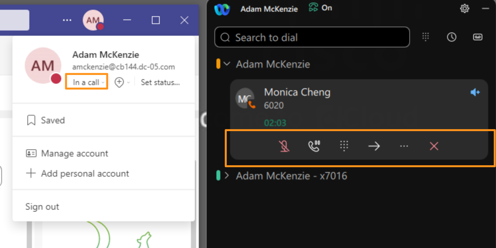

### Module 3g.6: **Calling Scenarios 6 of 8** - Set Microsoft Teams as default app from Webex Calling dock \[Approx 5 min\]

**Microsoft Teams as the default App for the Calling dock**

The Webex Calling dock is normally linked to the Webex App. This means that, when clicking on "Call History" or "Voicemail" notifications, they will take us to the Webex App. There is an option to make Microsoft Teams the default App for the Calling dock. When enabling this, if we click on "Call History" on the Calling dock it will take us now to the Microsoft Teams client where Call History for Webex Calling is.

1.  Continuing on Workstation 3, go back to the browser tab where you had **Webex Control Hub** logged in. Go to **MANAGEMENT** \> **Users**, choose user **Adam McKenzie** on user page, go to **Calling** tab. On the calling tab, scroll down to **User call experience** \> **Microsoft Teams integration**

    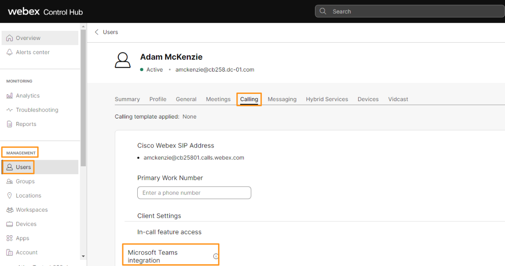

2.  Under the MS Teams Integration toggle the option for **Set Microsoft Teams as the default app for calling dock.** Click **Save**

    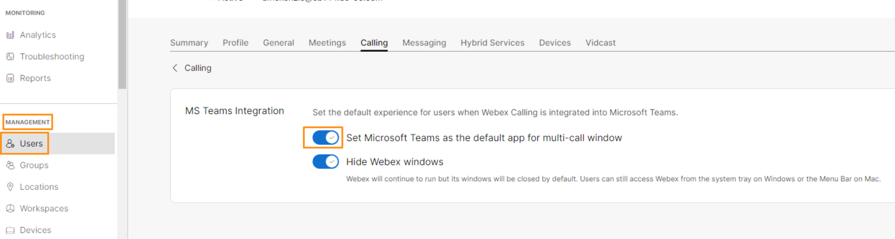

    > **NOTE**: *You can also toggle this option for entire organization by going to **SERVICES** \> **Calling** \> **Client Settings** & Microsoft Teams Integration.*

    > **NOTE**: *Sometimes it might take few minutes for the change to take effect and until then you will be still redirected to Webex.*

3.  Now go to the Webex Calling Dock and click on **Call history** (clock/history) icon & notice that it will take you to call history on the Microsoft teams.

    

4.  Similarly, you can click on voice mail icon on the Calling dock and it will you to the voicemails on Microsoft teams.

### Module 3g.7: **Calling Scenarios 7 of 8** -- Voicemail \[Approx 5 min\]

1.  From your mobile phone dial the DID number you noted for **Adam McKenzie** (from Session Details) in the Accessing the Lab module. If you cannot dial US phone numbers from your mobile, contact one of your proctors.

    > **NOTE**: *If you have not noted the DID number in the beginning of the lab, you can find the DID number by going to your **dCloud Lab** \> **Session Details** and note the DID number associated with extension number **6016** (it will be labeled as **Adam McKenzie**)*

2.  Do not answer the call on workstation 3 & let it go to voicemail (or Decline the call). Leave a voice message for few seconds and hang up the call.

3.  Now go to Microsoft Teams \> Webex Calling app and go to Voicemail tab. Observe that you have a new voice mail. Click play to listen to the voicemail. Make sure you can listen to the voicemail.

    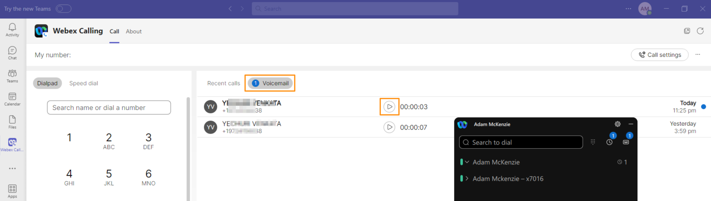

### Module 3g.8: **Calling Scenarios 8 of 8** - Create a Hunt Group and assign users to it \[Approx 10 min\]

1.  Continuing on Workstation 3, go back to browser page where you have signed into Cisco Unified Communications Manager. Log back in as **administrator**/**dCloud123!** if the previous login is timed out.

2.  Once logged in go to **Call Routing** \> **Route/Hunt** \> **Line Group**. Click on **Add new**

    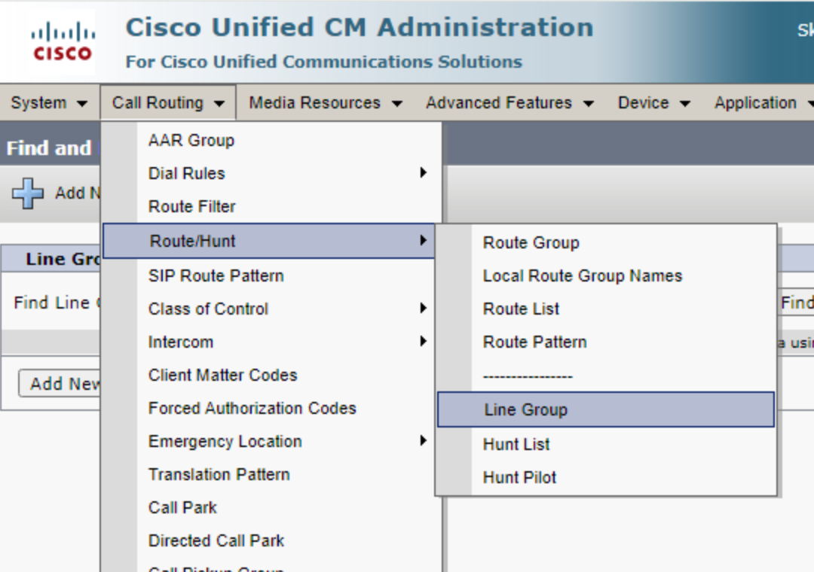

3.  Name the Line Group as **dCloud Line Group.** Select extension **6016/Base_PT** (Adam McKenzie) and click **Add to Line Group.** Similarly select extension **6020/Base_PT** (Monica) and click **Add to Line Group**. Click **Save.**

    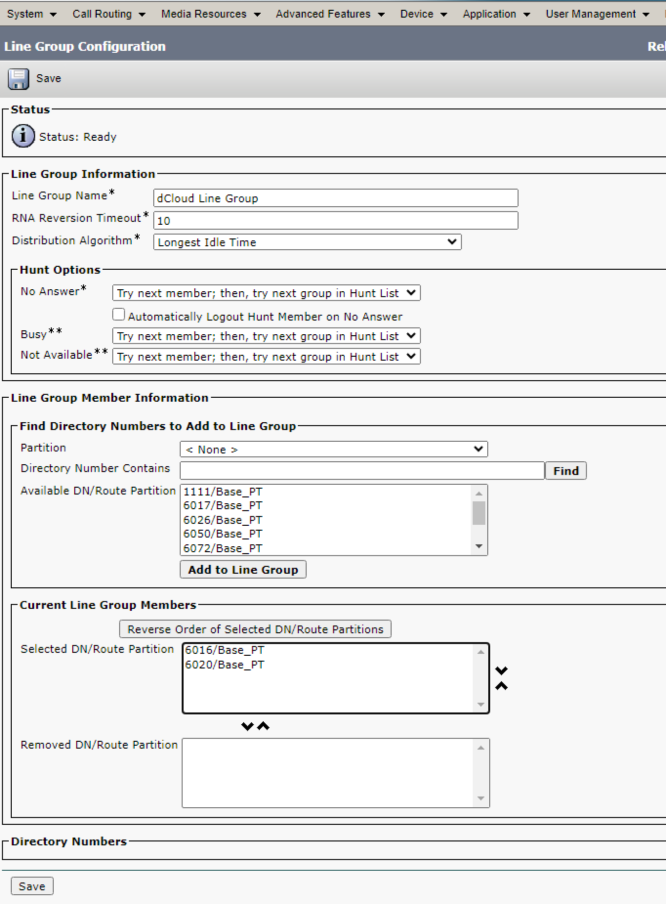

4.  Now, lets add this Line group to **Hunt List**. Go to **Call Routing** \> **Route/Hunt** \> **Hunt List**. Click on **Add new**

    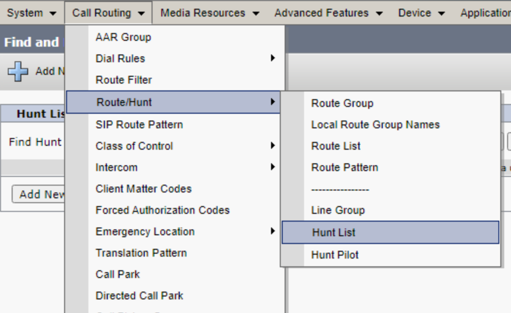

5.  Assign the name **dCloud Hunt List.** Select **dCloud_CMGroup** under Cisco Unified Communications Manager Group. Checkmark **Enable this Hunt List**. Click **Save**

    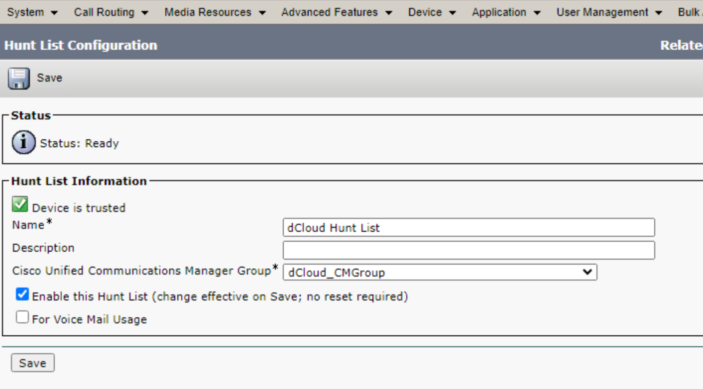

6.  Once the page reloads, click on **Add Line Group** on newly created Hunt List page. It will take you to **Hunt List Detail Configuration** page. Drop down the option **Line Group** and select the Line group you just created (**dCloud Line Group**) click on **Save.** Click **OK** on the prompt message that will appear.

    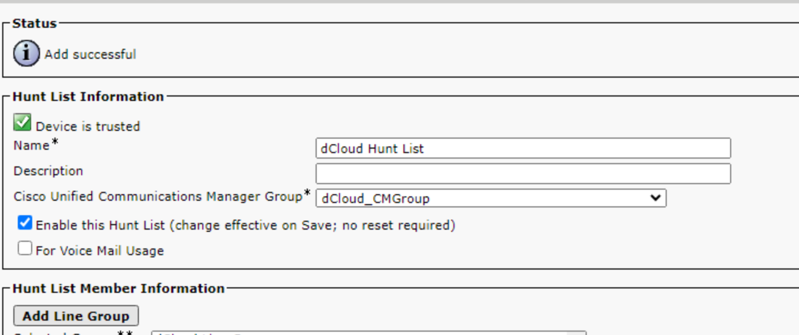

    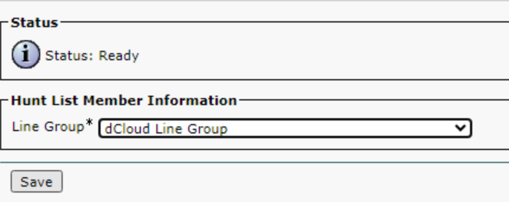

7.  Once the Line Group is added, click **Save** on Hunt List Configuration. Click **OK**.

8.  Now we are going to create the Hunt Pilot. Go to **Call Routing** \> **Route/Hunt** \> **Hunt Pilot**. Click on **Add new**

    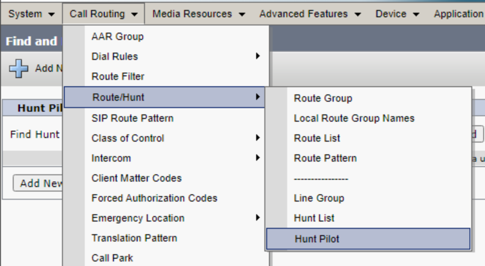

9.  Enter the directory number **7800** for **Hunt Pilot**. Select the **Route Partition** as **Base_PT.** Drop down the option for **Hunt List** & choose the hunt list we just created: **dCloud Hunt List.** Leave the rest of the fields defaults. Click **Save.**

    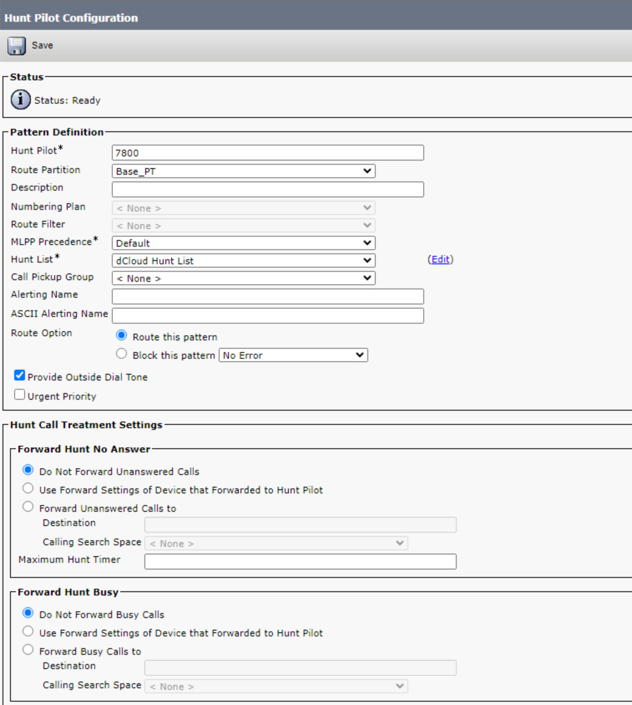

4.  Now go to Webex Calling dock & notice currently Hunt Group is enabled. You can click on it and it will be disabled. Click on the icon again to connect again to the Hunt Group.

    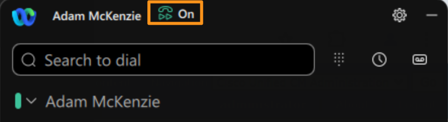

    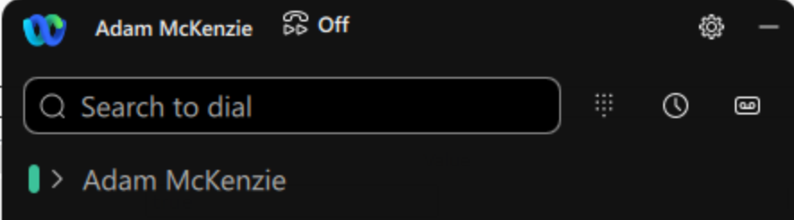

5.  Go to your dCloud Session **Info** \> **Phone Numbers**. Drop down the phone numbers and find the DID number associated with the extension **7800** (the one we assigned to the Hunt Group). This number will be different for each lab.

    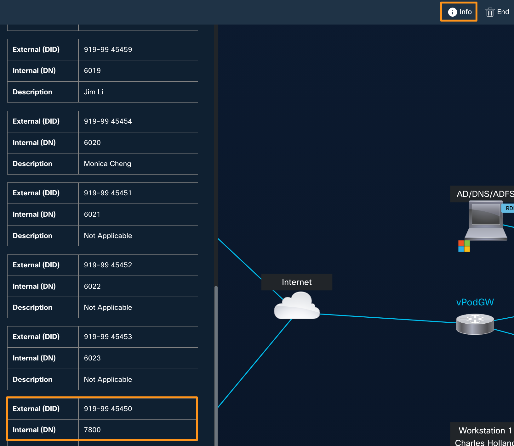

6.  Dial the DID number from your personal phone or ask one of the proctors to make the call for you. Notice the incoming call for **Adam McKenzie** (Workstation 3)

    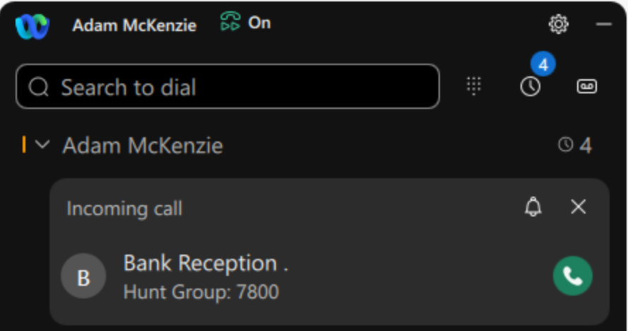

7.  Wait a few tones and notice the call moving to **Monica Cheng** (Workstation 4). Hang up the call from your phone/proctor's phone.

    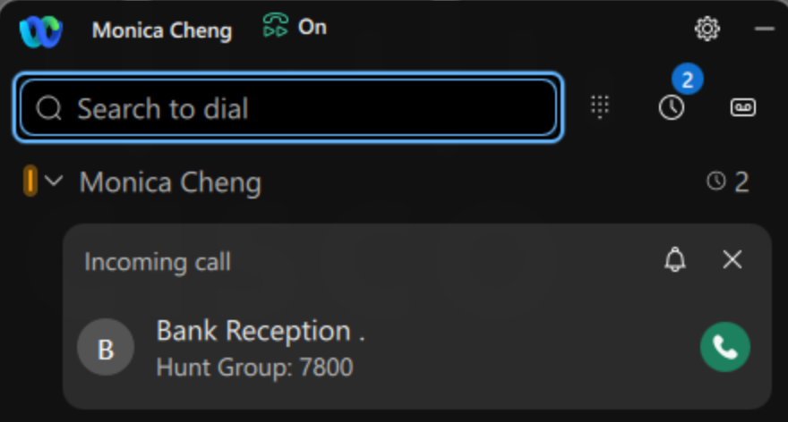

This Completes entire module 3 -- ***Webex Calling (UCM Calling) Integration with Microsoft Teams***.